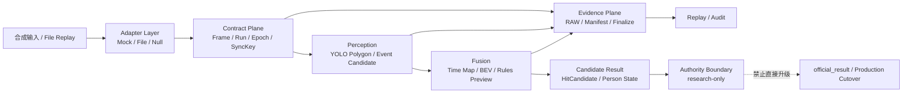

# Meta-Reality-Game-Engine V25.8 Research Edition

研究版元现实游戏引擎：以可复现的合成输入、契约和回放为首发边界，并为后续 V26 证据化能力保留稳定的接口。

本仓库当前为 R6 研究版候选。它不包含真实硬件 Adapter、真实数据、模型权重、供应商 SDK 或生产判定权威。

## 快速开始

```powershell
python -m pip install -e .
mrge validate
mrge simulate --frames 3
mrge generate-sample --output .\tmp-sample.jsonl
mrge replay --input examples/replay.jsonl
```

目录许可证边界见 [`docs/governance/RENAME.md`](docs/governance/RENAME.md)。Contracts 与 Replay 使用 Apache-2.0；其余研究引擎代码使用 AGPL-3.0-only。每个源文件均带 SPDX 标识。

## 系统整体架构

MRGE 采用“输入适配—稳定契约—感知候选—时空融合—证据回放—权威隔离”的分层设计。研究版首先保证离线、可重放和可审计；真实硬件接入和生产权威属于后续独立门禁。



### 各层职责

| 层 | 责任 | V25.8 研究版状态 |
|---|---|---|
| Adapter Layer | 提供合成、文件和空输入；隔离供应商 SDK | 已提供合成 Adapter；真实硬件不在首发 |
| Contract Plane | 固定 `run_id`、`epoch_id`、帧、同步和候选结果的边界 | `Frame`、`HitCandidate` 已公开 |
| Perception | 产生 polygon、事件像素或人体候选 | 当前为最小合成候选；YOLO 后端保留接口位置 |
| Fusion | 做时空绑定、BEV/规则预览和候选合并 | 研究接口；不产生生产最终判定 |
| Evidence Plane | 记录输入、manifest、finalize、归档和 replay | JSONL Replay 与来源清单已提供 |
| Authority Boundary | 明确 candidate、shadow、official 的权限差异 | 当前固定为 `research-only` |

### 重要契约

- `HitCandidate` 不是 `official_result`，候选输出不能直接改变生产判定。
- Replay 只能重放已有证据，不能凭本地序号、墙钟时间或临近帧伪造权威同步绑定。
- 录制、manifest、finalize 和归档属于证据生命周期；显示侧 mask、polygon 或预览不能替代 RAW 采集。
- V26 能力接入必须保留来源、版本、验证结果和 authority 状态，不能把局部 smoke/replay 直接写成现场终验。

## 即将更新的 V26 成功部分

以下内容是从 V26 候选/预开发基线整理出的后续更新方向。它们表示已有工程成果或局部门通过，不表示已经在本仓库发布，也不代表生产资格。

| V26 线 | 准备纳入的能力 | 当前证据状态与边界 |
|---|---|---|
| V26-A Recording Bundle | 统一封装 Event RAW、MVS RAW、evidence/person、manifest、finalize/archive | 候选录制与归档链；不恢复 post-mask derived RAW，不接管生产权威 |
| V26-B Polygon Gate | Event Polygon Gate 从 Shadow 推进到 Active 候选，保留缺失 polygon 的 fail-open 策略与日志证据 | 初始为 E 相机 final-test candidate；不改变 Hit Judge 最终权威 |
| V26-C Visible Replay/Observability | 可见回放、静态误检重复测试、canonical runner-root、严格路径/清单校验 | MR5-RC3 属于本地 evidence candidate；仍需独立部署资格门 |
| V26-F IR-ID | 玩家 registry、多 marker、身份绑定、ReID/hit 过滤、Player State Plane | F1.6 是移交用预开发基线；现场身份有效性和游戏权威待后续门验证 |

### V26 接入原则

1. 先以 `contracts/`、`replay/` 和 provenance 形式接入，再接入实现。
2. 每个能力同时记录 `implemented`、`replay/shadow`、`qualified` 和 `authority_ready`，不合并这些状态。
3. 首发继续排除真实硬件 Adapter、真实数据、模型权重和供应商 SDK；相关能力只以接口、合成样例或受控插件说明出现。
4. V26 更新完成后仍需通过独立的 SPDX、SBOM、Secret、数据来源和回放一致性检查，才能形成新的研究版标签。

## 下一版本预告

下一版本将复用 V27 完整体架构的设计原则：多相机分组感知、单 Owner Event、稀疏只读预览、profile 驱动几何、身份中立事实、证据封存和薄治理平面；不会复制真实 SDK、生产 Authority 或私有部署逻辑。详见 [`RENAME.md`](docs/governance/RENAME.md)。

## 当前状态

这是 V25.8 的研究版发布候选工作区，不是生产系统，也不代表现场有效性、资格通过或生产切换。

V25.8 的定位是 MRGE 的公开研究底座；V26 的定位是证据化与候选功能迭代层。两者都不能替代生产 Legacy 链路的独立资格和权威切换。
