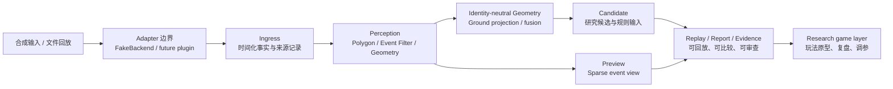
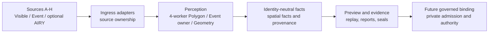

# Meta-Reality-Game-Engine V25.8 Research Edition

<!-- SPDX-License-Identifier: AGPL-3.0-only -->

[](LICENSES/AGPL-3.0-only.txt)
[](LICENSES/Apache-2.0.txt)

`Meta-Reality-Game-Engine` 是一个面向**元现实互动游戏**的研究型运行时：它把多路可见光、事件流或其他传感输入，组织为可回放、可检查、可复现实验的感知、几何、预览、证据与候选判定链路。

本仓库是 **V25.8 Research Edition**。除研究方法、稳定协议、合成回放和可替换的原创算法实现外，它现在还归档了维护者已确认可公开的 V25.8–V26 历史源码、真实研发数据与私有部署材料。它仍不构成真实场地的生产判定系统。

> **当前状态：Research / Candidate only。**
> 所有输出均为研究、候选或 Shadow 结果；它们不是比赛、计分、身份确认或安全相关场景的最终权威结论。`implemented`、本地 smoke/replay、独立资格验证、`authority_ready` 与生产切换是彼此独立的状态，不能互相替代。

## 它能支持什么样的游戏能力？

在合成数据、文件回放或经由未来独立 Adapter 接入的条件下，本引擎可以作为以下玩法的研究底座：

| 游戏能力 | 引擎如何提供支撑 | 当前边界 |
| --- | --- | --- |
| 空间目标互动 | 检测、分割、多相机几何和候选事件 | 仅候选结果，不做正式命中裁决 |
| 多人协作或对抗 | 以无身份几何轨迹和时间化事实组织交互 | 不含真实身份授权或计分权威 |
| 躲避、闯关、区域占领 | 区域、路径、接近与穿越等规则研究 | 规则输出须经独立游戏层审核 |
| 实体道具/球类玩法 | 事件过滤、弹道候选与回放对照 | 不含真实设备和现场标定保证 |
| 沉浸式叙事与导演系统 | 稀疏事件预览、证据片段和场景状态输入 | Preview 只用于展示，不可反向改写事实 |
| 赛后复盘与规则调试 | Replay、故障注入、报告与证据包结构 | 不等同于生产审计或裁决证据 |

这套设计的重点不是把单一模型输出直接变成“游戏真相”，而是让每个结论都能追溯到输入、时间、几何、过滤条件和规则版本，从而支持不同场地、传感器布局与玩法分支的安全研发。

## 公开能力概览

| 领域 | 已公开内容 | 典型用途 |
| --- | --- | --- |
| Contracts / Replay | Apache-2.0 协议、事件信封、Replay 输入输出结构 | 构建互操作实验工具、回归集和分析器 |
| 合成运行时 | FakeBackend、2/8 路合成样本、确定性模拟 | 不依赖真实设备复现完整数据流 |
| 感知接缝 | Polygon / Candidate / Timing schema 与批处理边界 | 替换模型或后处理实现而不改变下游协议 |
| 过滤与预览 | 热像素、聚类、陈旧结果过滤；稀疏事件预览 | 研究降噪、可视化与证据对照 |
| 几何分支 | 地面投影、融合、`foot_point` 锚点、四周向中心布局 | 面向不同传感器模组探索空间定位假设 |
| 治理与可复现 | 环境记录、故障注入、报告、R6 检查器 | 让研究结论具备可复查的边界 |
| 历史研发资产 | V25.8–V26 的实际源码、研发数据、部署材料、哈希与来源记录 | 复现历史研发、派生分支与审查演进 |

## 系统整体架构



架构有四条不可省略的原则：

1. **先事实，后结论。** 传感事实、派生候选、审查结论必须分层保存，不能让 UI 或过滤器回写原始事实。
2. **先几何，后身份。** 公共代码以无身份的空间事实为核心；任何身份、权限或计分权威都必须在独立的受控层完成。
3. **先回放，后现场。** 文件回放、合成样本和故障注入是默认验证路径；真实硬件仅能通过未随首发发布的独立 Adapter 接入。
4. **先证据，后裁决。** 每次研究输出应保留来源、版本、时间和过滤条件；候选输出不得被包装成最终事实。

### V25.8 当前实现层

| 层 | 公开接口/模块 | 职责 | 不承担的职责 |
| --- | --- | --- | --- |
| 输入层 | `mrge.adapters`、`mrge.replay` | 合成输入、文件回放、协议解码 | 真实相机、SDK 或现场设备控制 |
| 感知层 | `mrge.perception`、Polygon schema | 检测/分割结果的协议化与处理接缝 | 发布模型权重或真实推理服务 |
| 事件层 | `mrge.filters.*` | 热像素、聚类、陈旧候选等研究过滤 | 改写原始事件或给出权威裁决 |
| 几何层 | `mrge.geometry`、Geometry schema | 投影、融合、锚点和布局假设 | 现场标定保证或真实身份绑定 |
| 预览层 | `mrge.preview.sparse_event` | 稀疏事件预览与研究可视化 | 反向控制、最终事实生成 |
| 候选层 | Candidate schema、规则输入 | 生成可审查的研究候选 | 生产计分、处罚或通行授权 |
| 治理层 | `tools/r6_release_check.py`、报告与清单 | 复现、风险提示、发布前检查 | 独立认证或生产批准 |

## 从输入到游戏原型的全链路

```text
Replay / Synthetic Facts
  -> protocol validation and provenance
  -> perception result or event filtering
  -> ground projection and multi-view fusion
  -> identity-neutral spatial facts
  -> game-rule candidate input
  -> preview, replay report and evidence bundle
  -> researcher-reviewed game prototype behavior
```

其中 “game-rule candidate input” 只是为玩法层提供可审查输入。例如：一个对象是否进入区域、两条轨迹是否接近、一次事件是否满足研究规则的时间窗。它不是最终命中、积分、身份或安全决策。

## 快速开始

建议使用 Python 3.11 或更新版本，在虚拟环境中执行：

```powershell
python -m pip install -e .
mrge validate
mrge simulate --frames 1 --cameras 2
mrge generate-sample --output .\tmp-sample.jsonl --cameras 2
mrge replay --input examples\quickstart_2cam_synthetic.jsonl --fault stale_polygon
mrge report --input examples\fullchain_8cam_replay.jsonl --output .\tmp-reports
python tools\r6_release_check.py
```

| 示例 | 内容 | 适合验证 |
| --- | --- | --- |
| `examples/quickstart_2cam_synthetic.jsonl` | 两路最小合成回放 | 安装、协议与基础 Replay |
| `examples/fullchain_8cam_replay.jsonl` | 八路全链路合成事实 | 多路时间、过滤、候选与报告链路 |

`--fault stale_polygon` 用于注入陈旧 Polygon 故障；它是研究回归工具，不代表真实部署的故障覆盖率。

## 面向不同场地的几何研发分支

公开代码支持将“几何假设”显式放入 Profile，而不是隐藏在业务逻辑中。当前研究变体包括：

| 假设 | 配置/实现线索 | 适用研究问题 |
| --- | --- | --- |
| 人体脚点作为定位锚点 | `anchor_mode=foot_point` | 降低人体框中心在地面定位中的系统偏差 |
| 四周相机向中心观察 | `sensor_layout=four_sides_inward` | 对称场地、交叉视角与中心区域覆盖 |
| 通用地面投影与融合 | `mrge.geometry` | 比较标定、遮挡和跨视角合并策略 |
| 历史实验变体 | `research/variants/*` | 派生新场地/新模组条件下的可追溯支线 |

这些 Profile 是研究假设，并非针对某个真实场地的合格标定配置。新分支应把布局、锚点、时间基准和验证样本一起版本化。

## V25.8–V26 历史归档与授权例外

V25.8 是研究基线，V26 的 Recording Bundle、Polygon Gate、可见光回放、IR-ID、YOLO、事件、预览、融合与部署实现以历史原貌归档在 [`historical/`](historical/)。本轮采用“**完整公开，授权例外**”策略：

| 分类 | 含义 | 社区可如何使用 |
| --- | --- | --- |
| 历史源码与部署材料 | 维护者确认可公开的 V25.8–V26 原始文件 | 在对应许可证条件下复现、改造和提交改进 |
| 真实研发数据 | 已纳入历史归档的真实记录与证据材料 | 进行离线研究、回放与再分析；须遵守附带数据说明 |
| 来源与哈希清单 | [`historical/RELEASE_MANIFEST.json`](historical/RELEASE_MANIFEST.json) | 校验导入内容、来源快照与 V26 Git 提交 |
| V26 代码知识图谱 | [`historical/knowledge-graph/v26/`](historical/knowledge-graph/v26/) | 按层级和导览理解 279 个历史文件、2,654 个静态节点与 6,964 条已提取关系 |
| 授权例外 | [`historical/EXCLUSIONS.md`](historical/EXCLUSIONS.md) | 识别不可再分发的供应商、凭据、第三方或专有材料 |

本次实际导入由 release manifest 逐文件校验。较早的 pre-V27 2,857 项哈希清单仍保留为 V27 参考审计台账，不能被解读为 V27 源码已发布。

## 下一版本预告：复用完整架构，不重复造轮子

下一阶段将以 V27 Clean Runtime 的完整体架构为设计输入，保留其已经验证的职责分层，而不是重新堆叠一套平行框架：



计划中的复用方向：

- 使用 Profile 驱动多源接入、布局和策略切换；
- 保留四路并行 Polygon/后处理的职责边界、事件所有者与稀疏预览模式；
- 继续以无身份几何事实作为公共层的输出；
- 将未来的 Admission、Lease、Trust、身份绑定和权威判定置于私有、受治理的扩展层；
- 从一开始记录 provenance、版本和可回放证据。

不会镜像供应商 Event HAL/相机 SDK、受限模型与权重、密钥/证书或未获授权的第三方材料。历史代码中的生产 Authority/Judge/Game Manager 仅作为历史研究实现公开，不获得现场启用、裁决或身份权威。详细的阶段图、复用边界和“不重复建设”清单见 [RENAME.md](docs/governance/RENAME.md)。

## 发布范围与非目标

当前公开范围**不包含**：

- 供应商 SDK、驱动、二进制和受限第三方模型资产；
- 密钥、账户、证书、令牌及未获授权的个人数据或网络端点；
- 未在维护者公开权利声明内的数据、场地资料和部署档案；
- 将历史代码直接视为生产裁决、正式计分、身份确认、授权通行或安全控制能力的主张；
- 对真实场地准确率、时延、稳定性或合规性的承诺。

如果你计划把研究结果接入真实设备或真实玩家，请先完成独立的数据治理、隐私、授权、设备安全、性能、规则与审计评估。公开仓库的通过记录不能替代这些资格过程。

## 仓库导航

```text
mrge/                    # 引擎核心、协议、Replay、过滤、预览与几何模块
contracts/               # Apache-2.0 的公共协议与 Replay 契约
examples/                # 合成回放样本
research/variants/       # 可追溯的研究变体与 Profile
historical/              # V25.8–V26 源码、数据、部署材料、图谱、排除项与发布清单
tools/                   # R6 检查、报告和辅助工具
docs/governance/         # 范围、命名、架构预览与发布治理
docs/                    # 设计、Replay、Adapter、贡献与安全文档
LICENSES/                # AGPL-3.0-only 与 Apache-2.0 正文
```

推荐阅读顺序：

1. [开放范围与命名/架构预览](docs/governance/RENAME.md)
2. [架构说明](docs/ARCHITECTURE.md)
3. [Replay 规范](docs/REPLAY_SPEC.md)
4. [Adapter 协议](docs/ADAPTER_PROTOCOL.md)
5. [贡献指南](CONTRIBUTING.md) 与 [安全策略](SECURITY.md)

## 许可证

本仓库采用分域许可：

| 内容 | 许可证 |
| --- | --- |
| 引擎实现、工具、研究代码与文档（除另有声明） | [AGPL-3.0-only](LICENSES/AGPL-3.0-only.txt) |
| `contracts/` 与 Replay 契约 | [Apache-2.0](LICENSES/Apache-2.0.txt) |

适用边界、例外与第三方归属以 [LICENSE.md](LICENSE.md)、[THIRD_PARTY_NOTICES.md](THIRD_PARTY_NOTICES.md) 和各文件 SPDX 标识为准。商业、封闭部署或其他授权需求，请通过仓库维护者公开渠道联系。

## 贡献与研究纪律

欢迎贡献可复现的协议、合成样本、过滤/几何变体、文档与测试。提交前请确保：

- 历史归档数据必须附带公开权利与来源记录；不得提交密钥、权重、未获授权的个人数据或第三方受限资产；
- 为新的研究结论提供可运行的合成回放、明确 Profile 和预期输出；
- 不把 Preview、Shadow 或 Candidate 状态描述为最终权威；
- 尊重分域许可证，并记录第三方依赖、来源和适用限制；
- 在 [CONTRIBUTING.md](CONTRIBUTING.md) 与 [CODE_OF_CONDUCT.md](CODE_OF_CONDUCT.md) 的约束下协作。

## 发布状态

当前公开基线是 V25.8 Research Edition；`pre-v27-original-audit.1` 为本地候选审计标签，表示范围与清单检查的一个研究快照，不是独立资格认证或生产 Release。R6 检查器可验证公开仓库的结构性约束，但不能证明真实硬件、真实数据、现场性能、外部许可或生产权威状态。

---

Meta-Reality-Game-Engine 的目标是让社区能够在清晰边界内研究“现实空间如何成为可回放、可解释、可派生的游戏输入”，同时把真实世界系统应有的安全、隐私与权威责任留在它们应被独立验证的地方。
