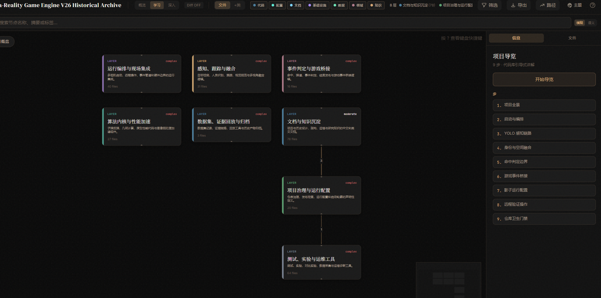
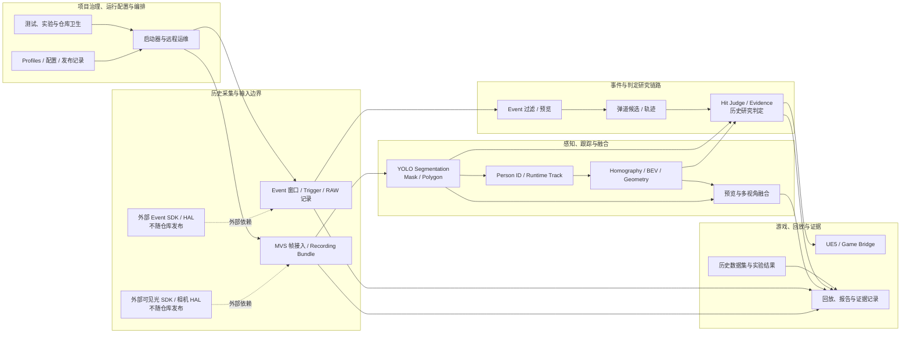

# Meta-Reality-Game-Engine V25.8 Research Edition

<!-- SPDX-License-Identifier: AGPL-3.0-only -->

这是仓库根目录的命名、范围与架构入口。

- 当前公开版本：**Meta-Reality-Game-Engine-V25.8-Research-Edition**
- 当前定位：元现实游戏引擎的研究版本，同时作为 V25.8–V26 历史实现、数据与部署材料的公开归档入口；历史代码不因此获得生产 Authority。
- 分域许可证：`contracts/` 与 Replay 使用 Apache-2.0；引擎、工具与其余未另行声明内容使用 AGPL-3.0-only。
- 公开模式：维护者已确认其对纳入版本库的 V25.8–V26 自有源码、真实数据和私有部署材料拥有公开权利；迁移过程保留逐文件来源、哈希与例外记录。
- 不公开的例外：供应商 SDK 或二进制、受第三方再分发限制的模型权重、他人个人数据/身份资料、密钥、证书、令牌、未获授权的网络端点及任何来源或授权仍不清晰的内容。

## 开源内容总览

这是一个“**研究引擎 + 可复核历史归档**”仓库，而不是把历史代码直接宣称为可投入真实比赛或生产裁决的产品。公共内容分为三层：

| 层级 | 已公开内容 | 用途与边界 |
| --- | --- | --- |
| 研究引擎 | `mrge/`、`contracts/`、Replay、几何、过滤、预览与研究 Profile | 供开发者在合成或自有授权环境中复现、派生和验证研究分支；不替代现场资格。 |
| V25.8–V26 历史归档 | 历史源码、研发数据、部署脚本、配置、证据与发布记录 | 保留可追溯研究上下文，便于回放、迁移、比较与分支研发。 |
| 可检索知识资产 | V26 静态代码知识图谱、发布清单、哈希、排除清单和治理说明 | 帮助理解模块边界与来源；图谱和清单不替代真实运行、日志、资格或 Authority 证据。 |

公开采用“**完整公开，授权例外**”原则：自有且确认可再分发的材料以文件形式发布；供应商 SDK/HAL、二进制、受限权重、凭据、未获授权个人资料和来源不清内容始终排除。许可仍以根目录与文件内的 SPDX/具体声明为准：`contracts/` 与 Replay 为 Apache-2.0，其余未另行声明内容为 AGPL-3.0-only。

## V25.8–V26 历史公开扩展

本仓库不再只发布最小研究实现。`historical/v25.8/` 与 `historical/v26/` 保留经筛查的历史源码、部署脚本、配置、真实数据和研发文档，尽可能维持原始目录与可追溯来源；V26 的静态代码知识图谱已发布在 [`historical/knowledge-graph/v26/`](historical/knowledge-graph/v26/)，用于导航模块、层级与已验证的静态关系。

这是一项“全量公开，授权例外”的迁移，而不是把哈希清单误作源码发布：每个未迁入项目必须有明确的例外原因，且其路径、哈希和来源保留在公开排除清单中。真实场地数据和私有部署材料的公开，仅代表维护者声明的公开权利，不构成对安全、隐私、现场表现或生产资格的保证。

当前迁移的文件数量、字节数、树哈希与 V26 固定提交见 [`historical/RELEASE_MANIFEST.json`](historical/RELEASE_MANIFEST.json)；图谱来源提交、节点/边数量、分层和导览约束见 [`historical/knowledge-graph/README.md`](historical/knowledge-graph/README.md)；不可再分发的 V25.8 专有组件、混合工作树和其他授权例外见 [`historical/EXCLUSIONS.md`](historical/EXCLUSIONS.md)。

## V26 代码知识图谱：使用说明

V26 图谱位于 [`historical/knowledge-graph/v26/knowledge-graph.json`](historical/knowledge-graph/v26/knowledge-graph.json)，对应固定历史提交 `18f453bc887497c73efe3b8ac39ddfe3809b212c`。它包含 279 个文件级节点、2,654 个静态节点、6,964 条已提取关系、8 个架构层级和 9 步中文导览。

### 图谱界面示例



上图是“项目概览”视图：卡片表示文件级架构层，右侧是从项目全景到仓库卫生门禁的阅读导览。该图片仅展示静态代码图谱界面，不展示真实数据、硬件画面、运行日志或裁决结果。

### 启用本地图谱查看器

前提：已克隆本仓库，并安装 Node.js（含 `npx`）。以下 PowerShell 命令在**仓库根目录**执行：它只复制已发布的图谱 JSON 到临时查看目录，并启动仅监听 `127.0.0.1` 的本地查看器；不会启动 V26 运行时、相机、Event HAL 或任何现场服务。

```powershell
$viewerRoot = Join-Path $env:TEMP "mrge-v26-knowledge-graph-viewer"
$uaDir = Join-Path $viewerRoot ".ua"
New-Item -ItemType Directory -Force -Path $uaDir | Out-Null
Copy-Item "historical/knowledge-graph/v26/knowledge-graph.json" $uaDir -Force
Copy-Item "historical/knowledge-graph/v26/meta.json" $uaDir -Force
Set-Content -LiteralPath (Join-Path $uaDir "config.json") -Encoding utf8 -Value '{"outputLanguage":"zh"}'
npx --yes "https://github.com/Egonex-AI/Understand-Anything/releases/download/v2.9.4/understand-anything-viewer.tgz" $viewerRoot
```

终端会打印带一次性访问令牌的 `Dashboard URL`，浏览器会自动打开该地址；如果没有自动打开，请完整复制该 URL（包括 `?token=`）到浏览器。查看完成后直接在终端按 `Ctrl+C` 关闭查看器。图谱文件本身不被改写，也不会上传到外部服务。

建议按以下顺序使用：

1. 从“项目概览”读取 8 个层级，先确定工作落点，而不要从单一脚本推断整个系统。
2. 从“项目导览”依次查看启动编排、YOLO 感知、身份/空间融合、命中边界、游戏桥接、Shadow、远程验证和仓库卫生门禁。
3. 用搜索和“文件”视图定位节点后，回到 `historical/v26/` 阅读实际源码、Profile、配置、测试与记录；以 source commit、release manifest 和实际证据共同复核结论。
4. 派生新布局或传感器方案时，先将输入、时间基准、几何锚点、输出事实、消费者和 Authority 边界版本化，再修改算法或接入代码。

图谱是静态导航，不会证明硬件已连接、部署能启动、数据质量合格或命中/身份结果具备 Authority。当前没有可验证的跨批 import map，因此图谱不补造推测性的跨模块依赖边。

## V26 历史实现架构图

> 这是从已公开 V26 源码、配置、工具与静态知识图谱归纳出的历史结构。它用于理解真实归档内容和寻找迁移切入点；其中供应商接入、模型权重和现场凭据可能仅以外部依赖引用存在，并不随仓库发布。



## MRGE 1.0 正式推进版整体架构图

> 此图对应正在推进的 **Meta-Reality Game Engine Version 1.0** 正式架构：以 `MRGE_V1_0_ARCHITECTURE_SPEC.zh-CN.md` v8.1.1 为规范性来源。它是“ACTIVE / APPROVED、IMPLEMENTATION IN_PROGRESS、NOT QUALIFIED”的目标设计，不是 V26 已实现功能清单，也不构成生产切换、真实比赛或裁决 Authority 声明。

```mermaid
flowchart TB
    GM["Game Manager\n比赛、玩家与装备主身份"]
    OP["Operator Console\n启动、受控停止、状态"]
    SELF["Startup Self-Test Window\n只读 Gate 投影"]
    CFG["Hardware Profile Editor\nMVS / Event 候选配置"]
    LIFE["Lifecycle Control Service\n意图、状态、监督"]
    SYNCCTRL["Sync Authority Controller\nReceipt / Term / Fence / WAL"]

    subgraph GOV["执行治理面 EGP：只治理执行元数据"]
        ACTION["Action Registry\n注册动作与副作用类型"]
        DAG["Capability DAG\n依赖与 Gate"]
        ADMIT["Admission Controller\n默认拒绝"]
        LEASE["Resource Lease Manager\nHardware / GPU / Schema"]
        TRUST["Trust Domain Registry\nDEV / QUAL / PROD"]
        RUNNER["Approved Runner\n唯一受批准执行器"]
        GWAL["Governance Ledger\nAttempt / Admission / Lease / Closeout"]

        ACTION --> ADMIT
        DAG --> ADMIT
        TRUST --> ADMIT
        ADMIT --> GWAL
        ADMIT --> LEASE
        LEASE --> GWAL
        LEASE --> RUNNER
    end

    subgraph SENSOR["传感与受控传输层"]
        MVS["MVS A-H\nBayer RAW"]
        FRAME["Owned Frame Ring"]
        EVENTHOST["EventOwnershipDomain\n首选单一 EventHalHost 管理 A-H"]
        EADAPTER["Logical Adapter A-H\n独立线程、Ring、Frontier"]
        ERING["Owned Event Batch Ring"]
        EING["EventIngressActor\n每路 Ring 单消费者"]
        TRIGGER["Raw Trigger Edge Fact"]
        WINDOW["Owned Event Window Store"]
        RAWARCHIVE["Event Raw Archive Writer\nProfile 受控的独立副本"]

        MVS --> FRAME
        EVENTHOST --> EADAPTER --> ERING
        ERING --> EING
        EING --> TRIGGER
        EING --> WINDOW
        EING --> RAWARCHIVE
    end

    subgraph AIRY["可选 AIRY 几何辅助：默认关闭、非 Authority"]
        AIRYHOST["AirySourceHost\n私有 SDK 与单一设备 Owner"]
        CLOCK["Airy Native Time Bridge\n点级 window_ref"]
        AIRYOBS["AiryGeometryObservationFact\nparticipant_uid = null"]
        ASSIST["TrackingAssistFact\nNON_AUTHORITY"]
        AIRYPROJ["NonAuthorityMotionTrackProjection"]
        AIRYLEDGER["Optional Capability Ledger"]
        AIRYSEAL["OptionalCapabilitySeal"]

        AIRYHOST --> CLOCK --> AIRYOBS --> ASSIST --> AIRYPROJ
        AIRYOBS --> AIRYLEDGER
        ASSIST --> AIRYLEDGER
        AIRYPROJ --> AIRYLEDGER --> AIRYSEAL
    end

    subgraph AUTH["同步权威闭环"]
        AWAL["Single-writer Authority WAL"]
        READY["A-H Ready Barrier"]
        PREAMBLE["Probe / Fixed Train / Coded Preamble"]
        RECEIPT["AuthorityReceipt"]
        BIND["Trigger Binding"]
        COHORT["A-H Cohort"]
        GAP["GapFact"]
        TERM["TerminalReason Registry"]
        EPOCHSEAL["AuthorityEpochSeal"]

        SYNCCTRL --> AWAL --> READY --> PREAMBLE --> RECEIPT
        TRIGGER --> BIND --> COHORT
        RECEIPT --> BIND
        GAP --> TERM --> EPOCHSEAL
        COHORT --> EPOCHSEAL
    end

    subgraph GPU["GPU 感知与融合数据面"]
        H2D["Pinned H2D Upload"]
        ISP["CUDA ISP"]
        YOLO["4× TensorRT Worker\nAB / CD / EF / GH，768×768 FP16"]
        SEG["GPU Mask / Polygon Primitive"]
        VTRACK["Visual Runtime Track Builder"]
        EGUARD["EventPixelDefectGuard"]
        EVTGPU["GPU Event Denoise\nSparse Point Projection"]
        TRAJ["Event Ballistic Detection"]
        WARP["Event-centric Warp"]
        FUSION["CUDA Fusion Compositor"]
        SURFACE["GPU Presentation Surface"]

        FRAME --> H2D --> ISP --> YOLO --> SEG --> VTRACK
        WINDOW --> EGUARD --> EVTGPU --> TRAJ
        ISP --> WARP
        SEG --> WARP
        EVTGPU --> WARP
        TRAJ --> WARP
        WARP --> FUSION --> SURFACE
    end

    subgraph ID["身份、绑定与无身份几何层"]
        PID["ParticipantIdentityFact\nGame Manager 唯一主身份"]
        EQUIP["EquipmentIdentityAssignmentFact"]
        IROBS["IRMarkerObservationFact\n观测，不是玩家身份"]
        IDBIND["PlayerTrackBindingFact\n有效区间与 disposition"]
        VGEOM["VisualTrackGeometryFact\n无身份 World / BEV 几何"]
        PLOC["VisualBaselineLocationFact / Series"]
        PPOLY["PlayerPolygonBindingFact"]

        GM --> PID --> EQUIP
        EING --> IROBS
        EQUIP --> IDBIND
        IROBS --> IDBIND
        VTRACK --> IDBIND
        VTRACK --> VGEOM
        VGEOM --> PLOC
        IDBIND --> PLOC
        IDBIND --> PPOLY
        SEG --> PPOLY
        VTRACK -. "只读基线参考" .-> AIRYPROJ
    end

    subgraph EVIDENCE["语义事实、证据与潜在判定层"]
        POLY["Polygon Fact"]
        BALL["BallisticTrajectoryFact"]
        HEB["HitEvidenceBundle\n仅身份中立引用；未来 Gate"]
        HIT["HitExistenceFact\n未来独立批准的 Producer"]
        REL["RelationFact\nsource / target 归因；未来 Gate"]
        CHAIN["PlayerEvidenceChainIndex\n只索引，不创造事实"]
        LEDGER["Canonical Ledger"]

        SEG --> POLY
        TRAJ --> BALL
        POLY --> HEB
        BALL --> HEB
        VGEOM --> HEB
        HEB -. "仅已批准 Hit Producer" .-> HIT
        HIT -. "命中存在与归因分离" .-> REL
        IDBIND -. "有效 source / target 区间" .-> REL
        PPOLY -. "仅用于归因" .-> REL
        POLY --> LEDGER
        BALL --> LEDGER
        PID --> LEDGER
        EQUIP --> LEDGER
        IROBS --> LEDGER
        IDBIND --> LEDGER
        PLOC --> LEDGER
        PPOLY --> LEDGER
        HEB --> LEDGER
        BIND --> LEDGER
        RECEIPT --> LEDGER
        EPOCHSEAL --> LEDGER
        PID --> CHAIN
        IDBIND --> CHAIN
        PLOC --> CHAIN
        PPOLY --> CHAIN
        BALL --> CHAIN
        HIT --> CHAIN
        REL --> CHAIN
        CHAIN --> LEDGER
    end

    subgraph PRESENT["展示、编码、记录层"]
        GL["OpenGL Local Preview\n严格只读图层白名单"]
        NVENC["Hardware Encode Plane"]
        WEB["HTML5 / WebRTC"]
        SRT["Main + A-H SRT"]
        MATCH["Match Evidence Lite"]
        MATCHSEAL["MatchEvidenceSeal"]

        SURFACE --> GL
        SURFACE --> NVENC
        NVENC --> WEB
        NVENC --> SRT
        NVENC --> MATCH
        RAWARCHIVE --> MATCH
        LEDGER --> MATCH --> MATCHSEAL
    end

    subgraph REPLAY["标准比赛回放：不重跑算法或判定"]
        NVDEC["NVDEC MVS Decode"]
        ERAW["Event RAW Decode"]
        RFUSE["GPU Replay Fusion"]

        MATCH --> NVDEC --> RFUSE
        MATCH --> ERAW --> RFUSE
        MATCH --> RFUSE
    end

    subgraph REVIEW["独立赛后模型分析与人工复核"]
        PACK["PostMatch EvidencePack Builder\n命中复盘 / 规则违规复盘"]
        OUTBOX["Durable Analysis Outbox"]
        REQ["Provider Payload Adapter\n无网络、无密钥"]
        EGRESS["Policy Egress Gateway\n唯一网络与密钥 Owner"]
        CLOUD["Remote API Only\nDeepSeek-V4-Flash 候选"]
        RESP["Provider Response Adapter\n无网络、无密钥"]
        VERIFY["Local Schema / Ref / Policy Verifier"]
        HOPINION["LLMHitOpinionFact\nSHADOW_ONLY"]
        VOPINION["LLMViolationOpinionFact\nSHADOW_ONLY"]
        ALEDGER["Analysis Ledger"]
        CASE["PostMatchReviewCase\n争议 / 规则审计 / 人工请求"]
        WORKBENCH["Post-Match Review Workbench\nblind-first、独立角色"]
        HUMAN["HumanArbitrationDecisionFact\nREVIEW_ONLY"]
        ASEAL["MatchAnalysisSeal"]

        LEDGER -->|"只读引用"| PACK
        AIRYLEDGER -->|"可选 NON_AUTHORITY 引用"| PACK
        MATCH -->|"已封存或临时只读输入"| PACK
        PACK --> OUTBOX --> REQ --> EGRESS --> CLOUD
        CLOUD --> EGRESS --> RESP --> VERIFY
        VERIFY --> HOPINION --> ALEDGER
        VERIFY --> VOPINION --> ALEDGER
        MATCH --> CASE
        HOPINION --> CASE
        VOPINION --> CASE
        CASE --> WORKBENCH --> HUMAN --> ALEDGER
        ALEDGER --> ASEAL
    end

    GM --> LIFE
    OP -->|"幂等 ControlCommand"| LIFE
    CFG -->|"ConfigApplyRequest"| LIFE
    LIFE -->|"ExecutionRequest；无设备句柄"| ADMIT
    RUNNER -->|"Admission + Hardware Lease + Fence"| SENSOR
    RUNNER -->|"Admission + GPU Lease"| GPU
    RUNNER -->|"仅请求 Receipt；无签名密钥"| SYNCCTRL
    LIFE -->|"SelfTestRunFact / Status"| SELF
    GWAL -. "只读治理状态" .-> SELF
    SENSOR -. "Ready / Readback" .-> SELF
    AUTH -. "Gate / Receipt" .-> SELF
    GL -->|"只读展示"| OP
```



## 开发复用边界

| 结构 | 应复用的边界 | 禁止的捷径 |
|---|---|---|
| 执行治理 | Action Registry → Admission → Lease → Approved Runner | 读取图像/Event 负载、写 Authority WAL、持有设备句柄或签名密钥 |
| Event 接入 | 单一物理 Owner、A-H 独立 Adapter/Ring/Frontier、Raw→Sanitized 分流 | 多 Owner 争抢设备、让 Raw CD 直接进入算法、合并多路 Source Frontier |
| 感知与预览 | 四 Worker 感知、Authority No-Loss 与 Preview Latest-Wins 分离 | 为显示或编码丢弃事实、由 Preview 反压 Authority |
| 身份与几何 | Game Manager 签发 `participant_uid`；几何先无身份，再在有效窗口绑定 | 用 IR code、track、AIRY、相机编号或 LLM 直接生成玩家身份 |
| 命中与归因 | `HitEvidenceBundle → HitExistence → Relation` 的存在/归因拆分 | 以玩家接近、身份或模型意见跳过 Hit existence |
| AIRY | 默认 `DISABLED`，可选 `SHADOW/AUGMENT`，独立 Optional Seal | 改写基线位置、身份绑定、Hit/Relation、AuthorityReceipt 或 Base qualification |
| 回放与复核 | 标准 Replay 只消费已记录内容；模型/人工只读封存证据 | 标准回放重跑模型/算法，或让 LLM/人工改写比赛状态 |

完整的命名映射、阶段路线、pre-V27 迁移规则与发布治理见 [docs/governance/RENAME.md](docs/governance/RENAME.md)。根目录文件直接展示 V26 历史结构与 MRGE 1.0 目标架构，治理目录保留细化规则。
