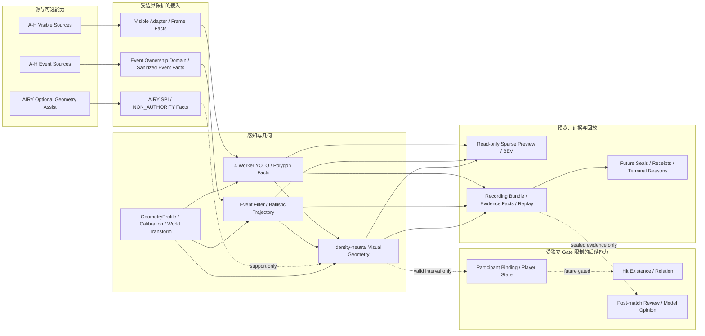
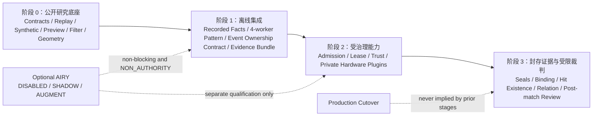

# Rename and public-boundary guide

<!-- SPDX-License-Identifier: AGPL-3.0-only -->

本文件定义 V25.8 研究版向“Pre‑V27 原创代码研究底座”扩展后的公开命名、目录和权威边界。它不授权复制未通过逐文件原创性/许可证复核的历史源码。

## 已批准的公开命名

| 旧概念或历史实现 | 公开名称/目录 | 状态 |
|---|---|---|
| Global YOLO / 人体 Polygon | `mrge.perception`、`contracts/polygon_gate.schema.json` | Contract/研究接口已公开；真实后端仍是可选插件 |
| Event 热像素、cluster、stale 筛选 | `mrge.filters.event`、`mrge.filters.polygon` | clean-room 研究实现已公开 |
| `sparse_gl` Event 显示经验 | `mrge.preview.sparse_event` | clean-room 稀疏点预览已公开；无完整 raster/Authority 写权 |
| BEV/场地坐标假设 | `mrge.geometry`、`contracts/geometry_profile.schema.json` | profile 驱动，不再由 camera index 推断 |
| 脚定位点 | `anchor_mode=foot_point` | 公开 geometry profile |
| 四周朝中心传感器布局 | `sensor_layout=four_sides_inward` | 公开研究变体/独立 profile |
| V26 Recording Bundle | `contracts/recording_bundle.schema.json` | 研究契约；不带真实 RAW/归档 |
| V26 Polygon Gate | `contracts/polygon_gate.schema.json` | `candidate`，不改变 Hit Judge 权威 |
| V26 IR-ID / Player State | `contracts/ir_id.schema.json` | `shadow`，不构成玩家主身份 |
| 历史 Shadow/Dry-run/失败实验 | `research/variants/*` | 必须包含 `STATUS.md` 和不可宣称项 |
| 历史来源与审计 | `provenance/*` | hash-only inventory；未审计源码不得批量复制 |

## 当前公开目录

```text
contracts/                 Apache-2.0：稳定 Schema/事实合同
replay/                    Apache-2.0：JSONL 回放与故障注入
src/mrge/
  adapters/                AGPL：Fake/File/Null 边界
  perception/              AGPL：研究后端接口
  filters/                 AGPL：Event/Polygon 过滤
  preview/                 AGPL：只读稀疏预览
  geometry/                AGPL：GeometryProfile、Pose、变换
  engine/                  AGPL：候选管线与研究报告
research/
  geometry_profiles/       Apache-2.0：布局/锚点 profile
  variants/                AGPL：条件化支线与实验状态
docs/architecture/         AGPL：架构、范围、下版预告
docs/algorithms/           AGPL：算法语义和限制
provenance/                AGPL：来源、hash、候选检查
```

## 不能在 Rename 中改变的语义

- `HitCandidate` 不能改名为 `official_result`、Final Verdict 或生产命中。
- `candidate`、`shadow`、`research-only`、qualified、`authority_ready`、production cutover 必须分开记录。
- 不能用 `frame_id-1`、最大 seen、wall-time 最近邻或本地序号伪造同步、身份或几何绑定。
- 预览、过滤、Recorder、UI 和研究报告没有 Authority WAL/签名/生产网络写权。
- AIRY、IR code、视觉 track、相机编号和模型意见不能直接成为 `participant_uid`、Hit Existence 或 Relation Authority。
- 真实 SDK、设备 handle、模型权重、真实数据、私有 profile、凭证和运行归档继续排除。

## 与下一版本架构的复用关系

当前仓库只复用 V27 架构中已经适合作为公开研究底座的模式：

1. profile 驱动的几何和校准边界；
2. 稀疏 Event 点预览而非完整 Event raster；
3. 预览/过滤与 Authority 解耦；
4. 身份中立的几何事实优先于玩家归因；
5. 可选能力（例如 AIRY）默认非 Authority、可降级；
6. 来源、合同、回放和候选检查先于真实硬件接入。

不会在本仓库重复实现或复制：真实 Event HAL、供应商 SDK、生产 Authority WAL、比赛 Judge、Game Manager、真实模型执行、私有设备管理或现场部署脚本。

## 下一版本预告：从研究底座走向完整 MRGE 架构

> 状态：架构预告，不是功能承诺、资格结论或生产发布。

下一版本将以 V27 完整体架构为设计输入，在当前公开的 Replay、Preview、Filter、Geometry 和研究支线之上扩展，重点是复用已验证的结构原则，而不是再造一套平行系统。

### 最新架构预览



当前公开仓库实现的是 Contracts、Replay、合成 Adapter、Preview/Filter、GeometryProfile、候选结果和研究报告。图中的真实 A-H 设备、YOLO Engine、Event Ownership Domain、Seal、玩家绑定、Hit/Relation 和赛后分析均是下一版本架构方向，需分别经过来源、硬件、资格和 Authority Gate。

### 阶段性架构图



| 阶段 | 可做什么 | 明确不能做什么 |
|---|---|---|
| 阶段 0 | 公开原创研究代码、合成样例、回放、过滤、预览和 GeometryProfile | 连接真实设备、写生产 Authority、使用真实数据/权重 |
| 阶段 1 | 离线重放已记录事实，验证四 Worker/单 Owner/证据 bundle 的合同与守恒 | 把离线 PASS 当作硬件资格或真实命中质量 |
| 阶段 2 | 在 Admission、Lease、Trust Domain 和独立插件边界下接入硬件 | 复用开发目录、私有 profile 或绕过 readback/校准/资格 Gate |
| 阶段 3 | 处理已封存证据上的绑定、Hit/Relation 与赛后审查 | 自动改写比赛结果、HP、Game State 或生产 Authority |

| 方向 | 复用原则 | 当前公开基础 |
|---|---|---|
| 多相机感知 | 采用 AB/CD/EF/GH 四个 Global YOLO Worker 的分组模式；完整 Polygon 与发布背压分开处理 | FakeBackend、Polygon Contract、Replay |
| Event 所有权 | 每台 Event 设备只能有一个物理 Owner；公共核心只保留 Adapter SPI/事实合同 | Null/Fake Adapter、Event Filter |
| 稀疏预览 | 只传输可绘制 Event 点，不传完整 raster；Preview 不反压事实/Authority | `mrge.preview.sparse_event` |
| 几何支线 | 以 `GeometryProfile`、`CalibrationRef`、anchor/profile 取代硬编码场地坐标 | foot-point、four-sides-inward profile |
| 身份与命中 | 先保留身份中立的 Polygon/Visual Geometry/Trajectory，再在独立 Gate 后做玩家绑定与 Relation | `candidate`/`shadow` Contract 边界 |
| 证据与回放 | Replay 读取已记录事实；标准回放不重跑真实 YOLO/Event/模型 | JSONL、Recording Bundle、研究报告 |
| 可选增强 | AIRY 作为默认关闭、可缺省、NON_AUTHORITY 的运动几何支持 | 研究支线与 Optional Capability 约束 |
| 治理 | 执行治理平面只管理 Admission/Lease/Capability，不读取图像/Event 负载，也不写业务 Authority | provenance、检查器和 Release Manifest 模式 |

### 当前不会重复建设的部分

- 不复制真实 Event HAL、相机 SDK、私有设备发现、生产启动脚本或现场配置；
- 不另建一个混合 UI/Authority/生命周期的超级进程；
- 不以 Preview、IR code、AIRY、LLM 或模型意见生成玩家身份、Hit、Relation、HP 或游戏状态；
- 不在标准 Replay 中重新跑真实模型或上传真实视频/Event RAW；
- 不绕过 Release Manifest、Lease、Trust Domain、校准与资格 Gate。

### 分阶段预告

1. **公开研究层**：补齐 profile、事实 Schema、Synthetic/Replay、过滤和只读预览。
2. **离线集成层**：以记录事实验证四 Worker、Event 所有权、证据 bundle 与独立 GeometryProfile。
3. **受治理能力层**：在独立 Admission/Lease/Trust Gate 下接入真实硬件和可选插件；不复用开发目录或私有配置冒充资格。
4. **后续裁判/赛后分析层**：Hit Existence、Relation、人工复核和模型意见仅在封存证据与独立 Authority 后作为受限能力推进。

完整架构参考：V27 Clean Runtime 的《MRGE 1.0 架构规范》。该规范是设计输入和边界来源；本公开预告只提炼其可公开复用的结构，不复制其私有 Adapter、真实硬件配置或生产授权语义。

当前仓库的 `pre-v27-original-audit.1` 仍只是本地候选检查通过的公开研究审计标签。独立环境复核、第三方许可证审计、真实硬件 Gate、资格、Authority Ready 和正式 Release 仍需分别完成。

## Pre‑V27 迁移规则

每个候选文件必须先出现在 `PRE_V27_FILE_INVENTORY.csv`，并完成以下终态之一：

- `ORIGINAL_PUBLIC`：可按目标许可证迁移；
- `ORIGINAL_DECOUPLE`：重写 SDK/路径/进程耦合后迁移；
- `ORIGINAL_EXPERIMENTAL` 或 `ORIGINAL_VARIANT`：迁入 `research/variants/` 并带状态；
- `THIRD_PARTY_BOUND`、`PRIVATE_DATA_BOUND`、`UNKNOWN`：不进入公开源码。

## 文档状态

本文已按当前 Pre‑V27 扩展内容更新，待用户审阅后才提交和推送。它不改变既有 `pre-v27-original-audit.1` 标签。
