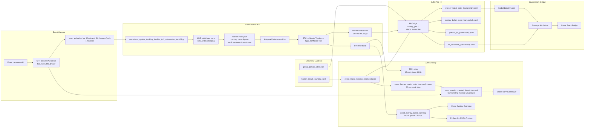

# Event Side Chain

Last updated: 2026-07-08

This is the living document for the event-camera side of the system. It must be
updated whenever event capture, synchronization, mask evidence, event overlay,
bullet tracking, hit-candidate generation, attribution input, or related status
keys change.

Chinese companion document: `EVENT_SIDE_CHAIN_CN.md`. Keep both versions in
sync when the event-side chain changes.

## Purpose And Authority

The event side has three parallel flows:

1. Event capture and synchronization.
2. Event pixel visualization, including raw event overlay and masked BEV event
   overlay.
3. Bullet point, pseudo hit, and hit candidate evidence.

Hit existence authority belongs to `hit_judge_server.py`. Global bullet
reconstruction and damage attribution may enrich a hit, but they must not become
required evidence for a final hit unless that rule is explicitly approved and
documented.

## Current Production Path

```text
Event cameras A-H
-> C++ Native HAL broker
-> 4 ms FIFO slices
-> Event workers A-H
-> EventViz / tracking / BulletEventSender
-> Hit Judge
-> pseudo_hit / hit_candidate
-> Damage Attribution
-> Game Event Bridge
```

The current launch profile is `launch_profiles/627_event_overlay_bev.json`.
The production startup entry is `launch_fusion_system.py --launch-profile
launch_profiles/627_event_overlay_bev.json`.

Human mask visualization filtering is display-only in the current profile:
`event_mask_evidence_service.py` publishes the mask raster, and the C++
Native HAL broker publishes a separate 33.33 ms rolling masked overlay for
Global BEV. Raw FIFO tracking and hit tracking remain unblocked by this display
mask.

V24-E4 keeps OpenGL ownership in the Global BEV GUI thread.  The new event-layer
presentation worker is CPU-preparation only.  In V24-E4-A `shadow` mode it is
metadata-only: it reads sparse history sidecars, selects the frame for the same
BEV presentation target, and evaluates sync/draw eligibility without reading
sparse point payloads or projecting vertices.  In V24-E4-B `active` mode it may
read sparse points and prepare field/NDC vertices for GUI-thread upload.  Active
mode must fall back to the original GUI direct path when the worker bundle is
stale or built for the wrong target.  Do not replace this with OpenGL
multi-threading or CUDA rendering without a separately approved design.

V24-E5 extends the same worker with a target-keyed bundle ring.  The GUI
consumes an exact bundle for the current BEV target when available, may consume
a near bundle within `event_layer_presentation_target_tolerance_ticks`, and
otherwise falls back to the original GUI direct sparse path.  The ring is only a
display optimization; it does not change Event raw tracking, pseudo hit, final
hit, or Game Bridge authority.

After V24-E5B validation, the standard launch profile uses
`global_bev_event_layer_presentation_worker_mode=active` with fallback still
enabled.  The initial active profile keeps `bundle_ring_size=8`,
`prebuild_lookahead_ticks=2`, `prebuild_lookback_ticks=2`,
`prebuild_max_per_cycle=1`, and target tolerance `1` tick.  Shadow remains the
required low-risk preflight mode for future tuning.

## Data Flow



## Capture And Synchronization

Current event capture uses the C++ Native HAL broker instead of direct Python
`EventsIterator` ownership in each worker.

Key implementation files:

| Role | File |
| --- | --- |
| Broker process | `native_event_bridge/hal_event_fifo_broker.cpp` |
| FIFO reader wrapper | `native_event_bridge/hal_event_pipe_iterator.py` |
| Event worker | `metavision_spatter_tracking_linefilter_tsf1_autosender_backfill.py` |
| Launcher wiring | `launch_fusion_system.py` |

Current profile defaults:

| Key | Current default |
| --- | --- |
| `event_native_hal_broker_enable` | `true` |
| `event_native_hal_broker_slice_us` | `4000` |
| `event_native_hal_broker_wait_mode` | `poll` |
| `event_native_hal_broker_poll_sleep_us` | `100` |
| `event_native_hal_broker_cpus` | `29` |
| `event_worker_cpus` | `30,31,32,33,34,35,36,37` |
| `event_sync_source` | `mvs_soft_trigger` |

The synchronization baseline is the MVS soft trigger. Exposure duration is not
the event-chain sync baseline.

## Worker Processing Order

The current worker processing order is:

```text
FIFO event slice
-> trigger/sync mapping
-> human-mask buffer/filter accounting
-> track input selection
-> hot-pixel filter / cluster sanitize
-> SpatioTemporalContrastAlgorithm
-> spatter_tracker.process_events
-> clusters.numpy()
-> CppLineMotionFilter / line_filter.update
-> draw_paths and debug_rows
-> BulletEventExtractor
-> BulletEventSender
```

The important operational boundary is that event tracking currently uses raw
event input and is not blocked by human-mask delay.

## Human Mask And Evidence

Current profile defaults:

| Key | Current default |
| --- | --- |
| `event_worker_human_mask_filter_enable` | `false` |
| `event_track_input_policy` | `raw` |
| `event_mask_evidence_enable` | `true` |
| `event_mask_evidence_period_ms` | `30` |
| `event_mask_evidence_stale_ms` | `120` |
| `event_mask_raster_enable` | `true` |
| `event_mask_raster_template` | `/dev/shm/event_human_mask_raster_{camera}.mmap` |
| `event_mask_raster_dilate_px` | `8` |
| `event_human_mask_cache_max_fps` | `40` |
| `event_human_mask_stats_jsonl` | empty string, disabled by default |

The separate `event_mask_evidence_service.py` reads
`human_result_{camera}.jsonl` and publishes
`event_mask_evidence_{camera}.json`. When `event_mask_raster_enable=true`, it
also publishes `/dev/shm/event_human_mask_raster_{camera}.mmap`. The raster is
built from YOLO polygon data when available and falls back to bbox polygons when
polygon data is absent. Hit Judge consumes the evidence JSON. Mask evidence may
be degraded by sync age, but mask lag should not directly stop raw event
tracking.

## Visualization Outputs

Event worker visualization outputs:

| Output | Meaning | Main consumers |
| --- | --- | --- |
| `event_overlay_latest_{camera}` | Shared-memory raw event pixel image | Event Overlay Overview, Preview, raw debug fallback |
| `event_overlay_{camera}_latest.json` | Event overlay sidecar/status | Status, Global BEV, Preview |
| `event_overlay_masked_latest_{camera}` | Shared-memory display-only event pixels after human-mask raster filtering | Global BEV event layer |
| `event_overlay_masked_{camera}_latest.json` | Masked overlay sidecar/status | Status, Global BEV |
| Event Overlay Overview reader | Tries `event_overlay_latest_{camera}` first, then `event_overlay_masked_latest_{camera}` as a display fallback | Prevents one camera from being marked `not_initialized` when the legacy overlay shm is absent but the masked display stream is alive |
| `bullet_ts_latest_{camera}` | TSF1 shared memory | Legacy/TSF consumers |
| `event_obs_{camera}_latest.json` | OBS sidecar when enabled | OBS diagnostics |

Current profile defaults:

| Key | Current default |
| --- | --- |
| `event_overlay_pub_max_fps` | `40` |
| `event_overlay_render_mode` | `mono_sparse` |
| `event_overlay_pub_channels` | `1` |
| `event_tsf1_pub_max_fps` | `83.3333333333` |
| `event_obs_submit_max_fps` | `30` |
| `event_viz_build_max_fps` | `80` |
| `event_viz_buffer_enable` | `true` |
| `event_viz_no_mask_policy` | `raw_debug` |
| `event_visual_mask_overlay_enable` | `true` |
| `event_visual_mask_slice_us` | `33333` |
| `event_visual_mask_accumulation_us` | `33333` |
| `event_mask_control.json.event_visual_mask_slice_us` | hot control, status-window managed |
| `event_mask_control.json.event_visual_mask_accumulation_us` | hot control, status-window managed |
| `event_visual_mask_publish_fps` | `40` |
| `event_visual_mask_overlay_history_slots` | `128` |
| `event_visual_mask_overlay_sparse_enable` | `true` |
| `event_visual_mask_overlay_sparse_sidecar_template` | `sync_ipc/event_overlay_sparse_{camera}_history.json` |
| `event_visual_mask_overlay_sparse_max_points` | `20000` |
| `event_sync_map_ring_json_template` | `sync_ipc/event_sync_map_ring_{camera}.json` |
| `event_sync_map_ring_records` | `512` |
| `event_sync_map_ring_write_interval_ms` | `100` |
| `global_bev_event_layer_backend` | `sparse_gl` |
| `global_bev_event_layer_template` | `event_overlay_masked_latest_{camera}` |
| `global_bev_event_layer_sidecar_template` | `event_overlay_masked_{camera}_latest.json` |
| `global_bev_event_layer_sparse_sidecar_template` | `event_overlay_sparse_{camera}_history.json` |
| `global_bev_event_layer_sparse_max_points_draw` | `20000` |
| `global_bev_event_layer_sync_map_ring_template` | `event_sync_map_ring_{camera}.json` |
| `global_bev_max_mvs_sync_delta_ticks` | `2` |
| `global_bev_mvs_sync_outlier_policy` | `hide` |
| `global_bev_event_layer_sync_mode` | `mvs_tick_guarded` |
| `global_bev_event_layer_max_sync_delta_ms` | `50` |
| `global_bev_event_layer_max_sync_delta_ticks` | `2` |
| `global_bev_event_layer_sync_normal_ms` | `50` |
| `global_bev_event_layer_sync_warn_ms` | `80` |
| `global_bev_event_layer_sync_hard_ms` | `80` |
| `global_bev_event_layer_hold_last_good_on_hard_outlier` | `true` |
| `global_bev_event_layer_hold_last_good_ms` | `250` |
| `global_bev_event_layer_accumulate_enable` | `true` |
| `global_bev_event_layer_accumulate_window_ms` | `40` |
| `global_bev_event_layer_accumulate_max_frames` | `1` |
| `global_bev_event_layer_texture_scale` | `0.5` |
| `global_bev_status_debug_interval_ms` | `0` |
| `global_bev_alignment_mode` | `shadow` |
| `global_bev_alignment_delay_ms` | `820` |
| `global_bev_alignment_shadow_interval_ms` | `250` |

Important distinction:

- `Global BEV event layer` displays event pixels. In the current profile it
  reads the masked visual layer. It is display-only: it can accumulate and hold
  visual history for smooth monitoring, but it must not alter final-hit
  authority or the judgement sync threshold.
- `Global BEV event bullet overlay` displays recognized bullet trajectory
  points.
- `Global BEV alignment` is a metadata-only delayed-presentation shadow bundle.
  It chooses the MVS presentation target and Event sparse frame metadata for the
  same sync id, but it does not read sparse point payloads, does not touch
  OpenGL, and does not change hit authority.

Event pixels being visible does not prove bullet tracking is active.

## BEV Event-Layer Sync Timestamp Policy

For Global BEV event-layer display, accumulated event windows are synchronized
to MVS by `event_window_end_us`.

This is an explicit strategy: do not use `event_window_center_us` as the sync
decision timestamp for masked visual event windows. The masked overlay is a
rolling accumulation window, and the rendered frame becomes operator-visible at
the window end. Candidate sorting, sync-ring mapping, and BEV visual sync delta
checks therefore use `event_window_end_us`. The fields `event_window_start_us`
and `event_window_center_us` are retained only as diagnostics.

Runtime status must expose `event_layer.sync_timestamp_policy` and per-camera
`event_layer_sync_timestamp_policy=event_window_end_us`. If this field ever
regresses to center-based logic, treat it as a display-sync bug before widening
the `global_bev_event_layer_max_sync_delta_ms` gate.

## Global BEV Event-Layer Display Budget

V24-C6 adds a display-only budget guard for the Global BEV event layer. The
guard is currently most important for `global_bev_event_layer_backend=sparse_gl`.
It does not change Event HAL capture, FIFO slices, Event worker tracking,
masked overlay publication, pseudo hit, final hit, or Game Bridge output.

When the Global BEV GUI thread spends more than the configured event-layer
display budget in one paint tick, it may keep the previous already-projected
sparse point set for a camera instead of doing more sidecar/mmap read and
projection work on that GUI tick. This is a visualization hold, not an Event
frame drop: the sparse history sidecars continue to be produced by the Event
side and can be selected again on a later paint tick.

New profile/control keys:

| Key | Default | Meaning |
| --- | --- | --- |
| `global_bev_event_layer_display_budget_enable` / `event_layer_display_budget_enable` | `true` | Enable the Global BEV display budget guard |
| `global_bev_event_layer_display_budget_ms` / `event_layer_display_budget_ms` | `10` | GUI-thread event-layer read/project budget per paint tick |
| `global_bev_event_layer_display_hold_ms` / `event_layer_display_hold_ms` | `280` | Maximum visual hold age before a held sparse layer is allowed to expire |

New status fields:

| Field | Meaning |
| --- | --- |
| `event_layer.display_budget_enable` | Whether the display budget guard is active |
| `event_layer.display_budget_ms` | Configured event-layer display budget |
| `event_layer.display_budget_elapsed_ms` | Actual elapsed time for the latest event-layer paint preparation |
| `event_layer.display_budget_held_cams` | Cameras using previous projected sparse points because the budget was exhausted |
| `event_layer.per_camera.*.reason=held_by_display_budget` | Per-camera visual hold reason |
| `alignment.performance.event_layer_display_budget_*` | Compact diagnostic mirror for status and remote reports |

The judgement sync threshold remains `100 ms`. The BEV event layer is a
display-only path with a separate visual sync tier:

| Tier | Rule | Display behavior | Status |
| --- | --- | --- | --- |
| Normal | `abs(event_to_bev_sync_delta_ms) <= 50` | Draw current event layer | `event_layer.sync_display_level_by_cam.*=OK` |
| Warn | `50 < abs(event_to_bev_sync_delta_ms) <= 80` | Draw current event layer, but mark operator warning | `event_layer.sync_warn_cams` |
| Hard outlier | `abs(event_to_bev_sync_delta_ms) > 80` | Do not draw the mismatched current frame. If enabled, hold the previous good sparse points for up to `event_layer_hold_last_good_ms`; otherwise hide the camera event layer. | `event_layer.sync_hard_outlier_cams`, `event_layer.sync_hold_cams`, `event_layer.sync_hidden_cams` |

The standard profile sets `global_bev_event_layer_max_sync_delta_ms=50`,
`global_bev_event_layer_sync_normal_ms=50`,
`global_bev_event_layer_sync_warn_ms=80`, and
`global_bev_event_layer_sync_hard_ms=80`. This change is only for Global BEV
visual truth. It does not change raw Event FIFO/tracking, pseudo hit, final hit,
Game Bridge, or the judgement sync threshold.

## Bullet Point And Hit Candidate Outputs

Event workers do not directly own final hit files. Event workers send
`BulletEvent` packets through `BulletEventSender` to Hit Judge. Hit Judge writes
the visual bullet streams and candidate streams.

Main outputs:

| Output | Owner | Meaning |
| --- | --- | --- |
| `overlay_bullet_point_{camera}.jsonl` | Hit Judge | Real-time visual bullet point stream |
| `overlay_bullet_point_all.jsonl` | Hit Judge | Cross-camera aggregate visual bullet point stream |
| `overlay_bullet_event_{camera}.jsonl` | Hit Judge | Sparse turn/terminal/track events |
| `pseudo_hit_{camera}.jsonl` | Hit Judge | Strong-reasoning hit precursor |
| `pseudo_hit_all.jsonl` | Hit Judge | Aggregate pseudo hit stream |
| `hit_candidate_{camera}.jsonl` | Hit Judge | Final hit candidate rows |
| `hit_candidate_all.jsonl` | Hit Judge | Aggregate final hit candidate stream |

Bullet event types include:

- visual point sample
- turn event
- terminate event
- track probe
- shot-bounce-link turn-like event

## Hit Judge Authority

`hit_judge_server.py` owns hit existence.

Main loop order:

```text
poll_inputs()
-> receive_udp()
-> _process_pending_visual_point_segments()
-> process_pending_events()
-> _process_pending_impacts()
-> _flush_semantic_terminals()
-> _write_status()
```

Authority modes:

| Mode | Meaning |
| --- | --- |
| `strong_gate` | Older evidence-gated final-hit path |
| `strong_reasoning` | New pseudo-hit path, terminal/turn/stable-track contact with mask/person evidence |
| `both_shadow_compare` | Comparison mode when enabled |

Human-noise filtering is inside Hit Judge. Current important knobs include
`human_noise_filter_mode`, `human_noise_track_start_bbox_expand_px`, and
`pseudo_hit_dedup_ms`.

## Downstream Chains

After `hit_candidate_all.jsonl`:

```text
hit_candidate_all.jsonl
-> damage_attribution_service.py
-> damage_attribution_events.jsonl
-> game_event_bridge_service.py
-> TCP JSONL to Windows game manager
```

Global Bullet Fusion reads `overlay_bullet_point_all.jsonl` and produces
`global_bullet_tracks.jsonl`. It is an attribution/reconstruction aid, not a
required gate for hit existence.

Manual Hit Service is a separate authority path for operator click hits. It
must remain distinguishable from automatic hit output.

## Status And Control Files

Primary status:

| File | Meaning |
| --- | --- |
| `sync_ipc/event_native_hal_broker_stats.jsonl` | Native HAL broker open/start/FIFO/write statistics |
| `sync_ipc/event_worker_{camera}_status.json` | Per-camera worker state, loop rate, event rate, tracking diagnostics |
| `sync_ipc/event_mask_evidence_status.json` | Mask evidence service health and period |
| `/dev/shm/event_human_mask_raster_{camera}.mmap` | 30 ms human-mask raster consumed by the C++ HAL visual branch |
| `/dev/shm/event_overlay_masked_latest_{camera}.mmap` | 66 ms rolling masked event visualization layer for Global BEV |
| `sync_ipc/event_overlay_masked_{camera}_latest.json` | Masked overlay sidecar, including filter counts and mask age |
| `sync_ipc/event_overlay_overview_status.json` | Standalone event overview window status |
| `sync_ipc/hit_judge_status.json` | Hit authority, pseudo hit, human-noise, candidate counters |
| `sync_ipc/global_bullet_fusion_status.json` | Global bullet fusion input/output state |
| `sync_ipc/damage_attribution_status.json` | Damage attribution state |
| `sync_ipc/game_event_bridge_status.json` | Game TCP bridge state |
| `sync_ipc/system_status_latest.json` | Aggregated status-window source |

Primary controls:

| File | Meaning |
| --- | --- |
| `sync_ipc/event_mask_control.json` | Mask evidence period/stale and mask-raster enable/dilate hot update |
| `sync_ipc/event_overlay_overview_control.json` | Standalone Event Overlay window visible/hidden |
| `sync_ipc/global_bev_control.json` | BEV event layer, event bullet overlay, and V24-E4/V24-E5 event-layer presentation worker controls |
| `sync_ipc/hit_judge_control.json` | Authority, human-noise, bbox-start, output controls |
| `sync_ipc/manual_hit_control.json` | Manual hit enable and source ID |
| `sync_ipc/game_event_bridge_control.json` | Game bridge mode and manual-only/all selection |

V24-E4/V24-E5 BEV event-layer presentation worker controls:

| Key | Meaning |
| --- | --- |
| `event_layer_presentation_worker_enable` / `global_bev_event_layer_presentation_worker_enable` | Enable the CPU-prep worker |
| `event_layer_presentation_worker_mode` / `global_bev_event_layer_presentation_worker_mode` | `off`, `shadow`, or `active` |
| `event_layer_presentation_worker_interval_ms` | Worker build cadence |
| `event_layer_presentation_bundle_max_age_ms` | Maximum active bundle age before fallback |
| `event_layer_presentation_target_tolerance_ticks` | Maximum target-sync mismatch before fallback |
| `event_layer_presentation_bundle_ring_size` | Number of target bundles retained for exact/near GUI lookup |
| `event_layer_presentation_prebuild_lookback_ticks` | Target-window lookback available to the worker |
| `event_layer_presentation_prebuild_lookahead_ticks` | Target-window lookahead available to the worker |
| `event_layer_presentation_prebuild_max_per_cycle` | Maximum target bundles built in one worker cycle |
| `event_layer_presentation_bundle_cache_reuse_ms` | Recent bundle reuse window that avoids rebuilding the same target |

V24-E4 status keys live under
`sync_ipc/global_bev_status.json.event_layer.presentation_worker`.  Important
fields are `mode`, `state`, `compare_state`, `mismatch_cam_count`,
`build_p95_ms`, `active_consume_elapsed_ms`, `fallback_count`,
`updated_age_ms`, `target_delta_ticks`, `bundle_ring_count`,
`bundle_ring_size`, `cached_target_min`, `cached_target_max`,
`bundle_hit_count`, `bundle_miss_count`, `bundle_hit_ratio`,
`consume_exact_count`, and `consume_near_count`.

## Health Checks

Startup checks:

1. Native broker opened and started all required cameras.
2. FIFO files are fresh.
3. Event workers are active and have fresh status.
4. `event_sync_lock_state` is locked or explicitly degraded with reason.
5. Event overlay shm age is fresh.
6. If BEV event layer is expected to be mask-filtered, mask raster seq/pixels
   and HAL visual-mask publish/drop counters are moving. If `mask_pixels=0`
   while persons/polygons are present, check `projection_state`,
   `raw_bbox_xyxy`, `projected_bbox_xyxy`, and projected in-bounds point counts.
7. Hit Judge authority equals the intended test mode.
8. Game Bridge connection state is understood before external game tests.

Tracking checks:

1. `active_track_count`
2. `display_eligible_count`
3. `draw_paths_count`
4. `bullet_sender_queue_size`
5. `bullet_sender_dropped`
6. `last_overlay_bullet_point_age_ms`
7. hot-pixel removal and cluster-sanitize counters

Hit checks:

1. `overlay_bullet_point_all.jsonl` grows during real shots.
2. `pseudo_hit_all.jsonl` grows when bullet contact evidence exists.
3. `hit_candidate_all.jsonl` grows only when the active authority allows final
   output.
4. Human-noise suppression reasons are recorded, not silent.
5. Cross-camera duplicate suppression does not hide separate true hits.

## Common Failure Interpretations

| Symptom | Likely layer | First check |
| --- | --- | --- |
| Event pixels visible, no bullet points | Tracking/LineFilter | `draw_paths_count`, `display_eligible_count`, hot-pixel stats |
| Bullet points visible, no pseudo hit | Hit Judge/evidence | mask evidence freshness, track projection, human-noise detail |
| Pseudo hit visible, no hit candidate | Authority/output gate | `final_hit_authority`, `hit_candidate_output_enabled`, suppression reason |
| Hit candidate visible, no game damage | Attribution/bridge | `damage_attribution_events.jsonl`, bridge `client_connected` |
| Event overlay stale but MVS fresh | Event display/sync | overlay sidecar age, `event_overlay_sync_mode`, worker status |
| BEV event layer shows unmasked human motion | Display mask branch | `mask_raster_pixels`, `hal_visual_mask_overlay.mask_valid`, drop/reduction counters, BEV event-layer template |
| Mask raster has persons/polygons but zero pixels | Coordinate/FOV projection | `projection_state`, `raw_bbox_xyxy`, `projected_bbox_xyxy`, `projected_in_bounds_points` |
| Mask command is 30 ms but status shows 4 ms | Stale hot-control file | `sync_ipc/event_mask_control.json` source/seq; launcher must reset it from the active profile on startup |
| E/F overlay has events but no tracks | Hot-pixel/tracker | static hot-pixel map, shadow LineFilter diagnostics |

## V25-D/E Event File Replay Sync Boundary

Event file replay is implemented by
`native_event_bridge/event_file_fifo_broker.cpp`. It reads offline Event RAW and
writes the same `event_fifo_{camera}.evb` contract as the live HAL broker.
`--loop` is a smoke-test helper for short RAW datasets and does not change the
live Event chain.

Formal Event replay must verify External Trigger first. The governed remote
entrypoint is:

```powershell
tools\remote_test.ps1 check-event-raw-exttrig `
  -DatasetDir raw_records/<session> `
  -UpdateManifest
```

`-AllowMissingExtTrigger` is debug-only and must not be used as formal full
replay sync evidence.

Event worker direct-index mapping is guarded by `sync_ipc/sync_start.flag` and
is only enabled when the file declares `source_mode=mvs_file_replay` or
`event_sync_direct_index_map=true`. This path is useful to prove that Event
workers receive trigger edges and can enter the MVS sync coordinate system, but
it is not a complete full-replay synchronization strategy.

Accepted full Event+MVS replay needs the original common sync anchor, such as
per-camera `event_trigger_zero_to_mvs_sync` in the manifest or recorded
`event_trigger_map_{camera}.jsonl`. Without that anchor, Event RAW broker loop
count, Event decoding cadence, and MVS AVI replay cadence can drift even when
both sources individually replay correctly.

## V25-E Event Replay Pacing

In startup-selected full replay, the Event file broker can decode RAW/FIFO at a
different effective pace than the MVS file frame broker. When the dataset uses
the recorded Event-trigger-to-MVS-sync anchor and `sync_start.flag` enables
direct-index mapping, each Event worker now runs `event_replay_mvs_pacing`.

The pacer is enabled by default but only active in direct-index file replay. It
reads `sync_ipc/trigger_status.json`, allows the Event producer head to run at
most two MVS ticks ahead by default, and waits up to 250 ms per slice before a
timeout release. Live HAL mode bypasses the pacer.

Status and test reports must separate:

- `event_worker_sync`: latest Event producer head;
- `event_display_sync`: the BEV display-selected event bundle.

Full replay visual acceptance should use `event_display_sync.synced=true` and
`bundle_target_delta_ticks` within tolerance. Producer-head deltas are still
important for replay drift/backpressure diagnosis, but they are not the same as
the displayed BEV bundle.

## Revision Log

| Date | Version or node | Changed chain | Change summary | Contract impact | Validation | Risks |
| --- | --- | --- | --- | --- | --- | --- |
| 2026-07-09 | V25-A/D/E replay productization | Event file replay / source-mode evidence | Added dataset resolved manifest output and launcher-written `source_mode_effective.json` so Event replay runs can be audited from runtime facts rather than profile intent. | New replay evidence files: `replay_manifest_resolved.json`, `sync_ipc/v25_resolved_manifest_latest.json`, and `sync_ipc/source_mode_effective.json`. Event live HAL remains the production default and file replay remains startup-selected. | Local syntax validation passed. Remote `v25-replay-control` live action wrote replay control/status/command files on the test host. Full replay smoke still pending for this specific productization patch. | Do not use resolved manifest capability flags as proof that a run used replay; use `source_mode_effective.json` from the run archive. |
| 2026-07-09 | V25-E replay pacing validated | Event file replay / Event worker sync / BEV display sync | Added Event worker `event_replay_mvs_pacing` for direct-index full replay and split report diagnostics into `event_worker_sync` and `event_display_sync`. | Startup-selected replay only. Live HAL bypasses pacing. No hit authority, tracking, masked overlay, or FIFO contract change. | Remote full replay `v25e_report_full_replay_recheck_20260709_204938_display1_keepstdin`: runtime OK, 8/8 direct-index Event workers, `event_display_sync.synced=true`, exact bundle lookup, bundle delta 0, bundle hit ratio 0.9984. Live regression `v25e_report_live_recheck_20260709_204517_display1_keepstdin` stayed runtime OK and skipped stale MVS file broker stats. | File broker write errors are still reported after timeout shutdown/backpressure and should be split by run phase in a later toolchain pass. |
| 2026-07-09 | V25-D/E Event file replay sync boundary | Event RAW replay / full replay sync | Documented the External-Trigger-first replay contract, guarded `sync_start.flag` direct-index mapper, and the requirement for a recorded Event-trigger-to-MVS-sync anchor. | Production live mode remains `event_source_mode=live_hal`; file replay is startup-selected. Direct-index mapping is diagnostic only, not final strict-sync acceptance. | Remote smoke confirmed Event RAW ExtTrigger validity, FIFO loop startup, and Event worker trigger mapping; BEV Event/MVS strict sync is still not accepted for the historical split dataset. | Do not use `-AllowMissingExtTrigger` or direct-index replay as a substitute for a dataset-level common sync anchor. |
| 2026-07-09 | V25-F worker-sidecar report reconciliation | Remote test report, Event worker status archive | Added `runtime_worker_reconciled_links` in `remote_ops/check_fullsys_run.py`. The report may clear an archived `event:{camera}:worker` broken link only when the same run contains a fresh/drawn Event Overlay Overview row and a worker-owned `event_overlay_{camera}_latest.json` or `event_viz_{camera}_latest.json` sidecar published inside the run start/end window. | Report-only. It does not change Event worker operation, hit authority, FIFO contracts, masked display output, or BEV rendering. It is intended to separate shutdown-sampling false positives from real runtime worker failures. | Local syntax validation and remote summary/smoke are required after deploy. | Do not treat masked overlay or overview alone as worker evidence. If the worker-owned sidecar is missing, the broken worker link must remain broken. |
| 2026-07-09 | V25B-H remote validation update | Event worker status, Event Overlay Overview, remote test report | Confirmed the H-route false positive fix on a live `event_source_mode=live_hal` smoke. `check_fullsys_run.py` now records `runtime_overview_reconciled_links` when a stale aggregate status sample is corrected by a fresher overview row. | H-route `overlay_stale` caused by aggregate-status sampling skew is no longer treated as a runtime broken link when the overview row is fresh/drawn. This remains display/status reconciliation only and does not change hit authority. | Remote smoke `event_h_worker_infer_final_smoke_20260709_171733_display1_keepstdin`: `runtime_overall_state=OK`, `runtime_broken_links=[]`, `runtime_degraded_links=[]`; reconciled `event:H:overlay_stale` from fresh `event_overlay_masked_latest_H`. | Do not use reconciliation to hide real worker/sync failures. Global BEV MVS upload budget pressure and per-camera visual sync outliers remain separate follow-up risks. |
| 2026-07-09 | V25B-H event overview fallback | Event worker status, Event Overlay Overview, remote test tooling | Added event overlay reader fallback from legacy `event_overlay_latest_{camera}` to display-only `event_overlay_masked_latest_{camera}`, extended preflight cleanup for per-camera event worker/overlay sidecars and event shm, and archived per-camera event statuses in smoke-test outputs | Overview/status no longer treat a missing legacy overlay mmap as proof that the event route is dead when masked display output exists; stale `event_worker_*_status.json` must not survive into a new run | Local compile plus remote smoke required after deploy | If both legacy and masked overlay are absent, the route should still report broken; fallback must remain display-only and must not become hit authority |
| 2026-07-09 | V25-B-EXTTRIG implementation start | Event RAW recording, Native HAL broker diagnostics, Event RAW file replay | Added External-Trigger-first diagnostics to `hal_event_fifo_broker`: per-camera status now exposes trigger-in request/enable state, ext-trigger decoder availability, first/last external trigger timestamp, and last-trigger age. Added `event_file_fifo_broker`, a SDK Driver `Camera::from_file()` based RAW replay broker that writes the same `event_fifo_{camera}.evb` contract as the live HAL broker. Added `tools/check_event_raw_ext_trigger.py` to inspect recorded RAW files through the same replay decoder and optionally update dataset manifests. | Default production mode remains `event_source_mode=live_hal`. `file_replay` is startup-selected only and requires explicit RAW mapping. Missing External Trigger fails by default; synthetic/missing-trigger replay is debug-only through `event_file_fifo_broker_allow_missing_ext_trigger=true`. Event workers, tracking, pseudo hit, final hit, BEV, Preview, and Game Bridge keep the existing FIFO/IPC contract. | Local Python syntax checks passed for launcher, multi-camera launcher, and the RAW trigger check tool. `git diff --check` passed. Local C++ build was not run because this Windows workstation has no CMake in PATH; remote Linux/Metavision build is required before acceptance. | First replay broker version depends on SDK Driver callback ordering for CD and External Trigger events. It is suitable for shadow/inspect validation first. If a recorded RAW lacks External Trigger, do not use it for true-sync full replay; mark the dataset degraded instead of silently synthesizing sync. |
| 2026-07-08 | V24-Z4 rollback boundary after V24-Z5/Z6 hold | Event-side recording contract, documentation | Rolled back the V24-Z5 post-mask event recording changes and the unfinished V24-Z6 raster-source fix. Added `docs/versions/NODE_VERSION_20260708_V24Z4_POSTMASK_ROLLBACK.md` to record why the line was held. | Current accepted code contract is back to V24-Z4. Full recording does not include `event_postmask_events`, `event_slices_post_polygon_mask.*` is not accepted runtime output, and the offline post-mask filter tool is not part of the active workspace. Event raw/HAL recording, MVS raw recording, tracking, pseudo hit, final hit, Game Bridge, Native HAL visual mask overlay, and BEV display remain on the V24-Z4 boundary. | Working tree code was restored with `git restore` and V24-Z5 untracked files were removed. Keyword scan for `event_postmask_events`, `event_slices_post_polygon_mask`, `offline_filter_event_postmask`, and `PostMaskRecordingEventFilter` returned no active code/document hits before this rollback note was added. | Future post-mask derived recording must not restart from the old `human_result_{camera}.jsonl` same-sync matcher. If resumed, it should use the event-side mask raster as the default evidence source and require fresh remote validation before acceptance. |
| 2026-07-08 | V24-E5-A/B BEV event-layer target ring | Global BEV sparse event display, Status Window, Remote assessment | Added a target-keyed bundle ring for the event-layer presentation worker. GUI active consumption now looks up exact/near target bundles instead of only the latest bundle and reports `bundle_hit_count`, `bundle_miss_count`, `bundle_hit_ratio`, `consume_exact_count`, `consume_near_count`, compare hit/miss counts, and cached target range. Shadow now prebuilds future targets like active and reports `pending_target` when the exact target is not in the ring instead of falsely reporting a display mismatch. | Display-only. OpenGL upload/draw remains in the GUI thread. No CUDA renderer or OpenGL multi-threading is introduced. After V24-E5B validation, the default profile is `mode=active` with guarded fallback; `shadow` remains the required preflight mode for future parameter tuning. | V24-E5A shadow run `v24e5a_target_ring_shadow_lookahead2_20260708_124423_display1_keepstdin` reached runtime OK, status key OK, `display_mismatch_cam_count=0`, `bundle_ring_count=8`, compare hit ratio `0.5808`, overall WARN because the final sample was `pending_target`. V24-E5B active run `v24e5b_event_layer_target_ring_active_20260708_125329_display1_keepstdin` reached runtime OK, BEV render `30.57fps`, GUI event-layer elapsed `0.183ms`, `bundle_hit_ratio=0.9906`, `fallback_count=24`, `active_consume_count=2542`, and `display_mismatch_cam_count=0`; overall WARN only for `event_sync_outlier_cam_count=2`. | Building too many target bundles per worker cycle can increase CPU pressure. The default `prebuild_max_per_cycle=1` is intentionally conservative; current lookahead is `2` ticks to compensate worker/GUI cadence. Near-target consumption can introduce up to one MVS tick of display offset and must remain visible in status. Remaining risk is per-camera visual sync outliers, not GUI event-layer CPU. |
| 2026-07-08 | V24-E4-A shadow accepted, V24-E4-B active held back | Global BEV sparse event display, Remote assessment | V24-E4-A shadow was changed to metadata-only (`payload_policy=metadata_only_no_vertices`, `read_points=false`) and now compares display-level frame/draw eligibility separately from delta diagnostics. V24-E4-B active fallback was tested and exposed `active_consume_count`, `fallback_count`, `worker_state`, and fallback reasons. | Launch profile default remains `global_bev_event_layer_presentation_worker_mode=shadow`. Active remains a hot-switch/test mode only; OpenGL upload/draw stays in the GUI thread and no CUDA/OpenGL multi-thread path is introduced. | Shadow run `v24e4a_presentation_shadow_r2_20260708_015120_display1_keepstdin` reached runtime OK, status key OK, `display_compare_state=match`, `display_mismatch_cam_count=0`, `payload_policy=metadata_only_no_vertices`. Active run `v24e4b_presentation_active_r2_20260708_021006_display1_keepstdin` reached runtime OK but showed `active_consume_count=1180`, `fallback_count=1309`, `display_mismatch_cam_count=1`, render FPS about 26.2, and GUI paint p95 about 73.5ms. | Active fallback is functional but not ready as default: bundle cadence/target coupling is unstable and Python worker build p95 remains high. Next work should reduce target mismatch/fallback and GUI upload/paint pressure before enabling active by default. |
| 2026-07-08 | V24-E4-A/B BEV event-layer presentation worker | Global BEV sparse event display, Status Window, Remote assessment | Added a CPU-only event-layer presentation worker. V24-E4-A runs `mode=shadow` with `payload_policy=metadata_only_no_vertices`: it compares sparse frame selection and draw eligibility against the existing GUI direct path without reading point payloads or projecting vertices. Delta diagnostics are reported separately as `delta_compare_state`/`delta_mismatch_cam_count`. V24-E4-B can run `mode=active`, where the GUI consumes worker-prepared vertices only when the bundle target and age are valid; otherwise it falls back to the original GUI direct path. | OpenGL upload/draw remains in the Global BEV GUI thread. No CUDA renderer or OpenGL multi-threading is introduced. Raw Event capture, tracking, pseudo hit, final hit, Game Bridge, and judgement sync threshold are unchanged. New profile/control/status keys are `global_bev_event_layer_presentation_worker_*` and `event_layer.presentation_worker.*`. | Required sequence: run remote V24-E4-A shadow first and require `presentation_worker.mode=shadow`, `payload_policy=metadata_only_no_vertices`, `display_compare_state=match`, `display_mismatch_cam_count=0`, and no BEV FPS regression. Only then switch profile/control to V24-E4-B active and monitor `state=active_consumed`, `fallback_count`, `build_p95_ms`, `active_consume_elapsed_ms`, BEV render FPS, and Event-to-BEV sync outliers. | A one-target-late worker bundle can create fake synchronization if consumed blindly; active mode must keep target/age guards. If `fallback_count` grows, treat it as worker cadence/target coupling risk and keep shadow or tune interval/tolerance before attempting deeper GPU rendering. |
| 2026-07-07 | V24-E3 BEV GUI budget fairness and OBS restart circuit breaker | Global BEV sparse event display, Event worker OBS-SRT output, Status Window | Added rotating budget order for MVS texture upload and BEV sparse event-layer preparation so budget pressure no longer always penalizes the later A-H camera order. Added `display_budget_overrun_rate`, p95 held-camera diagnostics, sparse read/sync/project stage timings, and OBS-SRT rolling failure-window circuit breaker/status (`failure_window_count`, `failure_window_sec`, `circuit_open`). The production profile lowers `global_bev_event_layer_sparse_candidate_scan_initial` from `4` to `2` while keeping escalated scan at `32` for near-threshold candidates. | Display-only for BEV. OpenGL upload/draw remains in the Global BEV GUI thread; raw Event capture, tracking, pseudo hit, final hit, and Game Bridge authority are unchanged. Event worker status now exposes `obs.*` so OBS output failure can be separated from Event detection failure. | Local `py_compile` passed for Global BEV, status window, OBS streamer, event worker, and evaluation scripts. Remote V24-E3 smoke/stress validation must compare against V24-E2: BEV render FPS, GUI paint p95, event display-budget p95/held counts, MVS upload p95/held counts, YOLO FPS, mask-stats growth, and G-route OBS restart behavior. | Budget rotation can make which camera holds vary by tick; this is intentional fairness, not camera identity instability. If visual staleness remains, inspect `display_budget_order`, `display_budget_overrun_rate`, sparse stage timings, and MVS upload diagnostics before changing sync gates. If sync outliers rise after lowering initial scan, restore the initial scan to `4` before changing sync thresholds. |
| 2026-07-07 | V24-E2 BEV event-layer display sync tiers | Global BEV sparse event display, Status Window | Added display-only sync tiers for the BEV event layer: `<=50ms` normal, `50-80ms` warn/display, `>80ms` hard outlier with optional hold-last-good. | New profile/control/status keys include `global_bev_event_layer_sync_normal_ms`, `global_bev_event_layer_sync_warn_ms`, `global_bev_event_layer_sync_hard_ms`, `global_bev_event_layer_hold_last_good_on_hard_outlier`, `global_bev_event_layer_hold_last_good_ms`, `event_layer.sync_display_state_by_cam`, `event_layer.sync_display_level_by_cam`, `event_layer.sync_warn_cams`, `event_layer.sync_hard_outlier_cams`, `event_layer.sync_hold_cams`, and `event_layer.sync_hidden_cams`. | Local syntax/profile checks are required after implementation. Remote smoke should confirm hard outliers no longer draw mismatched current frames, warn outliers remain visible/yellow in status, and Global BEV FPS is not degraded. | Display-only. It does not change raw Event tracking, pseudo hit, final hit, Game Bridge, or the `100ms` judgement sync threshold. If operators see stale visual points, inspect `sync_hold_cams` and hold age before changing hit logic. |
| 2026-07-07 | V24-E1 remote validation and status-link repair | Native HAL masked visual overlay, Status Window, Global BEV event layer | Remote validation rebuilt `native_event_bridge/build/hal_event_fifo_broker` after the C++ source update. `visual_mask_control_seq` parsing was fixed to 64-bit so runtime `seq` no longer overflows. `system_status_latest.json` now exposes `global_bev.event_layer.sync_timestamp_policy` and per-camera HAL visual mask timing/control fields. | Runtime status can now confirm both the BEV end-timestamp sync strategy and the visual mask hot timing values from the unified status surface. | Remote runs: `v24e1_visual_mask_endts_20260707_205453_display1_keepstdin`, `v24e1_visualmask_hotseq_rebuild_20260707_211629_display1_keepstdin`, and `v24e1_status_link_confirm_20260707_212537_display1_keepstdin`. Hot switch test changed visual mask timing to 25ms and back to 33.333ms; all 8 cameras reported `control_apply_count=2`, final `slice_us=33333`, `accumulation_us=33333`, and `sync_timestamp_policy=event_window_end_us`. | The BEV event layer still shows occasional per-camera sync outliers under the strict 20ms visual gate, especially A/G in the short tests. This is a remaining display-sync robustness issue, not a raw Event capture or final-hit change. |
| 2026-07-07 | V24-E1 visual-mask hot timing and BEV end-timestamp sync | Native HAL masked visual overlay, Status Window, Global BEV event layer | `event_visual_mask_slice_us` and `event_visual_mask_accumulation_us` now default to `33333` and can be hot-switched through `sync_ipc/event_mask_control.json` from the status window. Global BEV event-layer frame selection and sync-map scoring now use `event_window_end_us`, not `event_window_center_us`, for accumulated event windows. | New/updated control keys: `event_visual_mask_slice_us`, `event_visual_mask_accumulation_us`, plus ms aliases for UI. HAL broker status exposes control path/seq/apply count/error. Global BEV status exposes `sync_timestamp_policy=event_window_end_us` and per-camera `event_layer_sync_timestamp_policy`. | Local validation required after implementation: profile JSON parse, Python compile, and native broker build/help. Remote smoke should confirm hot control changes appear in HAL broker status and BEV event sync deltas no longer show center-window bias. | Display-only change. It does not change raw FIFO, Event worker tracking, pseudo hit, final hit, or judgement sync threshold. If operators see worse visual lag, first check the new policy/status fields and the visual mask timing before changing sync gates. |
| 2026-07-07 | V24-C6 BEV event-layer display budget | Global BEV sparse event display | Added a display-only budget guard for the Global BEV event layer. In `sparse_gl` mode, when GUI preparation exceeds the configured budget, a camera can temporarily keep its previous already-projected sparse points instead of doing more read/project work on that paint tick. | New profile/control keys `global_bev_event_layer_display_budget_enable`, `global_bev_event_layer_display_budget_ms`, and `global_bev_event_layer_display_hold_ms`; new status fields under `event_layer.display_budget_*` and per-camera `reason=held_by_display_budget`. Event HAL capture, FIFO, raw tracking, masked overlay publication, pseudo hit, final hit, and Game Bridge authority are unchanged. | Local `py_compile` passed for Global BEV, launcher, status window, and check script. Launcher `--help` exposes the new keys. Remote smoke `v24c6_bev_upload_budget_r2_20260707_180758_display1_keepstdin` reached runtime OK and exposed `event_layer_display_budget_ms=10`, `event_layer_display_budget_held_cam_count=2`, and Global BEV render around 28 fps in the compact sample. | Too much holding can make BEV event pixels visually stale; diagnose with `display_budget_held_cams`, `display_hold_age_ms`, and sync-delta fields before blaming Event capture. This does not drop Event side history frames. Event-to-BEV sync outliers still appeared in the smoke and remain a separate follow-up risk. |
| 2026-07-07 | V24-C4 preflight and alignment diagnostics | Remote test workflow, Global BEV delayed alignment status | Added default remote-test preflight cleanup to stop stale launcher/Global BEV/YOLO/Event/HAL processes before smoke or stress runs, and added status-freshness checks so reports can reject stale `global_bev_status.json` written by an old process. Alignment status now reports MVS offset ticks/ms by camera, Event delta ticks/ms by camera, worker elapsed p95, and GUI p95 for refresh/upload/render/paint stages. Sparse sidecar/mmap startup races now report `last_read_error` instead of becoming opaque Event-layer errors. | No change to Event raw tracking, pseudo hit, final hit, Game Bridge, or OpenGL ownership. `alignment_mode=active` remains gated. New remote-test artifact: `preflight_clean_summary.json` and `preflight_clean.log` in each run directory. | Local `py_compile` passed for Global BEV, status window, and check script. Profile JSON parsed. Remote smoke `v24c4_preflight_alignment_diag_20260707_170807_display1_keepstdin` completed with `launcher_rc=124`, runtime OK, `status_key_ok=true`, fresh Global BEV status, MVS 8/8 synced, Event 8/8 synced, and BEV render about 29fps. | Preflight cleanup is broad by design for smoke/stress and must not be used when intentionally coexisting with a live desktop/latest system. GUI upload/render p95 remained high in the smoke (`upload_selected` about 22ms, `upload_event_layer_textures` about 24ms, `paint_total` about 61ms); next performance work should target GUI upload/draw/readback. |
| 2026-07-07 | V24-C2-0/C2-A local implementation, pending remote shadow validation | Global BEV sparse event display | Added sparse candidate escalation: initial scan stays at 4, but when the first pass has no usable frame or the best event-to-BEV delta is near the 20ms display gate, BEV expands the scan up to 32 candidates and reports the escalation reason. Runtime state no longer restores event-layer display controls by default, so launch profile/control owns `event_layer_backend`, color, dilation, and auto-degrade display settings. Sparse GL point size no longer degrades solely because render FPS briefly dips; it only responds to sparse draw guard cost. Added `published_wall_us` to Global BEV status and a shadow sparse selector worker that independently recomputes selected frame/sync delta without touching OpenGL. The shadow selector uses sidecar metadata only and cached/bisected sync-ring lookup; the profile uses a 1000ms shadow interval to keep it diagnostic-only. | New Global BEV keys: `global_bev_event_layer_sparse_candidate_scan_initial`, `global_bev_event_layer_sparse_candidate_scan_escalated`, `global_bev_event_layer_sparse_candidate_escalate_*`, `global_bev_event_layer_sparse_shadow_enable`, `global_bev_event_layer_sparse_shadow_interval_ms`, `global_bev_event_layer_dilate_stabilize_enable`, and `global_bev_runtime_state_event_layer_display_restore_enable`. Status adds `event_layer.shadow`, candidate escalation fields, runtime-state skipped keys, and status `published_wall_us`. Active rendering is unchanged in C2-A; shadow is diagnostic-only. | Local `py_compile` and launch-profile `--help` validation passed. Remote validation is still required before V24-C2-B active worker or V24-C2-C closure. | Shadow currently validates selection/sync consistency only; it does not yet own projection or OpenGL vertex buffers. If shadow mismatches active, do not proceed to active. |
| 2026-07-07 | V24-C2-A remote shadow validation | Global BEV sparse event display | Remote validation found the first shadow implementation was too heavy when it read sparse mmap data; it was changed to sidecar metadata only. Sync-ring lookup was optimized from linear scan to cached binary search. Shadow interval was increased from 250ms to 1000ms. | No final-hit or MVS contract change. C2-A remains diagnostic-only. | Remote run `v24c2a_shadow_1s_20260707_144523_display1_keepstdin` reached live OK. Sample after 60s: `render_fps=30.73`, `effective_dilate_px=16`, `event_layer.shadow.compare_state=match`, `mismatch_cam_count=0`, `status_age_ms<1s`, `render_fbo p95=0.877ms`, `event_layer_sparse_read p95=3.86ms`. Earlier rejected runs are archived: `v24c2a_shadow_cmpfix` showed shadow point-mmap reading could drive BEV to ~22fps and degrade dilation, and `v24c2a_shadow_metaonly` recovered long-run BEV near 30fps. | Do not switch C2-B active by only replacing the event-layer selection path. BEV `target_sync_id` advances every render frame, so an async active worker can easily produce a one-target-late event layer unless MVS target selection and event-layer worker output share the same presentation target contract. |
| 2026-07-07 | V24-C3-B0/B1/B2 delayed alignment shadow | Global BEV MVS/Event display alignment | Added a metadata-only delayed alignment worker inside Global BEV. It builds `alignment` shadow bundles at the configured delayed presentation target, comparing MVS raw-ring metadata and Event sparse-history metadata without reading image or sparse point payloads. | New `global_bev_alignment_*` keys and `global_bev_status.json.alignment.*` fields. Event raw tracking, pseudo hit, final hit, and sparse OpenGL drawing remain unchanged. | Local `py_compile` passed for the touched Python files and launcher help exposes the new keys. Remote shadow validation is pending. | Active alignment mode is gated and downgraded to shadow. If shadow finds MVS `missing_history` or `metadata_outlier`, fix MVS metadata/ring coverage before moving Event sparse active selection. |
| 2026-07-05 | V24-B5 sparse GL acceptance issue record | Global BEV sparse event display | Operator acceptance after V24-B4 found remaining display issues: sparse point dilation can appear to jump in size, and B camera can appear delayed relative to MVS visible light. Diagnosis points to stale/runtime-vs-control `event_layer_dilate_px` disagreement plus auto-degrade without hysteresis for point-size changes, and sparse frame selection near the strict 20ms visual sync threshold. | No code contract change in this record. This marks V24-B sparse GL as not closed. Future closure must stabilize `effective_dilate_px`, clear/normalize stale runtime state, and improve sparse candidate rescanning when the best sync delta is near threshold. | Remote acceptance run `v24b4_sparse_yfix_acceptance_20260705_213821_display1_keepstdin` reached 8/8 event workers ready, but operator acceptance failed due to the visual issues above. Live diagnosis saw B around +/-15-18ms in sampled states, C/G sometimes hidden by `event_mvs_sync_delta_too_large`, and remote runtime state still carrying `event_layer_dilate_px=4` while control requested 16. | Display-only, but not acceptable for closure. Status freshness also needs verification because `global_bev_status.json`/`test_run_status_latest.json` mtime appeared stale during live diagnosis. |
| 2026-07-05 | V24-B4 sparse GL Y-axis alignment | Global BEV sparse event display | Fixed the forward sparse-point projection from field coordinates to OpenGL NDC so it matches the shader's `display_to_sample_field_xy()` Y-axis convention. The previous sparse path used `ndc_y=qy*2-1`, while the BEV shader samples field Y through `uv.y -> 1-uv.y`, causing sparse event points to appear vertically inverted against the MVS background. | No launch/config contract change. This only changes `event_layer_backend=sparse_gl` display coordinates; texture fallback, final-hit evidence, event tracking, and MVS selection are unchanged. | Local `py_compile` and `git diff --check` passed. Requires live operator confirmation that sparse event points now align vertically with MVS/BEV. | Display-only. If a future backend bypasses the FBO shader, it must explicitly state its screen-to-field Y convention. |
| 2026-07-05 | V24-B2/B3 sparse GL performance guard | Global BEV sparse event display | Cached sorted event-sync ring records for sparse frame scoring, reduced the preferred sparse candidate scan from 8 to 4 with fallback, and changed auto-degrade for `event_layer_backend=sparse_gl` to guard on `render_fbo` draw cost rather than CPU sparse upload/read cost. | No new external launch key. `event_layer.performance_guard` now records `backend`, `guard_stage`, and `guard_p95_ms` so operators can see which stage controls visual point size. | Remote smoke `v24b2_sparse_gl_smoke_20260705_211217_display1_keepstdin` recovered Global BEV render to about 29-30fps; remote smoke `v24b3_sparse_gl_guard_smoke_20260705_211712_display1_keepstdin` kept `effective_dilate_px=16`, `sparse_gl_draw_points>0`, sparse read p95 about 3.7ms, projection p95 about 0.2ms, and `render_fbo` p95 about 0.9ms. | Display-only. A camera can still be hidden when its event-to-BEV visual sync delta exceeds the configured display target; this is a sync truth guard, not event-frame dropping, and final-hit judgement threshold remains unchanged. |
| 2026-07-05 | V24-B OpenGL sparse event points | Native HAL masked-overlay output, Global BEV event display | Native HAL broker now writes a display-only sparse point history ring from the already human-mask-filtered `window_events`, alongside the existing masked texture history. Global BEV can use `event_layer_backend=sparse_gl` to read `event_overlay_sparse_{camera}_history.json`, select frames with the V24-A sync ring, project event pixels through event->MVS and MVS->field homographies, and draw `GL_POINTS` directly into the BEV FBO. | New broker/profile keys `event_visual_mask_overlay_sparse_*`; new Global BEV keys/control `global_bev_event_layer_backend`, `global_bev_event_layer_sparse_sidecar_template`, `global_bev_event_layer_sparse_max_points_draw`; status adds `event_layer.backend=sparse_gl`, sparse point counts, sparse draw counts, and per-camera sparse sync/projection fields. Texture backend remains available for fallback. | Local `py_compile`, profile JSON, and diff whitespace checks passed; remote build/smoke must verify C++ broker compile, sparse sidecars fresh for A-H, Global BEV FPS near target, and `sparse_gl_draw_points>0` when event overlay data exists. | Display-only. It does not change final-hit evidence or event tracking. Sparse point draw may expose homography/projection mistakes more clearly; if sidecars are missing, switch `event_layer_backend=texture` as fallback. |
| 2026-07-05 | V24-A BEV event sync truth ring | Event/MVS sync map, Global BEV event layer | Event workers now write fixed-size `event_sync_map_ring_{camera}.json` files beside the existing append-only `event_trigger_map_{camera}.jsonl`. Global BEV reads the ring and maps each masked-overlay history frame by its own `event_window_center_us` to a historical MVS sync index, using exact/interpolated ring records instead of extrapolating delayed history frames from `event_sync_health.latest_map` | New event worker keys `event_sync_map_ring_json_template`, `event_sync_map_ring_records`, `event_sync_map_ring_write_interval_ms`; new Global BEV key `global_bev_event_layer_sync_map_ring_template`; status adds `event_layer.sync_truth_mode`, exact/interpolated/estimated/missing cam counts, and per-camera `event_sync_quality`, ring age, record count, nearest anchor delta, and ring error | Local `py_compile`, profile JSON, and diff whitespace checks passed. Remote smoke must confirm ring files are fresh for A-H and `estimated_sync_cam_count` stays at 0 during delayed history display | This fixes display sync truth only. It does not remove the current texture downsample/performance guard and does not replace the later GPU rendering work |
| 2026-07-05 | V23-E2 BEV event texture downsample | Global BEV event display performance | Added display-only event texture downsampling before Global BEV GL upload. The default profile uses `global_bev_event_layer_texture_scale=0.5`; the upload path uses OpenCV `INTER_AREA` resize when available to preserve sparse event presence with lower CPU cost, and the shader receives a scaled `mvs_to_event` matrix so event overlay geometry stays aligned while upload bandwidth is reduced | New launch/profile/control key `global_bev_event_layer_texture_scale` / `event_layer_texture_scale`; status adds per-camera `source_width/source_height`, `texture_scale_x/y`, `downsample_backend`, `downsample_ms`, and root `event_layer.texture_scale`. Native HAL history, event worker FIFO, final-hit sync threshold, and judgement authority are unchanged | Requires remote smoke with BEV event layer enabled; target is render FPS near 30 while `event_layer.event_frame_dropped_count=0` and no event worker BROKEN links | Downsampling can make very small sparse pixels coarser; operator must confirm visual thickness and alignment |
| 2026-07-05 | V23-E3 BEV history sidecar poll cache | Global BEV event display performance | Added delayed-presentation-safe caching for event history sidecar parsing. With the current 820ms BEV display delay, Global BEV can reuse parsed history entries for a short interval and still select frames for each target sync from the retained history window. Remote probes showed Python-side multi-frame compositing at 2-4 history frames still pulls BEV below target FPS, so the default keeps one 66ms source-accumulated overlay frame per camera | New launch/profile/control key `global_bev_event_layer_history_poll_interval_ms` / `event_layer_history_poll_interval_ms`, default `300ms` in `627_event_overlay_bev.json`; `global_bev_event_layer_accumulate_max_frames` default is `1`, and display-only `global_bev_event_layer_max_age_ms` is `2500ms`. In `mvs_tick_guarded` mode, MVS tick sync is authoritative for display; sync-correct delayed history frames are allowed even when `published_wall_us` age is high, and status marks this as `wall_age_relaxed`. Event source history ring, Native HAL callback, final-hit sync threshold, and judgement authority are unchanged | Remote smoke target: render FPS near 29-30 with `event_layer.event_frame_dropped_count=0`, `event_history_coverage_ms_min` above 3s, and max event-to-BEV sync within 20ms display target. V23-E3 live probe reached ~29.1fps with one BEV composite frame; 2-4 frame Python composite was not accepted. The display age threshold is not the final-hit judgement threshold | If BEV delay is disabled in a future profile, lower this poll interval or set it to `0ms`; if operators need visibly thicker no-gap event trails, move multi-frame compositing into the C++ broker/GPU path instead of re-enabling Python-side multi-frame BEV compositing |
| 2026-07-05 | V23-E1a Native broker fd/stats hardening | C++ HAL broker startup, diagnostics, masked-overlay history | Native HAL broker now treats `event_native_hal_broker_stats.jsonl` as non-critical diagnostics: it creates the parent directory, falls back to a pid-suffixed stats file if the primary file cannot be opened, and continues event FIFO publishing even if stats-jsonl is disabled. Shared-frame mmap writers now close their file descriptor after successful `mmap`, so 8 cameras x 128 history slots no longer exhaust the process fd limit | No data-path contract change. `sync_ipc/event_native_hal_broker_stats.jsonl` remains preferred; fallback files may appear as `event_native_hal_broker_stats.jsonl.<pid>.jsonl`; event capture must not depend on this file opening successfully. `event_visual_mask_overlay_history_slots=128` remains supported without per-slot fd retention | Requires remote rebuild/restart; verify broker process stays alive, no `Too many open files`, and `event_worker_{camera}_status.json` becomes fresh for A-H | If both primary and fallback stats files fail, broker runtime stats are visible in stdout/status only; investigate filesystem locking/permissions separately |
| 2026-07-05 | V23-E1 BEV event-layer no-drop accumulation | Global BEV event display, C++ HAL masked-overlay history, status performance | Global BEV now consumes masked-overlay history with a small time-window max composite instead of treating one nearest frame as the only visual truth; texture upload identity now includes history slot/path/window center so different history slots with the same local `frame_id` are not skipped; main `global_bev_status.json` is lighter and full debug moves to optional `global_bev_status_debug.json`; masked-overlay history slots increased to 128 and sidecar reports write/overwrite/coverage counters | New keys `global_bev_event_layer_accumulate_enable`, `global_bev_event_layer_accumulate_window_ms`, `global_bev_event_layer_accumulate_max_frames`, `global_bev_status_debug_interval_ms`; new status fields `event_layer.accumulated_event_frames`, `event_layer.uploaded_cams`, `event_layer.event_frame_dropped_count`, `event_layer.event_history_coverage_ms_min`, `event_layer.per_camera.*.accumulated_frame_count`, `event_layer.display_only`, `event_layer.judgement_sync_threshold_ms=100` | Local syntax/build checks and remote smoke are required after this patch | Display accumulation may visually thicken sparse event pixels. It is display-only and must not be used as final-hit evidence; judgement sync threshold remains 100 ms |
| 2026-07-05 | V23-D BEV/Event sync truth repair | Global BEV MVS frame selection, Global BEV event layer, status window | Added hard MVS sync outlier protection in Global BEV frame selection; added `mvs_tick_guarded` event-layer mode using event worker `event_sync_health_{camera}.json` `mapped_mvs_sync_index` instead of overlay publish freshness; added status diagnostics for MVS mixed-frame detection and event-to-BEV tick deltas | New launch/profile keys `global_bev_max_mvs_sync_delta_ticks`, `global_bev_mvs_sync_outlier_policy`, `global_bev_mvs_sync_tick_ms_est`, `global_bev_event_layer_max_sync_delta_ticks`; `global_bev_status.json.mvs_sync` and `event_layer.per_camera.*.event_to_bev_sync_delta_ticks` are now the truth fields for BEV/event alignment | Local syntax validation pending in this turn; remote smoke must confirm no `draw=true` when MVS or event sync delta exceeds threshold | If MVS metadata remains skewed, outlier cameras may be hidden rather than drawn; this is intentional for operator truth but still requires the later MVS split-worker queue repair |
| 2026-07-05 | V23-C1 BEV event-layer sync guard | Global BEV event display, status, Global YOLO diagnostics | Added BEV event-layer sync states, per-camera event/MVS age diagnostics, guarded `latest_guarded/drop_stale/fade` display policy, per-camera fade alpha, and event-layer performance guard that can reduce display dilation under BEV load; deployed together with Global YOLO micro-stage profiling | New Global BEV launch/profile keys `global_bev_event_layer_sync_mode`, `global_bev_event_layer_max_sync_delta_ms`, `global_bev_event_layer_fade_alpha_scale`, and `global_bev_event_layer_auto_degrade_*`; new status fields under `event_layer.per_camera.*` and `event_layer.performance_guard`; Global YOLO worker status now includes `micro_profile` | Local `py_compile` passed; remote targeted overlay deployed; 5 min smoke `v23c1_yolo_micro_smoke2_20260705_155959_display1_keepstdin` reached timeout normally with runtime OK, BEV event layer 8/8 synced, render about 30 fps, and YOLO micro-profile windows populated | Runtime `global_bev_runtime_state.json` can still override profile display values such as `event_layer_dilate_px`; 16 px auto-degrade should be rechecked after explicitly switching dilation back to 16 px |
| 2026-07-05 | BEV event-layer display control | Global BEV event display, status controls | Kept `event_layer_alpha` as the hot opacity control and added `event_layer_color_mode` with `camera/red/yellow`; Status Window can now change opacity and color through `sync_ipc/global_bev_control.json` | New launch/profile key `global_bev_event_layer_color_mode`; new Global BEV CLI key `--event-layer-color-mode`; new status fields `event_layer.color_mode` and `event_layer.available_color_modes` | Local syntax/profile validation required after implementation; remote run must confirm UI hot switching on the live BEV window | Color-only change is display-only; red/yellow mode intentionally overrides source RGB and may hide per-camera color identity while enabled |
| 2026-07-05 | V23-B HAL visual mask overlay | Event display, mask evidence, Global BEV | Added 30 ms mask-raster publisher in `event_mask_evidence_service.py`, added C++ HAL callback visual branch with 66 ms rolling masked overlay, switched Global BEV event layer to `event_overlay_masked_latest_{camera}`, and reset stale `event_mask_control.json` from the active profile on startup | New shm `/dev/shm/event_human_mask_raster_{camera}.mmap`, new shm `event_overlay_masked_latest_{camera}`, new sidecar `event_overlay_masked_{camera}_latest.json`, new status keys under mask evidence and HAL visual overlay, `event_mask_control.json` can hot-toggle raster/dilate but is no longer allowed to carry stale defaults into a new launch | Local Python compile/profile checks passed; remote Metavision 4.6.2 build passed; first smoke exposed native-broker sequential ready-gate conflict and stale control override, both fixed; second smoke reached timeout normally with masked-overlay counters moving | Needs live operator BEV visual confirmation under actual human motion; homography or polygon absence can make filtering appear ineffective; display-only mask must not be mistaken for hit/tracking authority |
| 2026-07-04 | Documentation standard node | Event side | Created living event-side chain document from current code/profile and recent remote event-chain report | Establishes required event-chain contract and revision log | Code/profile inspection only in this turn; previous remote report referenced | Must be refreshed after the next live remote run if runtime differs |

## Open Risks

- V24-B sparse GL is not closed. Remaining acceptance blockers are point-size
  instability, B/near-threshold per-camera display sync delay, and status
  freshness/runtimestate authority confusion.
- Core event JSONL outputs are still mostly shared append files. Run-scoped
  evidence remains recommended for cleaner replay and version comparison.
- Event layer and event bullet overlay are easy to confuse in status wording.
- Masked BEV event layer is display-only. It must not be used as final-hit or
  tracking evidence without a separately approved authority change.
- The masked overlay depends on correct Event-to-MVS homography inversion and
  live YOLO polygons. If polygon output is disabled or homography drifts, the
  branch may fall back to bbox/identity behavior and needs status confirmation.
- `event_visual_mask_no_mask_policy=hold_last_good` means a stale but previously
  valid raster is still used for visualization filtering; status should be read
  as `mask_valid` for freshness and `mask_hold_active` for last-good fallback.
- Game Bridge external TCP connection must be verified before claiming game-side
  delivery.
- Any future switch back to mask hard filtering must update this document and
  explicitly state expected delay and drop behavior.
