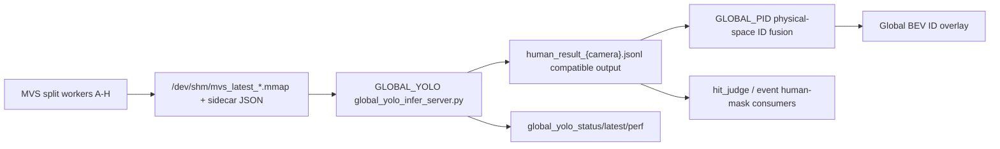

# Global YOLO C+3 Architecture

## 目标

围绕每路 YOLO 稳定达到 42fps、全局 8 路达到 320fps 的目标，本次加入一条可回退的 C+3 链路：

- C：独立 Global YOLO Inference Server，单进程持有一个模型实例，直接读取 8 路 MVS shared memory。
- 3：默认启用 fast/GPU-first 后处理路径，只抽取 boxes/conf/class 和中心点物理坐标，避免每个 shard 重复做 CPU mask/polygon 重处理。
- 兼容：继续输出 `human_result_{camera}.jsonl` 格式，Global PID、BEV ID overlay、hit/event 后续模块不需要立刻重写。

## 新增进程

`global_yolo_infer_server.py`

输入：

- `/dev/shm/mvs_latest_{camera}.mmap`
- `sync_ipc/mvs_latest_{camera}.json`
- `calib_true/field_calib_camera{camera}.json`
- `ids_8cam_fusion_config_627_runtime.json` 拆分后的 MVS runtime config

输出：

- `sync_ipc/global_yolo_status.json`
- `sync_ipc/global_yolo_latest.json`
- `sync_ipc/global_yolo_infer_perf.csv`
- primary 模式：`sync_ipc/human_result_{camera}.jsonl`
- shadow 模式：`sync_ipc/global_yolo_shadow/human_result_{camera}.jsonl`

## 数据流



## 运行模式

1. Legacy mode

   - `global_yolo_enable=false`
   - 继续使用 `YOLO_AC / YOLO_BD / YOLO_EG / YOLO_FH`
   - 当前 profile 默认保持此模式，避免无意改变生产链路。

2. Shadow mode

   - `--global-yolo-enable --global-yolo-shadow-mode`
   - 旧 4-worker 继续跑，Global YOLO 旁路写 `sync_ipc/global_yolo_shadow/`
   - 用于现场对比 `global_yolo_infer_perf.csv` 与原 `yolo_infer_perf_yolo_*.csv`

3. Primary C+3 mode

   - `--global-yolo-enable`，不加 `--global-yolo-shadow-mode`
   - launcher 跳过旧 YOLO shard worker
   - Global YOLO 直接写主 `human_result_{camera}.jsonl`

## 关键参数

- `--global-yolo-microbatch-groups A,C,E,G:B,D,F,H`
  - 默认两组 micro-batch，每组 4 路，目标每组 40Hz，总调度目标 80Hz。
- `--global-yolo-postprocess-backend gpu_fast`
  - 默认 fast path，不解 CPU mask polygon。
- `--global-yolo-footpoint-mode center`
  - 顶部俯视相机默认用 bbox center 做物理投影点。
- `--global-yolo-engine`
  - 后续 TensorRT engine 优先入口；为空时使用 config 里的 model。
- `--global-yolo-include-mask-polygons`
  - 兼容旧 mask polygon 消费链路的保留开关。开启后会增加 CPU 后处理压力。

## 阶段性验证

已完成：

- `python -m py_compile launch_fusion_system.py global_yolo_infer_server.py`
- `global_yolo_infer_server.py --help`
- `launch_fusion_system.py --launch-profile launch_profiles/627_event_overlay_bev.json --help`
- `launch_profiles/627_event_overlay_bev.json` JSON 解析

现场验证建议：

1. 先开 shadow：

   ```bash
   python3 launch_fusion_system.py --launch-profile launch_profiles/627_event_overlay_bev.json --global-yolo-enable --global-yolo-shadow-mode
   ```

2. 对比：

   - `sync_ipc/global_yolo_status.json`
   - `sync_ipc/global_yolo_infer_perf.csv`
   - `sync_ipc/yolo_infer_perf_yolo_*.csv`

3. 达到目标后切 primary：

   ```bash
   python3 launch_fusion_system.py --launch-profile launch_profiles/627_event_overlay_bev.json --global-yolo-enable
   ```

## 风险和后续

- `gpu_fast` 默认不输出 mask polygons；如果 hit/event 某些链路必须使用人体 mask，需要短期保持 legacy 或开启 `--global-yolo-include-mask-polygons`，中期改成 GPU mask/bitmap 总线。
- 真正达到 320fps 的核心仍取决于 TensorRT engine、batch layout、YOLO 输入尺寸和模型版本。当前新链路先解决“4 个模型实例/4 个后处理进程重复开销”的结构问题。
- 如果 AC 类似的异常后处理耗时来自 mask/fragment 逻辑，primary C+3 的 fast path 会绕开该热点；如果来自模型输入或相机图像内容，则需要继续看 `global_yolo_infer_perf.csv` 的 predict_ms。
