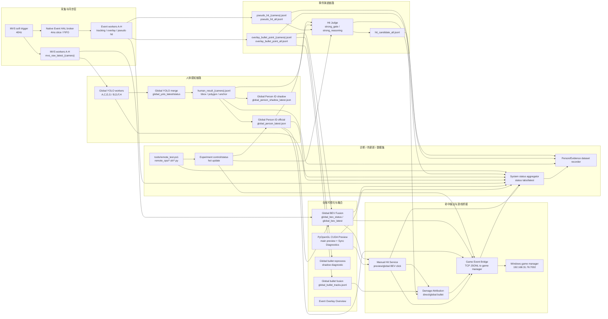
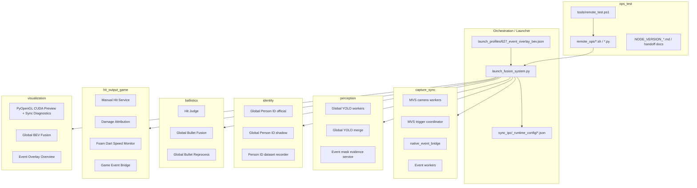

# Modular Architecture Decision Draft - 2026-07-04

本文档先完成决策前 4 步：

1. 全链路数据流图
2. 服务模块边界图
3. 模块输入 / 输出 / 状态 / 控制契约
4. 代码目录拆分建议

当前结论先不要求马上重构。更稳的做法是先把“模块边界”和“数据契约”定下来，再决定搬文件、拆包、抽公共库。

## 0. 当前事实基线

当前系统是 launcher 驱动的多进程架构。

- 业务启动入口：`launch_fusion_system.py`
- 当前启动配置：`launch_profiles/627_event_overlay_bev.json`
- 远端测试入口：`tools/remote_test.ps1`
- 远端复杂逻辑：`remote_ops/`
- 共享运行根：`sync_ipc/`
- 主要状态入口：`sync_ipc/system_status_latest.json`、`status_latest.json`、各服务 `*_status.json`

重要原则：

- 不要只看 profile 推断运行真相。`launch_fusion_system.py` 会生成 runtime config 和实际 child process 命令。
- 高频主链路、诊断旁路、实验热更新链路必须分开描述。
- UI 可以用中文业务分类，但 JSON key 必须保持稳定英文。
- 事件侧和 MVS 相机侧是 living chain documents。后续相关链路每次更新，
  必须同步更新 `EVENT_SIDE_CHAIN.md`、`MVS_CAMERA_CHAIN.md` 及其修订记录。
- 版本收口必须遵守 `CHAIN_DOCUMENTATION_STANDARD.md` 中的链路文档维护规则。

## 1. 全链路数据流图



### 数据流分层结论

| 层级 | 作用 | 当前关键文件 / 服务 | 是否主链路 |
|---|---|---|---|
| 采集同步 | MVS 帧、Event slice、trigger timeline | `mvs_cam_worker`, `mvs_trigger_coordinator`, native HAL broker, event worker | 是 |
| 人体感知 | YOLO bbox/polygon/anchor、Global Person ID | `global_yolo_infer_server.py`, `global_yolo_merge_publisher.py`, `global_person_id_server.py` | 是 |
| 事件弹道 | Event tracking、bullet point、pseudo hit | event worker, `hit_judge_server.py` | 是 |
| 全局可视化 | Global BEV、event layer、bullet overlay | `global_bev_fusion_renderer.py`, `event_overlay_overview_renderer.py`, `pyopengl_cuda_preview_renderer.py` | 主视图 + 旁路 |
| 命中输出 | manual hit、damage attribution、game bridge | `manual_hit_service.py`, `damage_attribution_service.py`, `game_event_bridge_service.py` | 取决于 authority |
| 实验诊断 | 热更新、数据集、状态、远端工具链 | `remote_ops/check_fullsys_run.py`, `person_id_dataset_recorder.py`, status window | 旁路 |

## 2. 服务模块边界图



### 边界原则

| 模块 | 拥有权 | 不应承担的职责 |
|---|---|---|
| `launcher` | 进程编排、profile 合并、runtime config、日志归档 | 业务算法本身 |
| `capture_sync` | 硬件输入、trigger、shm/FIFO、同步事实 | 命中判定、游戏输出 |
| `perception` | 人体检测、polygon、mask evidence | 全局 ID 稳定策略、最终命中 |
| `identity` | 全局人员 ID、坐标、显示 ID 映射 | 弹道真实性判定、伤害来源判定 |
| `ballistics` | 事件弹道、pseudo hit、final candidate | 游戏协议、UI 控制 |
| `hit_output_game` | 命中事件权威输出、人工命中、游戏桥接 | 原始感知、渲染 |
| `visualization` | 预览、BEV、状态窗口、运营显示 | 高风险业务判定默认权威 |
| `ops_test` | 远端测试、热更新、数据集、版本收口 | 高频主链路处理 |

## 3. 模块输入 / 输出 / 状态 / 控制契约

### 3.1 采集同步模块

| 模块 | 输入 | 输出 | 状态 | 控制 |
|---|---|---|---|---|
| MVS trigger coordinator | profile trigger fps | `global_trigger_timeline.jsonl`, trigger signal | launcher/status logs | profile args |
| MVS camera workers | camera devices, trigger | `/dev/shm/mvs_raw_latest_{camera}` | MVS status, launcher logs | runtime config |
| Native Event HAL broker | Event camera HAL | `sync_ipc/native_hal_fifos/*` | `event_native_hal_broker_stats.jsonl` | profile args |
| Event workers | HAL FIFO/event iterator, mask evidence, sync map | `overlay_bullet_point_*.jsonl`, `pseudo_hit_*.jsonl`, overlay shm | event worker status, event loop profile | event runtime config |

关键风险：

- 这里是高频主链路，不能让状态窗口、数据集录制、长 JSONL tail 阻塞它。
- 事件相机启动、USB、HAL broker、event worker 要分层看，不要把 overlay 有数据误判成 tracking 一定正常。

### 3.2 人体感知模块

| 模块 | 输入 | 输出 | 状态 | 控制 |
|---|---|---|---|---|
| Global YOLO workers | MVS shm frames | `human_result_{camera}.jsonl`, worker latest/status | `global_yolo_worker_*_status.json` | profile + runtime config |
| Global YOLO merge | worker latest/status | `global_yolo_latest.json`, `global_yolo_status.json` | canonical status | profile |
| Event mask evidence | `human_result_{camera}.jsonl` | `event_mask_evidence_{camera}.json` | `event_mask_evidence_status.json` | `event_mask_control.json` |

关键风险：

- bbox、polygon、mask、anchor、foot_pixel 是不同语义，必须用 contract 固化。
- YOLO 后数据用于回放/ID 优化可以轻量记录，重型 polygon/mask 数据只在状态窗口录制时开启。

### 3.3 全局人员 ID 模块

| 模块 | 输入 | 输出 | 状态 | 控制 |
|---|---|---|---|---|
| Global Person ID official | `human_result_{camera}.jsonl` | `global_person_tracks.jsonl`, `global_person_latest.json` | `global_person_status.json` | `global_person_id_control.json` |
| Global Person ID shadow | same as official | `global_person_shadow_*.json/jsonl` | `global_person_shadow_status.json` | `global_person_shadow_control.json` |
| Person ID dataset recorder | YOLO-after-recognition rows, annotations | dataset folders, manifests | `person_id_dataset_status.json` | `person_id_dataset_control.json` |

关键风险：

- `global_id`、`display_slot_id`、`display_player_id` 不能混用。
- Global BEV 显示 ID 是运营可见合同，Game Bridge 使用时必须记录来源。

### 3.4 事件弹道与命中候选模块

| 模块 | 输入 | 输出 | 状态 | 控制 |
|---|---|---|---|---|
| Event worker tracker | event slices, sync, optional mask evidence | bullet point/event JSONL, overlay shm | per-camera event status | event runtime config |
| Hit Judge | pseudo hit, bullet points, human/mask evidence | `hit_candidate_{camera}.jsonl`, `hit_candidate_all.jsonl` | hit judge status/debug JSONL | `hit_judge_control.json` |
| Global Bullet Fusion | `overlay_bullet_point_all.jsonl` | `global_bullet_tracks.jsonl`, latest/status | `global_bullet_fusion_status.json` | profile/control |
| Global Bullet Reprocess | recorded bullet/person/hit evidence | diagnostic run outputs | `global_bullet_reprocess_status.json` | profile |

关键风险：

- 命中候选优化和伤害来源归因是两个目标，不能重新绑成一个 final gate。
- 强门控和强推理必须有明确 `final_hit_authority`。
- Global bullet reconstruction 可以做 attribution evidence，不应作为真实命中成立的必要条件。

### 3.5 命中输出与游戏桥接模块

| 模块 | 输入 | 输出 | 状态 | 控制 |
|---|---|---|---|---|
| Manual Hit Service | preview/Global BEV click command | `damage_attribution_events.jsonl`, `manual_hit_latest.json` | `manual_hit_status.json` | `manual_hit_control.json` |
| Damage Attribution | hit candidates, global bullet tracks, person latest | `damage_attribution_events.jsonl` | `damage_attribution_status.json` | profile/control |
| Foam Dart Speed Monitor | global bullet tracks | speed diagnostics/events | speed status | profile/control |
| Game Event Bridge | `damage_attribution_events.jsonl`, person/latest display evidence | TCP JSONL to game manager, `game_event_bridge_sent.jsonl` | `game_event_bridge_status.json` | `game_event_bridge_control.json` |

关键风险：

- 当前 manual-only 模式会压制自动命中输出，这是业务选择，不是算法修复。
- 虚拟 source ID 99 是临时业务规则，未来开启真实 shooter attribution 时必须迁移 contract。

### 3.6 可视化、状态与运维模块

| 模块 | 输入 | 输出 | 状态 | 控制 |
|---|---|---|---|---|
| PyOpenGL CUDA Preview | MVS shm, hit/human/bullet/event overlay | main preview, Sync Diagnostics | `status_latest.json`, `status_tabs.jsonl` | multiple `*_control.json` |
| Global BEV Fusion | MVS shm, global person, event bullet/layer | BEV window, shm, sidecar JSON | `global_bev_status.json` | `global_bev_control.json` |
| Event Overlay Overview | event overlay shm | overview window | `event_overlay_overview_status.json` | `event_overlay_overview_control.json` |
| Remote tools | profile, labels, hot update args | start/stop/monitor/fetch/summary | `test_run_status_latest.json` | CLI/env args |

关键风险：

- 状态窗口可以控制链路，但不应该成为高频数据处理依赖。
- 远端测试必须继续优先走 `tools/remote_test.ps1`，避免 PowerShell/SSH 变量剥离和编码问题。

## 4. 代码目录拆分建议

### 4.1 推荐目标目录

建议最终目标不是一次性大搬家，而是先建立模块目录和 compatibility wrapper。

```text
meta-reality-game-engine/
  launcher/
    launch_fusion_system.py
    profiles/
    runtime_config/

  capture_sync/
    mvs/
    event/
    native_hal/
    sync_contracts.py

  perception/
    yolo/
    mask_evidence/
    anchors/

  identity/
    global_person_id/
    dataset_recorder/
    filters/

  ballistics/
    event_tracking/
    hit_judge/
    global_bullet_fusion/
    reprocess/

  hit_output/
    manual_hit/
    damage_attribution/
    speed_monitor/
    game_bridge/

  visualization/
    preview/
    global_bev/
    event_overview/
    status_window/

  contracts/
    ids.py
    time_sync.py
    coordinates.py
    hit_events.py
    status_schema.py
    control_schema.py

  ops/
    remote_ops/
    tools/
    dev_check/

  docs/
    architecture/
    node_versions/
    handoff/

  experiments/
    hit_judge/
    global_id/
```

### 4.2 不建议立即做的拆分

| 不建议 | 原因 |
|---|---|
| 立即移动所有 Python 文件 | launcher 和远端脚本当前依赖大量固定文件名，容易引入启动事故 |
| 先拆 UI | 状态窗口现在承担大量 control/status glue，先拆容易丢 key |
| 把自动命中和人工命中合并 | 会污染 authority 模式，影响测试解释 |
| 把 Global BEV display ID 当作 runtime global ID | 会埋下 ID 语义错误 |

### 4.3 建议的低风险执行路线

第一阶段：文档和 contracts，不移动核心文件。

- 新增 `contracts/`，只放小型纯函数和 schema 常量。
- 给 ID、坐标、时间、hit event、status/control key 建稳定 contract。
- 给现有服务加少量引用，不改服务位置。

第二阶段：旁路服务先模块化。

- 先移动或包装：
  - `manual_hit_service.py`
  - `game_event_bridge_service.py`
  - `damage_attribution_service.py`
  - `person_id_dataset_recorder.py`
  - `global_bullet_reprocess_service.py`
- 保留根目录 wrapper，避免 launcher 一次性大改。

第三阶段：可视化和状态层模块化。

- 拆 `pyopengl_cuda_preview_renderer.py` 的状态窗口、控制页、outbound hit window。
- Global BEV 渲染核心和 operator click/control 分开。
- Event Overlay Overview 独立归入 visualization。

第四阶段：高频主链路最后拆。

- Event worker、Hit Judge、Global YOLO、Global Person ID 最后动。
- 每拆一个主链路服务，都必须配套：
  - `dev_check`
  - 5-10 分钟 smoke
  - 状态 key 对齐检查
  - 性能指标对比

## 5. 最终决策需要回答的问题

| 决策问题 | 推荐默认 | 需要用户判断 |
|---|---|---|
| 是否马上大规模搬目录 | 否 | 先 contract，再 wrapper，再迁移 |
| 命中输出权威 | 当前 manual-only 可用于现场人工确认 | 自动命中测试前必须切回相应 authority |
| Global ID 优化放哪里 | `identity/` | 是否先建立 official/shadow 对比平台 |
| 事件弹道重建是否参与 final hit | 不作为必要条件 | 只用于 attribution evidence 更稳 |
| 状态窗口是否继续承担控制 | 可以，但归 `visualization/status_window` | 控制 schema 应从 UI 中抽出来 |
| 回放系统目标 | Evidence Replay 优先 | 不验证 YOLO/Event 原始感知性能 |

## 6. 近期可执行计划

1. 建立 `contracts/` 草案：
   - `ids.py`
   - `coordinates.py`
   - `hit_events.py`
   - `status_keys.py`
   - `control_keys.py`
2. 给 Manual Hit / Game Bridge / Damage Attribution 先接入 shared hit event contract。
3. 给 Global Person ID / Global BEV 显示 ID 建 ID 语义 contract。
4. 把状态窗口 key 检查工具纳入 `tools/dev_check.ps1`。
5. 为每个服务补一页短 contract 文档：
   - 输入
   - 输出
   - 状态
   - 控制
   - 运行频率
   - 是否主链路
   - 是否可热更新

## 7. 当前推荐架构方向

推荐采用：

- 业务域分层作为代码目录目标。
- 数据流图作为排障依据。
- 主链路 / 旁路 / 实验链路隔离作为治理原则。
- `contracts/` 作为第一批真实落地模块。
- wrapper 兼容旧入口，避免 launcher 和远端工具链一次性大改。

一句话：先定契约，再动目录；先迁旁路，再碰主链路。
