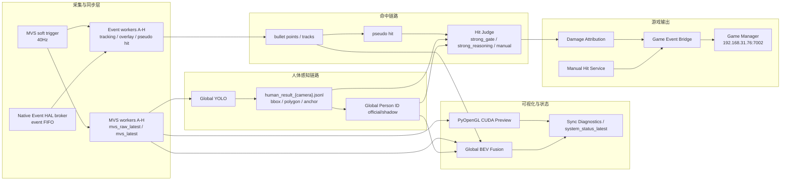

# 模块化架构决策草案

更新时间：2026-07-09

本文档是 `MODULAR_ARCHITECTURE_DECISION_DRAFT_20260704.md` 的中文可读版。目标不是马上重构，而是先把模块边界、数据契约、控制面和测试方法说清楚，为后续拆包和热更新做准备。

## 当前事实基线

系统是 launcher 驱动的多进程架构，不是单一程序。

主要入口：

- 业务启动入口：`launch_fusion_system.py`
- 当前 profile：`launch_profiles/627_event_overlay_bev.json`
- 远端测试入口：`tools/remote_test.ps1`
- 远端复杂逻辑：`remote_ops/`
- 运行时共享区：`sync_ipc/`
- 主要状态入口：`sync_ipc/system_status_latest.json`、`status_latest.json`、各服务 `*_status.json`

重要原则：

- 不要只看 profile 推断真实运行状态。launcher 会生成 runtime config 和实际 child process args。
- 高频主链路、诊断旁路、实验热更新链路必须分开描述。
- UI 可以用中文业务分类，JSON key 必须保持稳定英文。
- 事件侧和 MVS 侧是 living chain documents，相关链路每次更新必须同步更新 `EVENT_SIDE_CHAIN.md`、`MVS_CAMERA_CHAIN.md` 及其中文伴随文档。

## 全链路数据流



## 推荐模块边界

| 模块 | 负责什么 | 不负责什么 |
| --- | --- | --- |
| MVS Capture | 40Hz soft trigger、可见光帧、MVS metadata | 人体识别、命中判断 |
| Event Capture/Worker | 事件取流、切片、轨迹、overlay、pseudo hit evidence | 最终命中 authority、游戏输出 |
| Global YOLO | bbox、polygon、anchor、local_xy、人员 evidence | 跨相机最终 ID 决策 |
| Global Person ID | 跨相机 ID 融合、轨迹稳定、位置更新 | 伤害来源推断、hit 成立 |
| Hit Judge | strong_gate / strong_reasoning / final hit | 原始感知性能验证 |
| Manual Hit Service | 人工点击命中发布 | 自动命中判定 |
| Global BEV | 可视化融合、事件层叠加、ID 显示 | 命中 authority |
| Game Event Bridge | presence/hit TCP JSONL 输出 | 玩家身份、HP、战绩、手表绑定 |
| Sync Diagnostics | 状态查看、热切换控制 | 修改业务真相 |

## 控制面原则

控制文件应集中在 `sync_ipc/*control*.json`，状态文件应集中在 `sync_ipc/*status*.json`。

热更新只能改实验参数和显示/开关，不应隐式改变主链路 authority。涉及以下内容必须显式显示在状态窗口：

- `final_hit_authority`
- `strong_gate_enabled`
- `strong_reasoning_enabled`
- `manual_hit_enabled`
- `human_noise_filter_mode`
- `global_person_target`
- `event_layer_enable`
- `event_layer_dilate_px`
- recording/dataset state

## 代码目录拆分建议

短期不强制搬文件，先按模块建立边界：

```text
capture/
  mvs/
  event/
perception/
  global_yolo/
  global_person_id/
hit/
  hit_judge/
  manual_hit/
visualization/
  preview/
  global_bev/
bridge/
  game_event_bridge/
ops/
  remote_ops/
  tools/
docs/
  living_chains/
  node_versions/
```

当前阶段更重要的是统一数据契约和文档，而不是立刻大规模移动文件。

## 风险

- 模块化如果先搬文件、后定契约，会让调试成本上升。
- 热更新如果不区分 official/shadow，容易污染验收结果。
- 状态窗口如果显示旧 key，会误导现场判断。
- 远端运行版本如果不记录 commit/profile/run label，后续无法复盘。

## 推荐推进顺序

1. 继续维护 living docs 和中文伴随文档。
2. 把状态 key、control key 做成稳定契约。
3. 对非主链路功能优先独立进程化。
4. 引入统一 experiment/run metadata。
5. 再考虑代码目录拆分。

