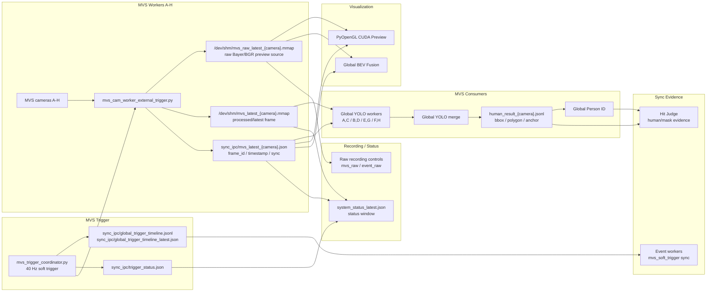

# MVS Camera Chain

Last updated: 2026-07-09

This is the living document for the visible-light MVS camera side. It must be
updated whenever trigger timing, camera workers, MVS shared memory, frame
metadata, YOLO consumption, Preview, Global BEV, recording, or related status
keys change.

## Purpose And Authority

The MVS chain owns visible-light capture, the 40 Hz software trigger timeline,
and the shared frame source consumed by YOLO, Preview, Global BEV, Global Person
ID, hit evidence, and datasets.

The MVS soft trigger is the synchronization baseline for event-to-MVS alignment.
Per-camera exposure duration must be handled as a correction/metadata issue, not
as the global sync baseline unless that rule is explicitly approved and
documented.

## Current Production Path

```text
MVS trigger coordinator
-> 8 MVS camera workers A-H
-> /dev/shm/mvs_raw_latest_{camera}.mmap
-> /dev/shm/mvs_latest_{camera}.mmap and sidecar metadata
-> Global YOLO / Preview / Global BEV / Hit Judge evidence / dataset recorders
```

The current launch profile is `launch_profiles/627_event_overlay_bev.json`.
The production startup entry is `launch_fusion_system.py --launch-profile
launch_profiles/627_event_overlay_bev.json`.

## Data Flow



## Startup And Runtime Ownership

Current split-worker mode:

| Key | Current default |
| --- | --- |
| `mvs_split_workers` | `true` |
| `mvs_trigger_fps` | `40.0` |
| `mvs_trigger_start_delay_ms` | `1000` |
| `mvs_worker_cpus` | `2-9` |
| `mvs_coordinator_cpu` | `1` |
| `mvs_yolo_shard_workers_enable` | `true` |
| `mvs_yolo_shards` | `A,C:B,D:E,G:F,H` |

In split-worker mode, each `mvs_cam_worker_external_trigger.py` owns its camera
SDK handle and publishes shared memory. The legacy MVS/YOLO process must not
open the cameras directly; it reads frames from shared memory instead.

`launch_fusion_system.py` patches the generated runtime MVS config so
`external_mvs_shm_enable=true` and `mvs_frame_pub_enable=true`.

## Shared Memory And Metadata

Main shared memory and sidecar outputs:

| Output | Meaning | Main consumers |
| --- | --- | --- |
| `/dev/shm/mvs_raw_latest_{camera}.mmap` | Raw preview frame stream | PyOpenGL CUDA Preview, Global BEV |
| `/dev/shm/mvs_latest_{camera}.mmap` | Latest MVS frame stream | YOLO, status, compatibility consumers |
| `sync_ipc/mvs_latest_{camera}.json` | Frame sidecar metadata | YOLO, Preview, BEV, status |
| `sync_ipc/mvs_frame_audit_{camera}.csv` | Optional frame audit | Diagnostics |
| `sync_ipc/global_trigger_timeline.jsonl` | Trigger timeline | Event sync, diagnostics |
| `sync_ipc/global_trigger_timeline_latest.json` | Latest trigger tick | Status and sync diagnostics |
| `sync_ipc/trigger_status.json` | Trigger coordinator state | Status window |

The shared memory writer preserves `frame_id` semantics so downstream display
and human-result overlays can match the same frame instead of mixing a new
background with old person metadata.

## Raw Recording Contract

The status window writes one operator command file for both sensor families:

```text
sync_ipc/record_control.json
targets = ["event_raw", "mvs_raw"] for Record All
```

In current production `mvs_split_workers=true`, the process that owns each MVS
camera frame is `mvs_cam_worker_external_trigger.py`, not the legacy monolithic
MVS/YOLO process. Therefore MVS RAW recording must be handled inside each split
worker after a valid frame is read and before or after shared-memory publish.

Per-camera MVS recording status is:

```text
sync_ipc/record_status_{camera}.json
```

The status window treats these files as the authoritative split-worker MVS
recording state. Each file must refresh while idle and while recording, and must
include at least `recording`, `session_id`, `record_root`, `session_dir`,
`writer_alive`, `writer_open`, `csv_open`, `queue_size`, `queue_limit`,
`written_frames`, `dropped_frames`, `video_path`, and `csv_path`.

The legacy `record_status.json` path remains compatible for non-split or older
MVS modes, but it is not sufficient evidence that split-worker MVS recording is
working.

## Consumer Contracts

| Consumer | Input | Contract |
| --- | --- | --- |
| Global YOLO workers | MVS shm + sidecar metadata | Read only assigned shard cameras; publish `human_result_{camera}.jsonl` |
| Global YOLO merge | Worker latest/status | Publish canonical `global_yolo_latest.json` and `global_yolo_status.json` |
| Global Person ID | `human_result_{camera}.jsonl` | Build global tracks and display/runtime ID evidence |
| PyOpenGL CUDA Preview | raw MVS shm + person/bullet/event overlays | Operator preview; status window; manual hit click target source |
| Global BEV Fusion | raw MVS shm + calibration + global person/event overlays | Field-coordinate view and display ID layer |
| Event workers | `global_trigger_timeline.jsonl` | Map event sync to MVS soft trigger |
| Hit Judge | human_result/global person evidence | Bind bullet evidence to human/person evidence |
| Dataset recorders | MVS/person/evidence streams | Record replayable evidence under operator control |

## Global BEV Delayed Alignment

V24-C3 introduces a metadata-only `DelayedAlignmentWorker` inside the Global BEV
process.  The worker builds a shadow `alignment` bundle from MVS raw-ring slot
metadata and Event sparse-history metadata.  It does not read MVS image payloads,
does not read sparse point payloads, and does not touch OpenGL.

The bundle uses the MVS soft-trigger timeline as the presentation baseline:

```text
latest_common_mvs_sync_id - global_bev_alignment_delay_ms
-> alignment.target_sync_id
-> MVS background selection diagnostics
-> Event sparse selection diagnostics
```

The current default is shadow-only.  OpenGL texture upload, sparse-point upload,
FBO rendering, and PBO readback remain owned by the Global BEV GUI thread.  This
keeps Qt/OpenGL context ownership unchanged while moving the CPU preparation
contract toward a single presentation target.

New status fields:

| Field | Meaning |
| --- | --- |
| `global_bev_status.json.alignment` | Shadow delayed-presentation bundle |
| `alignment.mvs.per_camera.*.state` | `synced`, `hold_warn`, `missing_history`, `metadata_outlier`, or reader error |
| `alignment.event_layer.per_camera.*.state` | Event sparse selection state for the same target |
| `alignment.compare_to_active` | Comparison between current active GUI selection and shadow bundle |

New profile/control keys:

| Key | Default |
| --- | --- |
| `global_bev_alignment_mode` | `shadow` |
| `global_bev_alignment_delay_ms` | `820` |
| `global_bev_alignment_shadow_interval_ms` | `250` |
| `global_bev_alignment_hold_warn_ms` | `150` |

`alignment_mode=active` is currently gated and downgraded to `shadow` until the
remote shadow run proves stable.  A non-synced MVS frame should be reported as
`hold_warn` or `missing_history`, not silently confused with an Event-layer
failure.

## Global BEV MVS Texture Upload Budget

V24-C5 adds a display-only upload guard inside the Global BEV GUI thread.  The
guard does not change MVS capture, trigger timing, shared memory publishing,
YOLO input, Preview input, Hit Judge evidence, or the MVS sync baseline.

The texture upload identity is now:

```text
camera + tick_id + frame_id + slot + width + height + pixel_format
```

When the selected MVS frame has the same upload identity as the texture already
resident in OpenGL, Global BEV skips the upload and reuses the current texture.
When the per-paint MVS upload budget is exhausted, Global BEV keeps the previous
texture for that camera instead of blocking the GUI thread.  The first texture
for a camera is still forced through so a camera does not stay black forever.

New profile/control keys:

| Key | Default | Meaning |
| --- | --- | --- |
| `global_bev_mvs_upload_budget_enable` / `mvs_upload_budget_enable` | `true` | Enable the GUI-thread upload budget guard |
| `global_bev_mvs_upload_budget_ms` / `mvs_upload_budget_ms` | `10` | Per-paint MVS texture upload budget |

New status fields:

| Field | Meaning |
| --- | --- |
| `global_bev_status.json.mvs_texture_upload` | Per-paint MVS upload summary |
| `mvs_texture_upload.uploaded_cams` | Cameras uploaded this paint tick |
| `mvs_texture_upload.duplicate_skip_cams` | Cameras skipped because the upload key already matches |
| `mvs_texture_upload.held_by_budget_cams` | Cameras showing the previous texture because upload budget was exhausted |
| `texture_upload.{camera}.upload_key` | Per-camera effective upload identity |
| `alignment.performance.mvs_upload_*` | Compact performance fields mirrored into the alignment diagnostic summary |

If `held_by_budget_cams` grows continuously and `hold_age_ms` approaches
`global_bev_frame_hold_ms`, treat it as a display overload symptom.  Do not
diagnose it as MVS capture loss unless the MVS sidecar/frame-id freshness also
stops advancing.

## V25-C MVS File Frame Broker Prototype

V25-C adds a standalone prototype at `remote_ops/mvs_file_frame_broker.py`.
It reads recorded `raw_mvs.avi + frame_index.csv` datasets and writes back into
the existing MVS contracts:

| Output | Current prototype behavior |
| --- | --- |
| `/dev/shm/mvs_latest_{camera}.mmap` | processed BGR frame via `MvsSharedFramePublisher` |
| `sync_ipc/mvs_latest_{camera}.json` | sidecar with `mvs_source_mode=file_replay`, `soft_trigger_mode=mvs_file_frame_broker`, `program_sync_index`, `sync_index`, `frame_id_local`, `mvs_frame_num`, `shape`, and `shm_name` |
| `/dev/shm/mvs_raw_latest_{camera}.mmap` | compatibility raw-preview output; currently grayscale payload marked as Bayer8 so existing Preview/BEV raw readers can open it |
| `sync_ipc/mvs_file_frame_broker_status.json` | broker status |
| `sync_ipc/mvs_file_frame_broker_stats.jsonl` | broker stats history |

Standalone validation command:

```powershell
powershell.exe -NoProfile -ExecutionPolicy Bypass -File tools\remote_test.ps1 `
  -Action smoke-mvs-broker `
  -DatasetDir recordings/20260708_181936_full `
  -MaxFrames 160
```

Current validation result:

- `recordings/20260708_181936_full` passed the standalone smoke: A-H each
  published 20 frames, with 0 broker errors.
- `recordings/v25b_exttrig_smoke_20260709_154731_display1_keepstdin_full`
  is not suitable for formal MVS replay acceptance because camera H contains
  only 1 video frame and 1 `frame_index.csv` data row.

This is not yet launcher/profile integrated. Production startup remains
`mvs_source_mode=live_camera`. When `mvs_source_mode=file_replay` is wired into
`multi_camera_launcher.py`, the live split MVS workers must be disabled so the
file broker is the only writer for the MVS shm/sidecar contracts.

## YOLO Shard Contract

Current production shard layout:

```text
YOLO_AC: A,C
YOLO_BD: B,D
YOLO_EG: E,G
YOLO_FH: F,H
```

Each worker must only read its assigned `/dev/shm/mvs_*` cameras. Do not infer
the active shard layout from an edited profile alone; verify the launcher
generated runtime config and child process arguments.

## Synchronization Contract

The MVS soft trigger timeline is the root sync source:

```text
mvs_trigger_coordinator
-> global_trigger_timeline.jsonl
-> Event worker event_sync_source=mvs_soft_trigger
-> Hit Judge human/event evidence alignment
```

Camera exposure time may differ per camera. This must be represented as
metadata/correction for frame timing and geometric evidence, not as a replacement
for the root sync baseline.

## Status And Control Files

Primary status:

| File | Meaning |
| --- | --- |
| `sync_ipc/trigger_status.json` | Trigger coordinator state |
| `sync_ipc/global_trigger_timeline_latest.json` | Latest trigger tick |
| `sync_ipc/mvs_latest_{camera}.json` | Per-camera frame metadata |
| `sync_ipc/global_yolo_worker_*_status.json` | YOLO worker state |
| `sync_ipc/global_yolo_status.json` | Merged YOLO state |
| `sync_ipc/global_person_status.json` | Global Person ID state |
| `sync_ipc/global_bev_status.json` | BEV MVS input freshness and render state |
| `sync_ipc/system_status_latest.json` | Aggregated status-window source |

Primary controls:

| Control | Meaning |
| --- | --- |
| Launch profile MVS keys | Startup trigger, split workers, CPUs, shards |
| Runtime MVS config | Effective child-process camera and shm behavior |
| Raw recording control | Operator-controlled MVS RAW recording |
| Global YOLO controls | Batch/anchor/polygon behavior when exposed |
| Global BEV control | BEV display and overlay behavior |

## Health Checks

Startup checks:

1. Trigger coordinator is running and `trigger_status.json` is fresh.
2. `global_trigger_timeline_latest.json` is fresh.
3. All required MVS workers are alive.
4. `/dev/shm/mvs_raw_latest_{camera}.mmap` and `/dev/shm/mvs_latest_{camera}.mmap`
   are fresh.
5. Each camera `frame_id` increments.
6. YOLO workers read only assigned cameras.
7. Preview and Global BEV read current shm names, not stale files from a prior
   run.

Normal performance expectations:

| Metric | Normal | Warning | Critical |
| --- | --- | --- | --- |
| Trigger FPS | about 40 | below 38 | below 35 |
| Frame age | below 100 ms | above 250 ms | above 1000 ms |
| YOLO per-camera FPS | about 40 or higher | below 38 | below 35 |
| Global BEV display FPS | about 30 | below 25 | below 20 |

## Common Failure Interpretations

| Symptom | Likely layer | First check |
| --- | --- | --- |
| Preview black but status says running | Preview/GPU or stale shm | raw shm age, Preview backend, `cuda_pbo_ready` |
| One camera frozen | MVS worker/camera | frame_id, sidecar age, worker log |
| Record All only produces Event RAW | MVS split worker recording | `record_control.json` targets, `record_status_{camera}.json`, MVS worker logs |
| Event sync degraded | Trigger mapping | `global_trigger_timeline`, `event_trigger_map_{camera}.jsonl` |
| YOLO FPS drops | YOLO shard/batch/GPU | worker perf CSV, partial batch, postprocess mode |
| Global ID jumps in handoff area | ID fusion/calibration | anchor mode, camera handoff gate, calibration |
| BEV image stale/flicker | BEV input copy | frame hold, shm age, copy retries |

## V25-D/E Full Replay Sync Contract

In MVS file replay mode, `remote_ops/mvs_file_frame_broker.py` writes
`sync_ipc/sync_start.flag` and `sync_ipc/sync_start_latest.json` when the first
A-H aligned batch is published.

The file is the minimum handoff contract for Event workers in full replay:
`source_mode=mvs_file_replay`, `tick_id_start`, and
`program_sync_index_start` tell downstream code that the MVS trigger baseline is
coming from replay rather than the live soft-trigger coordinator.

The guarded `event_sync_direct_index_map=true` path is diagnostic only. It lets
Event workers map local Event trigger index to
`tick_id_start + event_local_sync_index` when
`sync_start.flag.source_mode=mvs_file_replay`, but it is not accepted as the
formal sync proof for historical datasets.

Formal full Event+MVS replay datasets must store the original common sync
anchor, for example per-camera `event_trigger_zero_to_mvs_sync` or recorded
`event_trigger_map_{camera}.jsonl`. MVS `frame_index.csv` plus Event RAW
External Trigger proves both streams exist, but it does not by itself prove
strict BEV Event/MVS alignment during replay.

V25-E validation note:

- Full replay run `v25e_report_full_replay_recheck_20260709_204938_display1_keepstdin`
  consumed dataset
  `recordings/v25e_full_record_anchor_20260709_200415_display1_keepstdin_full`.
- MVS file broker published all eight cameras with
  `total_frames_published=44016` and `error_count=0`.
- Global YOLO consumed replay MVS frames at about `241.6` published FPS total,
  with input alignment full-batch ratio `0.9998`.
- Event/MVS visual acceptance used `event_display_sync`, not producer-head
  status; the displayed event bundle was exact on the BEV target.

## Revision Log

| Date | Version or node | Changed chain | Change summary | Contract impact | Validation | Risks |
| --- | --- | --- | --- | --- | --- | --- |
| 2026-07-09 | V25-A/D/E replay productization | MVS file replay / source-mode evidence | Added dataset resolved manifest output, universal `--dataset-dir`, and launcher-written `source_mode_effective.json` so MVS replay runs can prove whether live MVS workers or the file broker actually owned the source. | `mvs_source_mode=file_replay` remains startup-selected and mutually exclusive with live MVS camera writers. New archived evidence files: `sync_ipc/source_mode_effective.json` and `sync_ipc/v25_resolved_manifest_latest.json`. | Local syntax validation passed. Remote `v25-replay-control` live action wrote control/status/command files on the test host. Full replay smoke still pending for this productization patch. | Reports must prefer `source_mode_effective.json` over profile intent. A dataset may be usable for startup but degraded for strict Event/MVS sync. |
| 2026-07-09 | V25-E full replay validation | MVS file replay / Event full replay handoff | Validated MVS File Frame Broker as part of startup-selected full Event+MVS replay using a dataset with replay sync anchors. | Production live camera mode unchanged. `mvs_source_mode=file_replay` remains startup-selected and mutually exclusive with live MVS writers. | Remote run `v25e_report_full_replay_recheck_20260709_204938_display1_keepstdin`: runtime OK, MVS broker published 8/8 cameras, `total_frames_published=44016`, `error_count=0`, Global YOLO published about 241.6 fps total, Event display bundle exact on BEV target. | File replay currently uses zero exposure window metadata (`mvs_file_replay_zero_window`), acceptable for replay smoke but should be revisited if future offline tests need exposure-duration simulation. |
| 2026-07-09 | V25-D/E full replay sync boundary | MVS file replay / Event replay sync handoff | Documented that MVS file replay now publishes `sync_start.flag` on the first aligned batch and that direct-index Event mapping is diagnostic only. | Full replay acceptance now requires a recorded Event-trigger-to-MVS-sync anchor in the dataset manifest or bundle. Startup/consumption alone is not strict sync acceptance. | Remote smoke confirmed MVS replay and Event RAW loop startup, but BEV Event/MVS sync still fails on the historical split dataset because the common anchor is missing. | Do not mark full replay strict sync as passed from `frame_index.csv` and External Trigger presence alone. |
| 2026-07-09 | V25-C planning record | MVS camera side / replay source mode | Added V25 task-tree plan for a future MVS File Frame Broker that will feed recorded visible-light frames into the existing MVS shm/sidecar contract. | No current production MVS capture change. The default remains live camera capture; `mvs_source_mode=file_replay` is a planned startup-selected mode and must be mutually exclusive with live MVS writers. | Planning/documentation only. Implementation and remote replay smoke are pending under `V25_MAIN_TASK_TREE_20260709.md`. | Do not claim MVS replay acceptance until Global YOLO, Preview, Global BEV, and Global Person ID have consumed replay shm successfully from a manifest-selected dataset. |
| 2026-07-08 | MVS split-worker RAW record fix | MVS camera side / status window recording | Split MVS workers now subscribe to `sync_ipc/record_control.json` through the existing non-blocking `MvsRawRecorderManager`, write frames from the real split-worker read loop, and publish per-camera `record_status_{camera}.json`. Per-camera recording manifests avoid overwriting each other in the shared session directory. | Status-window Record All keeps the same `targets=["event_raw","mvs_raw"]` contract. In split mode, `record_status_{camera}.json` is authoritative; legacy `record_status.json` is compatibility only. | Local `py_compile` passed for `mvs_cam_worker_external_trigger.py` and `hik_rgb_yolo_seg_multicam_same_model_stableid_v5.py`. Full local smoke could not run in the bundled Python because `cv2` is not installed; remote MVS recording validation is still required. | Recording MVS AVI is intentionally disk/CPU heavy while enabled. Watch `dropped_frames`, queue size, and disk throughput during Record All tests. |
| 2026-07-07 | V24-C5 MVS upload budget guard | MVS camera side / Global BEV consumer | Global BEV MVS texture upload now uses `tick_id+frame_id+slot+shape+pixel_format` as the upload identity, skips duplicate uploads, and holds the previous texture when the per-paint upload budget is exhausted. | Display-only Global BEV change. New profile/control keys `global_bev_mvs_upload_budget_enable` and `global_bev_mvs_upload_budget_ms`; new status key `global_bev_status.json.mvs_texture_upload`. MVS capture, trigger baseline, YOLO, Preview, Hit Judge, and Event sync contracts are unchanged. | Local `py_compile` passed for Global BEV, launcher, status window, and check script. Launcher `--help` exposes the new keys. Remote smoke `v24c6_bev_upload_budget_r2_20260707_180758_display1_keepstdin` reached runtime OK, `status_key_ok=true`, `global_bev_from_this_run=true`, and reported `mvs_texture_upload.elapsed_ms=8.085`, `uploaded_cam_count=7`, `held_by_budget_cam_count=0`. | A too-strict budget can display an older MVS texture for up to `global_bev_frame_hold_ms`; status must be checked before blaming camera capture. First-frame upload bypasses the budget to avoid black cameras. |
| 2026-07-07 | V24-C4 preflight and alignment diagnostics | MVS camera side / Global BEV consumer / remote test workflow | Remote smoke/stress tests now run a preflight cleanup before launch, preventing stale desktop/latest processes from holding MVS camera handles or writing stale BEV status. Global BEV alignment status now exposes per-camera MVS offset ticks/ms, ring history span, target position, snapshot retry count, and GUI/worker p95 timings. | No change to MVS capture contract or trigger baseline. New run artifacts: `preflight_clean_summary.json`, `preflight_clean.log`, and `status_freshness` in the test report. | Local `py_compile` passed for touched Python files and profile JSON parsed. Remote smoke `v24c4_preflight_alignment_diag_20260707_170807_display1_keepstdin` reached runtime OK; MVS alignment reported 8/8 synced, 0 missing-history, 0 metadata-outlier, and all cameras had 64 valid raw-ring slots. | Preflight must be disabled only for intentional coexistence tests. If a camera remains `missing_history`, investigate raw-ring depth, per-camera tick metadata, or trigger timeline before blaming Event sparse overlay. |
| 2026-07-04 | Documentation standard node | MVS camera side | Created living MVS chain document from current code/profile and existing monitoring docs | Establishes required MVS chain contract and revision log | Code/profile inspection only in this turn | Must be refreshed after next remote run if runtime config differs |
| 2026-07-07 | V24-C3-B0/B1/B2 delayed alignment shadow | MVS camera side / Global BEV consumer | Added Global BEV metadata-only delayed alignment shadow bundle. It reads MVS raw-ring slot metadata and reports per-camera MVS background selection state for the same 820 ms presentation target used for Event sparse diagnostics. | New `global_bev_alignment_*` profile/control keys and `global_bev_status.json.alignment.*` status fields. No change to MVS capture, final hit, or OpenGL ownership. | Local `py_compile` passed for Global BEV, launcher, and status window. Launcher `--help` shows the new keys. Remote shadow validation is still required. | Active bundle rendering remains gated. If shadow reports `missing_history`, MVS raw ring depth or metadata timing must be investigated before active switch. |

## Open Risks

- MVS runtime truth depends on generated `_runtime_config/*.json`; profile-only
  reviews can be wrong.
- Exposure timing correction is not yet fully separated as a documented numeric
  contract.
- Raw recording and replay datasets must record source version and scenario
  manifests to remain useful for regression.
- Status-window MVS category must continue to prefer real frame/shm age and
  frame-id growth, not legacy fields.
