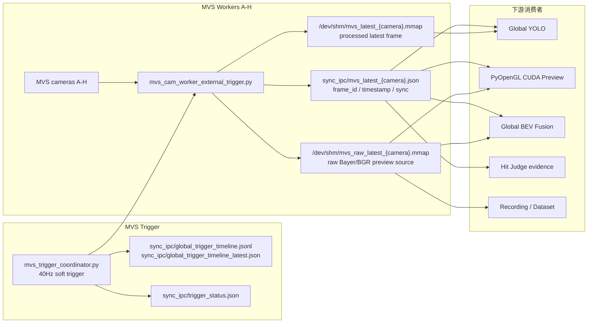

# MVS 可见光相机链路

更新时间：2026-07-09

本文档是 `MVS_CAMERA_CHAIN.md` 的中文伴随文档。MVS 链路是可见光画面、人员识别、Preview、Global BEV、命中证据和数据集录制的共同输入源。

> 2026-07-09 V25-C 进展：已新增并接入 `remote_ops/mvs_file_frame_broker.py`。standalone 模式可读取 `raw_mvs.avi + frame_index.csv` 并写回现有 `/dev/shm/mvs_latest_{camera}.mmap`、`sync_ipc/mvs_latest_{camera}.json`；`launch_fusion_system.py` 现在支持启动前指定 `mvs_source_mode=file_replay`，并在该模式下禁止 live MVS worker/trigger coordinator 同时写同一套 shm。生产默认仍是 `mvs_source_mode=live_camera`，file replay 需要继续用远端 full-system smoke 验收。

## 目的与权威边界

MVS 链路负责：

- 八路可见光相机 A-H 的采集。
- 40Hz MVS soft trigger 时间线。
- 向 YOLO、Preview、Global BEV、Global Person ID、Hit Judge evidence、dataset recorder 提供共享帧。

同步基准是 MVS soft trigger。每台相机曝光时间不同，只能作为 correction/metadata 处理，不能擅自把曝光中位数或某路曝光结束时间改成全局同步基准。

## 当前生产路径

```text
MVS trigger coordinator
-> 8 MVS camera workers A-H
-> /dev/shm/mvs_raw_latest_{camera}.mmap
-> /dev/shm/mvs_latest_{camera}.mmap and sidecar metadata
-> Global YOLO / Preview / Global BEV / Hit Judge evidence / dataset recorders
```

生产启动入口：

```bash
python3 launch_fusion_system.py --launch-profile launch_profiles/627_event_overlay_bev.json
```

## 全链路数据流



## 关键文件与共享内存

| 类型 | 路径/文件 | 说明 |
| --- | --- | --- |
| raw frame | `/dev/shm/mvs_raw_latest_{camera}.mmap` | Preview、BEV、raw recording 重要输入 |
| processed/latest frame | `/dev/shm/mvs_latest_{camera}.mmap` | YOLO 主要读取源 |
| sidecar metadata | `sync_ipc/mvs_latest_{camera}.json` | frame_id、timestamp、sync、exposure metadata |
| trigger timeline | `sync_ipc/global_trigger_timeline.jsonl` | MVS soft trigger 历史 |
| trigger latest | `sync_ipc/global_trigger_timeline_latest.json` | 最新 trigger 状态 |
| trigger status | `sync_ipc/trigger_status.json` | 状态窗口与诊断入口 |

## 下游使用方式

| 下游 | 使用 MVS 的方式 | 关键风险 |
| --- | --- | --- |
| Global YOLO | 读取 `/dev/shm/mvs_latest_*` 和 sidecar metadata | 如果 frame_id/stamp 不一致，会影响人员 polygon、anchor、Global ID |
| Preview | 读取 raw/latest frame，叠加 ID、mask、弹道 | mmap 重建后 reader 未 reopen 会造成黑屏或 stale |
| Global BEV | 读取 MVS raw texture，按 820ms BEV 显示延迟对齐事件层 | GUI 线程 upload 超预算会导致 hold last frame |
| Hit Judge | 使用 MVS trigger/person evidence 做 final hit gate | sync baseline 必须是 MVS soft trigger |
| Dataset/Recording | 录制 raw/evidence replay | 录制开关和 session_id 必须统一 |

## 状态窗口重点字段

状态窗口应显示每路：

- `frame_id`
- `frame_age_ms`
- `shm_age_ms`
- 是否卡帧
- 是否 stale
- 是否 metadata outlier

Global BEV/MVS upload 重点：

- `global_bev.mvs_texture_upload.elapsed_ms`
- `global_bev.mvs_texture_upload.elapsed_p95_ms`
- `global_bev.mvs_texture_upload.uploaded_cams`
- `global_bev.mvs_texture_upload.held_by_budget_cams`
- `global_bev.mvs_texture_upload.budget_overrun_rate`

## 常见故障

### 某路可见光不显示

检查顺序：

1. MVS worker 是否存活。
2. `/dev/shm/mvs_raw_latest_{camera}.mmap` mtime 是否新鲜。
3. `mvs_latest_{camera}.json` 中 `frame_id` 是否递增。
4. Preview/BEV reader 是否 reopen 了重建后的 mmap。
5. 是否因为 upload budget hold 住旧纹理。

### YOLO FPS 正常但 ID/位置异常

重点看：

- `sync_indices` 是否同组一致。
- `visual_mid_spread_ms` / `exposure_end_spread_ms`。
- `input_buffer.aligned_full_ratio`。
- polygon 是否完整输出。
- anchor/foot_pixel 策略是否和当前测试目标一致。

### BEV 与事件层不同步

先确认：

- MVS soft trigger target 是否正确。
- BEV display delay 是否按当前策略，例如 820ms。
- `event_delta_ms_by_cam` 是否超阈值。
- MVS metadata 是否 outlier。
- Event layer 是否用了 target ring 而不是 latest-only bundle。

## 文档维护规则

只要以下内容变化，就必须更新本文档和修订记录：

- trigger 周期或 sync 基准。
- MVS worker 输出路径或 sidecar metadata。
- YOLO/Preview/BEV 对 MVS 的读取方式。
- raw recording / full recording 里 MVS 录制契约。
- 状态窗口 MVS key。
- BEV MVS texture upload budget 策略。

## V25-C MVS File Frame Broker 原型

当前 standalone 验证入口：

```powershell
powershell.exe -NoProfile -ExecutionPolicy Bypass -File tools\remote_test.ps1 `
  -Action smoke-mvs-broker `
  -DatasetDir recordings/20260708_181936_full `
  -MaxFrames 160
```

已验证输出：

- `mvs_latest_{camera}.mmap`：processed BGR 帧，供 Global YOLO 等读取。
- `mvs_latest_{camera}.json`：包含 `mvs_source_mode=file_replay`、`soft_trigger_mode=mvs_file_frame_broker`、`program_sync_index`、`sync_index`、`frame_id_local`、`mvs_frame_num`、`shape`、`shm_name`。
- `mvs_raw_latest_{camera}.mmap`：第一版以灰度数据按 Bayer8 合同写入，仅用于兼容 Preview/BEV raw reader；后续如需高质量离线可视化，应再扩展 raw preview shm 支持 BGR8 三通道。
- `sync_ipc/mvs_file_frame_broker_status.json` 与 `sync_ipc/mvs_file_frame_broker_stats.jsonl`：记录 broker 状态。

数据集质量风险：

- `recordings/v25b_exttrig_smoke_20260709_154731_display1_keepstdin_full` 的 H 路 MVS 视频和 `frame_index.csv` 只有 1 帧，不能作为正式 MVS replay/full replay 验收样本。
- `recordings/20260708_181936_full` 已通过 standalone 小样本验证，A-H 每路发布 20 帧，0 error，可作为 V25-C 后续接 launcher 前的开发样本。

Launcher 接入口：

```powershell
powershell.exe -NoProfile -ExecutionPolicy Bypass -File tools\remote_test.ps1 `
  -Action smoke-mvs-replay `
  -DatasetDir recordings/20260708_181936_full `
  -Duration 90 `
  -DeployWorktree `
  -Wait `
  -SummaryAfter
```

该入口会自动追加：

- `--mvs-source-mode file_replay`
- `--mvs-file-frame-broker-dataset-dir <dataset>`
- `--mvs-file-frame-broker-replay-timing <realtime|fast>`
- `--mvs-file-frame-broker-loop`

V25-D/E manifest 自动展开规则：

- 现场传入 `recordings/<session>` 或 `raw_records/<session>` 任意一个同名 session 目录时，
  `remote_ops/check_v25_dataset_manifest.py` 会同时搜索这两个 sibling 目录。
- 对 MVS File Frame Broker，最终传入的 `--mvs-file-frame-broker-dataset-dir` 必须是包含
  MVS AVI/CSV 的目录，通常是 `recordings/<session>`；不能因为用户选择了 `raw_records/<session>`
  就把 Event RAW 目录传给 MVS broker。
- 对 full replay，Event RAW 路径可以来自 `raw_records/<session>`，MVS 文件可以来自
  `recordings/<session>`，但二者必须是同名 session，且 manifest/status 中要记录
  `search_roots` 与 `source_roots`，便于复盘确认没有混用不同测试数据。
- 如果合并后缺少任一路 MVS `raw_mvs.avi` 或 `frame_index.csv`，该数据集不能作为 MVS/full replay
  验收样本。

file replay 模式下的额外输出：

- `sync_ipc/mvs_file_frame_broker_status.json`
- `sync_ipc/mvs_file_frame_broker_stats.jsonl`
- `sync_ipc/trigger_status.json`，其中 `source_mode=mvs_file_replay`
- `sync_ipc/global_trigger_timeline.jsonl`
- `sync_ipc/global_trigger_timeline_latest.json`

V25-C1 播放策略修正：

- MVS file broker 必须按 `program_sync_index/sync_index` 成组发布 A-H，不能按“每路最新帧”顺序逐相机播放。
- 发布给下游的 `capture_ts_us` / `timestamp_us` 使用 replay 当前墙钟，避免 Global YOLO input buffer 把历史录制时间差误判为当前帧不同步。
- 发布给下游的 `mvs_soft_trigger_est_wall_us` / `soft_trigger_cmd_wall_us` 同样使用 replay 当前墙钟，避免 Global YOLO 继续从原始录制墙钟推导视觉时间。
- 第一版 replay sidecar 使用 0us 曝光窗口补齐 `rgb_exposure_start/mid/end_offset_us=0` 和 `exposure_time_us=0`，让 exposure-end barrier 不再等待到 timeout；真实曝光差异复盘需后续把录制时的曝光 readback 纳入 manifest。
- 原始录制时间保存在 `record_capture_ts_us_original`。
- sidecar 中 `mvs_file_replay_aligned_batch=true` 表示该帧来自同一个同步批次；`mvs_file_replay_skipped_to_align` 用于诊断某路数据集起始 sync 偏移导致的对齐跳帧。

当前限制：

- 第一版 MVS file broker 的 raw preview 以灰度/Bayer8 兼容 `/dev/shm/mvs_raw_latest_{camera}.mmap`，主要用于下游 reader 合同验证；如要做高保真本地视觉复盘，需要再扩展 BGR8/raw 原始格式。
- MVS replay 已能提供 MVS soft-trigger timeline。V25-E 已用带同步锚点的数据集完成一次 full replay smoke 验证；后续若要做更严格的物理时间复盘，还需要把录制时的真实曝光 readback 纳入 manifest。
- 如果数据集本身某路 MVS 视频或 `frame_index.csv` 帧数不足，必须由 manifest checker 标记 `usable_for_mvs_file_replay=false`，不能作为正式验收样本。

V25-D/E full replay 同步契约补充：

- `remote_ops/mvs_file_frame_broker.py` 在 file replay 第一组 A-H 对齐发布成功时，会写出
  `sync_ipc/sync_start.flag` 与 `sync_ipc/sync_start_latest.json`。
- 该文件用于通知 Event worker：当前系统不是 live MVS 软触发，而是 MVS file replay，
  其中 `source_mode=mvs_file_replay`、`tick_id_start`、`program_sync_index_start`
  是下游做回放同步判断的最低契约。
- 当前代码保留 `event_sync_direct_index_map=true` 作为受控诊断路径：Event worker 可以把
  本地 Event trigger index 映射到 `tick_id_start + event_local_sync_index`。该路径只允许在
  `sync_start.flag.source_mode=mvs_file_replay` 下启用，不能作为正式数据集同步验收依据。
- 正式 full replay 数据集仍必须保存原始共同同步锚点，例如每路
  `event_trigger_zero_to_mvs_sync`，或录制期生成的 `event_trigger_map_{camera}.jsonl`。
  仅有 MVS `frame_index.csv` 与 Event RAW External Trigger 不能证明二者在回放时严格对齐。

V25-C 远端验证节点：

- 节点记录：`docs/versions/NODE_VERSION_20260709_V25C_MVS_FILE_REPLAY.md`
- 最终 full-system smoke：
  `sync_ipc/full_system_tests/v25c_mvs_replay_timefix_20260709_185122_display1_keepstdin`
- MVS broker：A-H 每路 1898 帧，0 error。
- Global YOLO：`input_alignment_full_batch_ratio=0.9981`，`input_buffer_aligned_full_ratio=0.9981`，`capture_ts_spread_ms_p95=0.0`。
- Global BEV：MVS 8/8 同步，MVS offset A-H = 0ms，render FPS 约 30fps。
- 该 run 的 `runtime_overall_state=BROKEN` 来自 live Event 在 MVS-only replay 场景下无 sparse/trigger 输出，不判定为 V25-C MVS replay 失败；Event file replay/full replay 仍属于 V25-B/V25-E 后续验收项。

V25-E full replay 远端验证节点：

- 数据集：`recordings/v25e_full_record_anchor_20260709_200415_display1_keepstdin_full`
- full replay run：
  `sync_ipc/full_system_tests/v25e_report_full_replay_recheck_20260709_204938_display1_keepstdin`
- `runtime_overall_state=OK`
- MVS file broker：A-H 8 路发布，`total_frames_published=44016`，`error_count=0`。
- Global YOLO：`published_fps_total` 约 `241.6`，`input_alignment_full_batch_ratio=0.9998`。
- Event/MVS 视觉验收使用 `event_display_sync`：`synced=true`、`bundle_lookup_state=exact`、`bundle_target_delta_ticks=0`。
- 注意：本次 replay sidecar 仍使用 `mvs_file_replay_zero_window`，适合作为链路/同步 smoke；若要离线复盘曝光时间差，需要在后续版本录制并回放真实 exposure readback。

# 2026-07-09 V25-A/D/E replay 产品化证据层

- `launch_fusion_system.py` 新增统一 `--dataset-dir`。当 `mvs_source_mode=file_replay`
  时，launcher 会从 dataset checker 自动补齐 `mvs_file_frame_broker_dataset_dir`，
  避免现场把 `raw_records/<session>` 误传给 MVS broker。
- `source_mode_effective.json` 是判断 MVS 源模式的优先证据，字段包括：
  - `mvs_source_mode_effective`
  - `mvs_file_frame_broker_enabled`
  - `mvs_live_camera_enabled`
  - `mvs_file_frame_broker_dataset_dir`
  - `mutual_exclusion`
- `v25_resolved_manifest_latest.json` 记录该数据集的 `capabilities` 与
  `degraded_reasons`。一个数据集可以 `full_replay_startup=true`，但因为缺少共同同步锚点而
  `full_replay_sync=false`；这两者不能混为一谈。
- `remote_ops/v25_replay_control_panel.py` 与 `tools/remote_test.ps1 v25-replay-control`
  负责生成/刷新回放控制状态和启动命令，后续现场测试不应手写复杂 SSH 命令拼接 replay 参数。
- 本次补丁不改变 live MVS worker 的实时取流链路，也不改变 MVS File Frame Broker
  的帧发布算法；只补齐启动控制、manifest resolved、effective source-mode 与报告归档。
