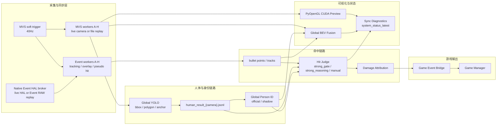

# 元现实游戏引擎

多相机实时判定与游戏事件桥接系统。当前项目以 8 路 MVS 可见光相机、8 路事件相机、Global YOLO、Global Person ID、事件弹道追踪、命中判定、Global BEV 可视化和游戏进程桥接为核心，支持现场实时运行、全量录制、Evidence Replay 复盘和 source-mode 离线回放。

> 本 README 是项目入口初版。具体链路契约以 living docs 为准，修改任一链路时必须同步更新对应文档和修订记录。

## 当前基线

| 项 | 当前值 |
| --- | --- |
| 推荐开发目录 | `C:\dev\meta-reality-game-engine` |
| GitHub remote | `https://github.com/ISA-AnXiaoYan/Meta-Reality-Game-Engine.git` |
| 主启动入口 | `launch_fusion_system.py` |
| 当前主 profile | `launch_profiles/627_event_overlay_bev.json` |
| 远端测试入口 | `tools/remote_test.ps1` |
| 远端复杂逻辑 | `remote_ops/` |
| 运行时共享目录 | `sync_ipc/` |
| 统一状态快照 | `sync_ipc/system_status_latest.json` |
| 当前生产源模式 | `event_source_mode=live_hal`，`mvs_source_mode=live_camera` |

## 系统目标

- 实时融合 8 路可见光与事件相机输入。
- 以 MVS soft trigger 作为全系统同步基准。
- 通过 Global YOLO 输出人体 bbox、polygon、anchor、local/global evidence。
- 通过 Global Person ID 稳定跨相机人员 ID 和位置。
- 通过事件侧轨迹与人体/trigger/person evidence 产生命中候选和最终命中。
- 在 Preview 与 Global BEV 中显示人员 ID、事件层、弹道层和系统状态。
- 向游戏进程管理系统发送 presence/hit JSON Line。
- 支持录制真实数据，再用 Evidence Replay/source-mode replay 做版本回归。

## 总体架构



## 主要模块

| 模块 | 关键文件 | 作用 |
| --- | --- | --- |
| Launcher | `launch_fusion_system.py`、`multi_camera_launcher.py` | 根据 profile 生成 runtime config 并拉起多进程系统 |
| MVS 可见光链路 | `mvs_trigger_coordinator.py`、`mvs_cam_worker_external_trigger.py`、`remote_ops/mvs_file_frame_broker.py` | 40Hz soft trigger、可见光帧、MVS metadata、MVS file replay |
| Event 事件链路 | `native_event_bridge/hal_event_fifo_broker.cpp`、`native_event_bridge/event_file_fifo_broker.cpp`、`metavision_spatter_tracking_linefilter_tsf1_autosender_backfill.py` | 事件相机取流、4ms FIFO slice、事件追踪、overlay、Event RAW replay |
| Global YOLO | `global_yolo_infer_server.py`、`global_yolo_merge_publisher.py` | 8 路人体识别、polygon、anchor/foot point、人员 evidence 发布 |
| Global Person ID | `global_person_id_server.py` | 跨相机 ID 融合、轨迹稳定、位置更新、official/shadow 对比 |
| Hit Judge | `hit_judge_server.py` | strong gate / strong reasoning / final hit authority |
| 弹道与归因 | `global_bullet_fusion_service.py`、`damage_attribution_service.py`、`manual_hit_service.py` | 全局弹道、伤害来源、人工点击命中 |
| 可视化 | `pyopengl_cuda_preview_renderer.py`、`global_bev_fusion_renderer.py`、`event_overlay_overview_renderer.py` | 主预览、Global BEV、事件 overlay、状态诊断窗口 |
| 游戏桥接 | `game_event_bridge_service.py` | TCP JSON Line presence/hit 输出 |
| 数据集与回放 | `person_id_dataset_recorder.py`、`remote_ops/check_v25_dataset_manifest.py`、`remote_ops/v25_replay_control_panel.py` | Evidence Replay Dataset、source-mode manifest、启动前 replay 控制 |
| 远端运维 | `tools/remote_test.ps1`、`remote_ops/` | 部署、启动、停止、summary、assessment、数据集检查 |
| 仓库治理 | `governance/`、`tools/check_repo_hygiene.py` | 唯一入口、文件责任域、历史债务基线与防污染检查 |

仓库治理遵循“已有债务只减不增”。新增或迁移运行入口时必须更新 `governance/entrypoints.json`；新增文件类型或责任域时必须更新 `governance/file_ownership.json`。标准 `dev_check` 会自动执行仓库卫生检查。

## 启动方式

生产启动入口：

```bash
python3 launch_fusion_system.py --launch-profile launch_profiles/627_event_overlay_bev.json
```

远端现场测试不要手写复杂 SSH 命令，统一从 Windows 本地仓库根目录执行：

```powershell
powershell.exe -NoProfile -ExecutionPolicy Bypass -File .\tools\remote_test.ps1 validate
powershell.exe -NoProfile -ExecutionPolicy Bypass -File .\tools\remote_test.ps1 smoke-live -Duration 370 -Label live_smoke -Wait -SummaryAfter
powershell.exe -NoProfile -ExecutionPolicy Bypass -File .\tools\remote_test.ps1 stress -Duration 1800 -Label stress_remote_ops
```

长效桌面运行：

```powershell
powershell.exe -NoProfile -ExecutionPolicy Bypass -File .\tools\remote_test.ps1 start-latest -Label desktop_latest
powershell.exe -NoProfile -ExecutionPolicy Bypass -File .\tools\remote_test.ps1 monitor -Label desktop_latest
powershell.exe -NoProfile -ExecutionPolicy Bypass -File .\tools\remote_test.ps1 stop-latest -Label desktop_latest
```

部署远端桌面的“一键启动”“一键停止”和“启动控制面板”入口：

```powershell
powershell.exe -NoProfile -ExecutionPolicy Bypass -File .\tools\remote_test.ps1 install-desktop-shortcuts
```

也可从本地直接让远端桌面打开启动控制面板，用于验证 GUI 环境：

```powershell
powershell.exe -NoProfile -ExecutionPolicy Bypass -File .\tools\remote_test.ps1 open-startup-panel
```

不启动全系统，仅检查面板到受管启动脚本的参数契约：

```powershell
powershell.exe -NoProfile -ExecutionPolicy Bypass -File .\tools\remote_test.ps1 check-startup-panel
```

启动控制面板默认进入 `live` 模式。完成 source mode 与数据集校验后，可点击“一键启动整套系统”；按钮会写入可复盘控制状态，并通过受管的 `start_latest_system.sh` 拉起全系统、等待真实状态就绪。仅打开面板本身不会启动系统。

面板启动结果写入：

```text
sync_ipc/v25_panel_launch_status.json
```

开发热修补验证可以使用：

```powershell
powershell.exe -NoProfile -ExecutionPolicy Bypass -File .\tools\remote_test.ps1 deploy-worktree
```

## 录制与回放

### Evidence Replay

Evidence Replay 用于复盘 Global Person ID、位置更新、pseudo/final hit、伤害输出和参数横向对比。它不用于证明 YOLO/Event 原始感知性能。

录制示例：

```powershell
powershell.exe -NoProfile -ExecutionPolicy Bypass -File .\tools\remote_test.ps1 smoke `
  -Label evidence_smoke `
  -Duration 370 `
  -PersonDataset mixed `
  -EvidenceReplayDataset `
  -Wait `
  -SummaryAfter
```

全量录制示例：

```powershell
powershell.exe -NoProfile -ExecutionPolicy Bypass -File .\tools\remote_test.ps1 smoke `
  -Label full_record_smoke `
  -Duration 370 `
  -FullRecording `
  -Wait `
  -SummaryAfter
```

当前全量录制包含 Event sensor/HAL RAW、MVS RAW、YOLO 后 polygon/person evidence、事件弹道轨迹、pseudo/final/hit debug。当前不包含 post-mask 派生事件流，相关方向已暂停，重启前必须重新设计并远端验收。

### V25 Source-Mode Replay

V25 增加启动前 source-mode 控制。实时生产默认仍是：

```text
event_source_mode=live_hal
mvs_source_mode=live_camera
```

离线回放可在启动前指定 dataset：

```powershell
powershell.exe -NoProfile -ExecutionPolicy Bypass -File .\tools\remote_test.ps1 list-datasets -DatasetLimit 20
powershell.exe -NoProfile -ExecutionPolicy Bypass -File .\tools\remote_test.ps1 check-dataset-manifest -DatasetDir recordings\<session> -PrintResolvedManifest
powershell.exe -NoProfile -ExecutionPolicy Bypass -File .\tools\remote_test.ps1 v25-replay-control -DatasetDir recordings\<session> -ReplayControlMode full_replay -ReplayTiming realtime
powershell.exe -NoProfile -ExecutionPolicy Bypass -File .\tools\remote_test.ps1 smoke-full-replay -DatasetDir recordings\<session> -Duration 90 -Wait -SummaryAfter
```

判断实际运行模式时，优先看：

- `sync_ipc/source_mode_effective.json`
- `sync_ipc/v25_resolved_manifest_latest.json`
- run 归档中的 `status/source_mode_effective.json`
- `system_status_latest.categories.source_mode_replay`

不要只凭 launch profile 推断实际生效模式。

## 状态窗口与运行事实

状态窗口中文显示业务分类，但 JSON key 保持稳定英文。关键入口：

- `sync_ipc/system_status_latest.json`
- `sync_ipc/status_logs/<run>/status_latest.json`
- `sync_ipc/status_logs/<run>/status_summary.csv`
- `sync_ipc/global_bev_status.json`
- `sync_ipc/global_yolo_status.json`
- `sync_ipc/global_person_status.json`
- `sync_ipc/hit_judge_status.json`
- `sync_ipc/event_overlay_overview_status.json`

V25 source-mode 状态必须在以下类别中可见：

```text
system_status_latest.categories.source_mode_replay
```

关键字段包括：

- `event_source_mode_effective`
- `mvs_source_mode_effective`
- `source_mode_effective_exists`
- `v25_resolved_manifest_exists`
- `usable_for_full_replay_startup`
- `usable_for_full_replay_sync`
- `v25_replay_control_exists`
- `v25_replay_status_exists`

## 本地检查与远端评估

本地开发检查：

```powershell
powershell.exe -NoProfile -ExecutionPolicy Bypass -File .\tools\remote_test.ps1 check
```

远端 run 结束后生成 summary：

```powershell
powershell.exe -NoProfile -ExecutionPolicy Bypass -File .\tools\remote_test.ps1 summary -Label <run_label>
```

节点评估：

```powershell
powershell.exe -NoProfile -ExecutionPolicy Bypass -File .\tools\remote_test.ps1 assess -Label <run_label> -AssessmentNode <node_name>
```

`launcher_rc=124` 通常表示 timeout 到时结束，属于正常短测结束方式。

## 重要文档入口

建议新同事先读：

| 文档 | 用途 |
| --- | --- |
| `PROJECT_DOCUMENT_INDEX_CN.md` | 中文文档入口和阅读顺序 |
| `PROJECT_GIT_WORKFLOW_CN.md` | Git、提交、禁止提交内容、版本收口 |
| `REMOTE_TEST_WORKFLOW_CN.md` | 远端启动、停止、summary、assessment |
| `CHAIN_DOCUMENTATION_STANDARD_CN.md` | living docs 更新规则 |
| `MVS_CAMERA_CHAIN_CN.md` | MVS 可见光与 trigger 链路 |
| `EVENT_SIDE_CHAIN_CN.md` | 事件相机、弹道、mask、hit evidence 链路 |
| `MODULAR_ARCHITECTURE_DECISION_DRAFT_20260704_CN.md` | 模块边界和架构方向 |
| `GLOBAL_YOLO_C3_ARCHITECTURE_CN.md` | Global YOLO、polygon、anchor、性能指标 |
| `EVIDENCE_REPLAY_DATASET_V1_CN.md` | Evidence Replay 数据集契约 |
| `GAME_EVENT_BRIDGE_HANDOFF_20260703_CN.md` | 游戏进程管理系统对接 |
| `V25_MAIN_TASK_TREE_20260709.md` | 当前 V25 source-mode/replay 主线任务树 |

## Git 与数据规则

提交前必须确认：

```powershell
git rev-parse --show-toplevel
git branch --show-current
git remote -v
git status --short --branch
```

不要从 `C:\Users\axyis\Documents\判定开发` 外层目录直接 `git add`。

可以提交：

- 源码
- launch profile 和配置模板
- `remote_ops/`
- `tools/`
- living docs、节点文档、测试说明

不要提交：

- `sync_ipc/`
- `recordings/`
- `raw_records/`
- `desktop_runs/`
- `*.tar.gz`
- CPU hotspot 采样
- `.ssh/`
- `__pycache__/`
- 临时构建产物和本地密钥

## 依赖与运行环境

项目没有统一的根 `requirements.txt`。当前生产运行依赖主要由远端环境提供，包括：

- Python/Conda 运行环境，当前远端常用环境名为 `ids_recv`。
- NVIDIA CUDA / OpenGL / PyOpenGL 相关运行环境。
- Hikrobot MVS SDK。
- Prophesee Metavision SDK，当前事件相机开发以 4.6.2 文档/API 为基线。
- C++ 编译工具链，用于 `native_event_bridge/` 和部分 native 扩展。

远端默认参数见 `tools/remote_test.ps1`：

| 项 | 默认值 |
| --- | --- |
| Host | `ysxq@192.168.31.115` |
| Remote project | `~/PycharmProjects/Ids_Test_3.9/test622yolo_gpu_627` |
| Launch profile | `launch_profiles/627_event_overlay_bev.json` |

## 当前已知风险

- Global BEV 仍可能出现 render FPS WARN、MVS texture upload budget hold、个别 Event-to-BEV visual sync outlier。
- full replay 严格同步不仅需要 Event RAW External Trigger 和 MVS frame index，还需要录制期共同同步锚点，例如 `event_trigger_map_{camera}.jsonl`。
- `source_mode_effective.json` 是实际运行源模式证据，profile 只是启动意图。
- 状态窗口若未运行，`system_status_latest.json` 不会刷新，此时需要用 run 归档中的 source-mode/status 文件作为旁证。
- Global YOLO polygon 开启对 mask evidence 和数据集复盘重要，但会增加后处理压力，性能测试必须同时看 FPS 和 postprocess queue。
- 人工点击命中、strong gate、strong reasoning、damage attribution 是不同 authority/输出链路，不能混作同一个判定。

## README 后续待补

- 补充面向对象与对外简介。
- 补充硬件拓扑图、相机编号示意图和现场布线说明。
- 补充远端环境从零安装步骤。
- 补充常用状态窗口截图。
- 补充数据集目录真实样例。
- 补充 GitHub 分支/发布策略和 tag 规则。
