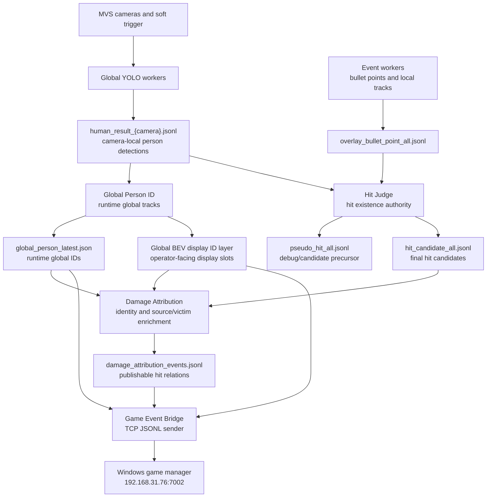

# V20-C Identity Evidence Chain Governance

Date: 2026-07-03
Branch: `a-test-20260703-v20-hit-candidate-attribution-split`
Status: pending validation
Latest deployed run: `identity_evidence_v20c_20260703_234756_display1_keepstdin`

## 1. Purpose

This document records the current V20-C state as a pending-validation node and
separates the responsibilities of hit detection, identity binding, attribution,
and game-event sending.

The current problem is not a single threshold bug. The chain has accumulated
semantic pollution:

- Local camera IDs, Global Person runtime IDs, Global BEV display IDs, and the
  virtual damage source ID 99 are mixed in adjacent fields.
- `hit_candidate_all.jsonl` is append-only and can contain multiple versions of
  candidate semantics in the same file.
- `damage_attribution_service` used to recover target identity from current
  `global_person_latest.json`, so old/local hit candidates could be bound using
  a later person snapshot.
- `stable_id_matches_global_id` was used as a fallback, even though local
  `stable_id` is explicitly not a global ID.
- Game bridge output had no strict schema boundary between source/victim,
  runtime/display ID, and diagnostics.

V20-C starts the cleanup by adding identity evidence and disabling weak global
ID fallback. It is not accepted yet; it must be validated with fresh hit samples.

## 2. Version Record

| Node | Scope | Current Status | Notes |
|---|---|---|---|
| V20-A | Strong-reasoning pseudo hit stream | implemented before this node | Hit existence can be produced from terminal/turn/stable track contact with mask. |
| V20-B | Human-motion noise filtering | partially tuned | `bbox_start` soft filtering was tested; current runtime uses 48 px after manual hot switch. |
| V20-B1 | Stable visual bullet track cache for pseudo hit | implemented before this node | Improved recall by using stable track key/points instead of only tiny real-time segments. |
| Virtual 99 source | Force all damage source to global virtual ID 99 | implemented and remotely verified | Bridge hit source is forced to `99/G0099`; virtual presence keeps `P99` on field. |
| V20-C | Identity evidence for target binding | implemented, pending validation | Adds target evidence, history-based binding, display evidence, and reserves target ID 99. |

## 3. Pending Validation Points

These points are explicitly pending and must not be treated as accepted.

| Item | Expected Result | Validation Data |
|---|---|---|
| Fresh hit candidate includes `target_identity_evidence` | New rows in `hit_candidate_all.jsonl` include camera, local ID, person sync, bbox/centroid evidence. | Next live hit run or replay-generated hit candidate stream. |
| Damage attribution uses strong identity evidence | `target_global_runtime_reason` should be `history_local_id_map`, `current_local_id_map`, or explicit evidence; `stable_id_matches_global_id` should not appear unless fallback is manually enabled. | `damage_attribution_events.jsonl` after V20-C deployment. |
| Bridge sends evidence fields | Hit payload contains `target_identity_evidence` and `target_display_evidence`. | `game_event_bridge_sent.jsonl`, and external receiver if connected. |
| Target never becomes virtual 99 | No hit event should publish `target_yolo_id=99` or `target_global_id=G0099`. | Damage attribution and bridge sent logs. |
| Game bridge TCP receiver availability | `client_connected=true` and sent hits reach Windows manager. | `game_event_bridge_status.json`; currently observed timeout. |
| Strong-reasoning control persists | After restart, `final_hit_authority=strong_reasoning` and bbox start expand value is intended value, not default reset. | `hit_judge_control.json` and `hit_judge_status.json`. |

## 4. Current Full Chain



## 5. Authority Boundaries

| Layer | Owns | Must Not Own |
|---|---|---|
| Event workers | Event bullet points, local bullet IDs, event-side diagnostics | Final hit decision, global person identity, game damage. |
| Global YOLO | Camera-local detections, bbox/mask/polygon/person local IDs | Global ID, hit decision, damage. |
| Global Person ID | Runtime global person tracks, local-id aggregation, field position | Hit existence, damage source, game player identity. |
| Hit Judge | Whether a hit candidate exists | Damage source attribution, global bullet reconstruction, player HP/game logic. |
| Damage Attribution | Bind final hit candidate to victim ID and optional source inference | Creating new hits; rejecting true hit existence because attribution is unresolved. |
| Game Event Bridge | Protocol conversion and delivery to Windows manager | Recomputing target identity, filtering hit existence except reserved-ID safety. |
| Windows manager | Player identity, HP, watches, damage application | Vision-side detection or evidence generation. |

## 6. Pollution Sources

| Pollution Type | Symptom | Root Cause | Required Fix |
|---|---|---|---|
| ID semantic pollution | `stable_id`, `global_id`, display slot, and `99` are read as interchangeable. | Old fields carried compatibility names without schema markers. | Require `id_semantics`, `target_identity_evidence`, and reserved-ID rules. |
| Temporal pollution | Candidate is bound to a later person snapshot. | Attribution read only current `global_person_latest.json`. | Use run-scoped historical snapshots keyed by sync/time. |
| File pollution | New and old candidate semantics coexist. | Append-only shared JSONL files survive restarts/tests. | Run-scoped outputs or start-epoch filtered analysis must be mandatory. |
| Authority pollution | Attribution starts acting like final hit gate. | Hit existence and who-hit-whom are mixed in one event. | Keep `hit_candidate` authoritative for hit existence; attribution can be unresolved. |
| Protocol pollution | External receiver cannot tell runtime ID from display ID. | Bridge payload had compatibility fields without evidence metadata. | Bridge must include source/target semantics and evidence fields. |
| Virtual ID collision | Real display slot 99 can be overwritten by virtual source 99. | Global BEV display allocator may use 99 as a normal display slot. | Reserve 99 end to end. |
| Status pollution | `OK/DEGRADED/BROKEN` mixes stale optional tools and active chain health. | Overall status aggregates unrelated service categories. | Separate production chain health from optional/replay/tooling health. |

## 7. V20-C Changes Already Implemented

1. `hit_judge_server.py`
   - Adds `target_identity_evidence`.
   - Records target camera, camera-local ID, person sync index, person event timestamp, bbox, centroid, and confidence.

2. `damage_attribution_service.py`
   - Maintains short Global Person history.
   - Resolves target runtime ID by `camera + local_id + sync_index`.
   - Adds display ID evidence.
   - Disables `stable_id_matches_global_id` fallback by default.
   - Rejects target display slot 99.

3. `game_event_bridge_service.py`
   - Forces damage source to virtual 99.
   - Keeps virtual 99 in presence.
   - Skips sending hit if target resolves to reserved virtual 99.
   - Passes target identity/display evidence through to hit payload.

4. `launch_profiles/627_event_overlay_bev.json`
   - Enables identity evidence parameters.
   - Reserves virtual ID 99.

## 8. Current Known Risks

| Risk | Severity | Current Mitigation | Remaining Work |
|---|---|---|---|
| New V20-C fields not yet validated on fresh hit rows | High | Syntax and small replay samples passed. | Need live/replay hit run after deployment. |
| Bridge TCP receiver timeout | High for external game integration | Local sent log still records attempts. | Confirm Windows manager is listening on `192.168.31.76:7002`. |
| `hit_judge_control` resets after restart | Medium | Manual hot switch restored strong reasoning and bbox 48 px. | Move desired defaults into profile/runtime init or remote_ops init. |
| Display slot 99 may still be created upstream | High | Bridge/attribution now reject or replace 99. | Reserve 99 in Global BEV display allocator too. |
| Append-only logs mix old and new schemas | High | Analysis filters by `start_epoch`. | Move hit/damage/bridge streams to run-scoped directories. |
| Strong evidence may reduce publish count | Medium | Weak fallback disabled intentionally. | Track unresolved attribution count separately from hit recall. |
| Status window still mixes optional services | Medium | Prior status-cn degradation fixed. | Add chain-specific health sections and schema-version warnings. |

## 9. Proposed Governance Solution

### Phase 1: Freeze Contracts

Approve one schema contract for each boundary:

- `hit_candidate`: hit existence only.
- `identity_evidence`: victim binding evidence only.
- `damage_attribution`: source/victim enrichment only.
- `game_event_bridge`: protocol output only.

Each payload must include:

- `schema_version`
- `authority`
- `id_semantics`
- `run_id`
- `source_file` or service name
- evidence fields if an ID is used for publishable output

### Phase 2: Run-Scoped Output

Move mutable streams from global `sync_ipc/*.jsonl` to run-scoped directories:

```text
sync_ipc/runs/{run_id}/hit_candidate_all.jsonl
sync_ipc/runs/{run_id}/damage_attribution_events.jsonl
sync_ipc/runs/{run_id}/game_event_bridge_sent.jsonl
sync_ipc/runs/{run_id}/global_person_tracks.jsonl
```

Keep compatibility symlinks/copies for existing tools, but all analysis must
read the run-scoped files.

### Phase 3: Chain Health Dashboard

Status window should show separate health rows:

- Hit existence chain
- Victim identity binding chain
- Damage source attribution chain
- Game bridge delivery chain
- Optional replay/tooling chain

Do not let replay/tooling stale status degrade production chain health.

### Phase 4: Reserved ID Policy

Reserve global/display ID 99 as virtual damage source:

- Global BEV display allocator must not create display slot 99.
- Damage attribution must reject target slot 99.
- Bridge must reject target 99 and keep virtual source 99 in presence.
- Status window should show `virtual_id_99_reserved=true`.

### Phase 5: Validation Matrix

Validation must separate these metrics:

| Metric | Source | Acceptance Direction |
|---|---|---|
| Hit recall | `hit_candidate_all.jsonl` vs marked real hits | Must not regress. |
| Human-noise false positives | false-positive marker + pseudo hit stream | Must decrease or be explainable. |
| Victim binding resolved rate | damage attribution events | Should improve with evidence history. |
| Victim binding correctness | manually marked target ID or replay labels | Must be measured before acceptance. |
| Bridge delivery | bridge sent log + Windows receiver log | Must be connected and consistent. |
| Reserved 99 violations | damage/bridge logs | Must be zero. |

## 10. Approval Recommendation

Recommended approval path:

1. Approve V20-C as `pending-validation`, not as accepted production logic.
2. Approve Phase 1 and Phase 4 immediately because they reduce semantic pollution without changing hit recall.
3. Approve Phase 2 before the next large test series to prevent old/new log mixing.
4. Run one controlled live hit test and one no-hit movement/noise test.
5. Accept V20-C only if:
   - fresh hit candidates include identity evidence,
   - publishable damage events no longer use `stable_id_matches_global_id`,
   - target 99 count is zero,
   - bridge receiver is connected or delivery failure is explicitly excluded from algorithm validation.

