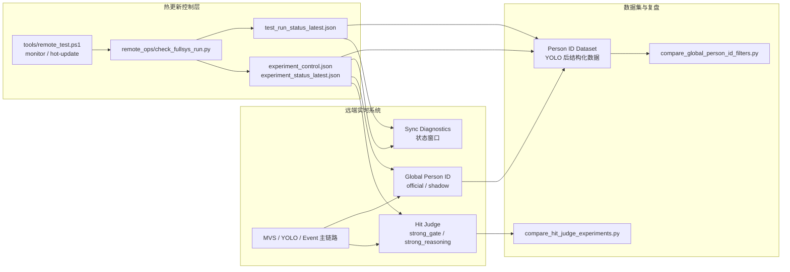

# V22 Hot Update Lab

## 目标

V22 的目标不是改动核心感知主链路，而是建立一个可控的 A 测实验层：

- 命中候选/人体噪声过滤、Global Person ID 等非核心主链路可以热更新。
- 每次热更新写入稳定 JSON 状态，不依赖 SSH/PowerShell 终端中文输出。
- 每轮远端实测和数据集复用测试都能记录 experiment_id、stage、config_hash。
- 后续横向对比时可以区分“真实逻辑变化”与“测试工具/参数污染”。

## 新增状态文件

```text
sync_ipc/experiment_control.json
sync_ipc/experiment_status_latest.json
sync_ipc/experiment_events.jsonl
sync_ipc/test_run_status_latest.json
sync_ipc/test_run_events.jsonl
```

这些文件是机器可读真相源。PowerShell/SSH 只负责触发动作，不再作为状态判断依据。

## 远端热更新入口

```powershell
.\tools\remote_test.ps1 monitor -Label desktop_latest

.\tools\remote_test.ps1 hot-update `
  -ExperimentId v22_bbox48_live `
  -ExperimentStage V22-hit-soft-filter `
  -HitProfile experiments\hit_judge\bbox48_soft.json `
  -GlobalIdProfile experiments\global_id\alpha_beta_countgate.json `
  -GlobalPersonTarget shadow
```

常用快速参数：

```powershell
.\tools\remote_test.ps1 hot-update -BboxStartExpandPx 48 -HumanNoiseMode soft -AuthorityMode strong_reasoning
.\tools\remote_test.ps1 hot-update -BboxStartExpandPx 96 -HumanNoiseMode soft -AuthorityMode strong_reasoning
.\tools\remote_test.ps1 hot-update -AuthorityMode strong_gate -HumanNoiseMode shadow
```

如果 profile 是本地文件，`remote_test.ps1` 会自动上传到远端：

```text
sync_ipc/remote_hot_update_profiles/
```

## 状态窗口变化

`Sync Diagnostics` 的控制页新增/增强：

- `bbox start px`：人体噪声过滤的起点 bbox 外扩参数，可热切换。
- `实验热更新` 状态分组：显示 experiment_id、stage、config_hash、final_hit_authority、human_noise 模式、Global ID target/backend、远端 run_state。
- `人员ID数据集` 分组：显示 run_id、experiment_id、experiment_stage、experiment_config_hash。

## 数据集记录契约

`person_id_dataset_recorder.py` 继续只记录 YOLO 后结构化数据，不记录重型 mask 位图。V22 增加：

- run_id
- experiment_id
- experiment_stage
- experiment_config_hash
- dataset_config_hash
- id_semantics
- replay_contract

这保证数据集可以用于 Global ID/位置服务/命中判定逻辑的回放对比，但不能用来验证 YOLO/Event 原始感知性能。

## 横向对比工具

Global Person ID：

```powershell
python tools\compare_global_person_id_filters.py `
  --dataset-dir <person_id_dataset_dir> `
  --profile launch_profiles\627_event_overlay_bev.json `
  --recompute-anchor `
  --anchor-mode auto_topdown_center `
  --geometry-fusion-enable
```

Hit Judge：

```powershell
python tools\compare_hit_judge_experiments.py `
  --source-dir <fullsys_run_or_dataset_dir> `
  --profile experiments\hit_judge\bbox48_soft.json `
  --profile experiments\hit_judge\bbox96_soft.json
```

Hit Judge 对比工具是快速证据审计：它统计已经输出的 pseudo_hit/hit_candidate/annotation，不能恢复当时没有生成的候选。完整命中漏检仍需结合真实远端实测和 Evidence Replay。

## 架构图



## 风险点

- `strong_reasoning` 作为最终命中权威时仍然依赖 pseudo_hit 证据质量；如果 pseudo_hit 根本没有生成，离线统计无法补回来。
- `bbox start px` 过大可降低人体噪声误判，但也可能压制贴近人体边缘起始的真实命中，需要用命中正样本复测。
- Global ID official/shadow 热更新必须明确 target；默认建议先打到 shadow，确认无退化后再切 official。
- 状态窗口中文显示受远端桌面字体/编码影响时，以 JSON key 和 `sync_ipc/*latest.json` 为准。
