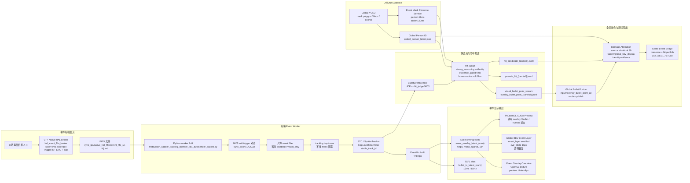

# 远端事件侧全链路生效状态报告

检查时间：2026-07-04  
远端项目：`ysxq@192.168.31.115:~/PycharmProjects/Ids_Test_3.9/test622yolo_gpu_627`  
启动入口：`launch_fusion_system.py --launch-profile launch_profiles/627_event_overlay_bev.json`  
本地代码分支：`a-test-20260703-v20-hit-candidate-attribution-split`

## 结论摘要

1. 当前远端事件相机取流已走 C++ Native HAL broker，不是 Python EventsIterator 直接取流。
   - 进程：`native_event_bridge/build/hal_event_fifo_broker`
   - 模式：8 路相机 -> 4ms slice -> FIFO -> Python event worker
   - 最新统计：8/8 opened、8/8 started、`write_errors=0`、`slice_us=4000`、broker CPU 约 13%。

2. 每路 Event worker 均处于 active，主循环约 217-271Hz。
   - 同步基准：`mvs_soft_trigger`
   - 同步状态：各路 `event_sync_lock_state=LOCKED`
   - 取流输入：`event-native-hal-fifo-path sync_ipc/native_hal_fifos/event_fifo_{camera}.evb`

3. 当前人体 mask 不参与事件追踪硬过滤。
   - `event_worker_human_mask_filter_enable=False`
   - worker 状态：`human_mask.enabled=false`、`mode=visual_only`、`reason=disabled`
   - `event_track_input_policy=raw`
   - 因此事件追踪/弹道候选不会因为 mask 延迟被掐断，mask 只作为后段 evidence/显示依据。

4. 当前显示链路在跑，但“弹道轨迹点/命中候选”本轮没有新输出。
   - `event_overlay_latest_{A-H}` 新鲜，Global BEV event layer 正在绘制。
   - `overlay_bullet_point_all.jsonl`、`pseudo_hit_all.jsonl`、`hit_candidate_all.jsonl` 当前为 0 字节。
   - worker 状态显示直接原因是 `bullet_source_state=draw_paths_empty_no_active_track`，不是 sender queue 堵塞。

5. Global BEV 上有两条事件显示层，当前只启用了事件像素层。
   - `event_layer.enabled=true`
   - `event_layer.dilate_px=16`
   - `event_layer.dilate_backend=cv2_dilate`
   - `event_bullet.enabled=false`，这是弹道轨迹点 overlay，不是事件像素层。

6. Hit Judge 当前最终判定权威为 strong_reasoning。
   - `final_hit_authority=strong_reasoning`
   - `hit_judge_final_mode=evidence_gated`
   - 人体噪声过滤开启：`human_noise_filter.mode=soft`
   - bbox start 过滤当前为 `48px`
   - 当前 `hit_candidate_total=0`、`pseudo_hit_total=0`

7. 伤害归因和游戏桥接进程都已启动，但游戏桥接外部连接未通。
   - Damage attribution：`mode=publish`、`source_global_id=99` 默认来源、`target_id_source=global_bev_display`
   - Game bridge：`force_hit_source_global_id=99`、`virtual_presence_global_id=99`
   - 当前桥接状态：`client_connected=false`、`client_last_error=TimeoutError: timed out`
   - 所以“本机事件 -> 伤害归因”链路已就绪，但“发送到 Windows/game 端”当前未真正送达。

## 当前生效架构图

## 关键运行参数

| 层级 | 当前生效参数 |
| --- | --- |
| C++ HAL broker | `event_native_hal_broker_enable=True`、`slice_us=4000`、`wait_mode=poll`、`poll_sleep_us=100` |
| Event worker | `event_worker_cpus=30,31,32,33,34,35,36,37`、8 路 active |
| 同步 | `event_sync_source=mvs_soft_trigger`、各路 `LOCKED`、RGB exposure 不作为同步基准 |
| mask 硬过滤 | 关闭，`enable_event_human_mask_filter=False` |
| mask evidence | 独立进程，`period_ms=16`、`stale_ms=120` |
| tracking 输入 | `event_track_input_policy=raw` |
| overlay | `event_overlay_pub_max_fps=40`、`event_overlay_render_mode=mono_sparse`、`channels=1` |
| TSF1 | `tsf1_pub_accumulation_time_us=12000`、`tsf1_pub_fps=83.3333` |
| OBS | `event_obs_submit_max_fps=30`，当前 OBS 不是主要判定源 |
| Global BEV event layer | enabled，`dilate_px=16`，`dilate_backend=cv2_dilate` |
| Global BEV event bullet overlay | 当前 control 关闭，`event_bullet.enabled=false` |
| Hit Judge | `final_hit_authority=strong_reasoning`、`human_noise_track_start_bbox_expand_px=48`、跨相机去重 120ms |
| Damage Attribution | `attribution_source=direct_hit_global_id`、默认来源 99、目标 ID 来源为 Global BEV display |
| Game Event Bridge | publish 模式，虚拟 99 在场，但 TCP client 当前未连接 |

## 当前链路健康度

### 正常

- Native HAL broker 8 路全部打开并持续写 FIFO。
- 每路 Event worker 状态新鲜，主循环频率接近设计目标。
- 事件同步锁定 MVS soft trigger，未退回曝光时间或本地 event sync。
- Event overlay shm 和 sidecar 新鲜，Event Overlay Overview 能画。
- Global BEV event layer 正在读取 `event_overlay_latest_{camera}` 并用 `cv2_dilate` 16px 膨胀显示。
- `event_human_mask_stats_*.jsonl` 当前没有继续增长，诊断日志限流/默认关闭生效。

### 有条件正常

- `overlay_bullet_point_all.jsonl` 当前为空。原因不是队列堵塞，而是当前 worker 没有 active/display eligible track。
- `global_bullet_fusion_status.stats.input_records=0` 是上游无视觉弹道点的自然结果。
- `hit_candidate_all.jsonl` 当前为空，表示本轮启动后没有 strong_reasoning final hit 输出；这不能单独证明漏检，需结合真实射击样本窗口分析。

### 异常或风险

- Game Event Bridge 目标 `192.168.31.76:7002` 当前连接失败，presence 和 hit 即使生成也无法送到外部 game 端。
- 当前事件侧 JSONL 文件仍多为共享 latest/append 文件，非 run-scoped，历史样本容易污染复盘。
- Global BEV event layer 和 event bullet overlay 名称接近，但语义不同：前者是事件像素层，后者是弹道轨迹点层。状态窗口与报告必须持续区分。
- `event_loop_profile_*.jsonl` 是旧文件，当前 `event_loop_profiler_enable=False`，不能用它判断本轮热点。
- 伤害归因当前依赖 hit candidate 输入；若 `hit_candidate_all.jsonl` 为空，identity evidence 也不会被验证到。
- 虚拟来源 ID 99 已在 game bridge / damage attribution 层保留，但仍需要继续确认 Global Person ID / Global BEV display 分配器不会把真实玩家分配到 99。

## 建议后续治理

1. 增加事件链路统一 authority 字段。
   - 每条输出标记 `chain_authority=display_only | hit_candidate | final_hit | attribution | game_publish`
   - 避免显示链路、候选链路、最终判定链路互相污染。

2. 将事件侧核心输出改为 run-scoped。
   - `sync_ipc/runs/{run_id}/overlay_bullet_point_all.jsonl`
   - `sync_ipc/runs/{run_id}/pseudo_hit_all.jsonl`
   - `sync_ipc/runs/{run_id}/hit_candidate_all.jsonl`
   - 保留 `sync_ipc/*_latest` 兼容状态窗口。

3. 状态窗口拆分三类事件侧状态。
   - 事件像素显示：`event_layer`
   - 弹道轨迹显示：`event_bullet`
   - 命中判定输出：`hit_candidate / damage_attribution / game_bridge`

4. 增加启动后自检。
   - broker 8/8 opened
   - worker 8/8 active
   - overlay shm age < 200ms
   - hit judge authority == expected
   - game bridge connected 或显式标红外部未连接
   - event bullet overlay 被手动关闭时，不作为弹道检测失败。

5. 做一次带真实射击的短窗口验证。
   - 观察 `visual_point_submit_count` 是否增长
   - 观察 `overlay_bullet_point_all.jsonl` 是否非空
   - 观察 `pseudo_hit_all.jsonl` 与 `hit_candidate_all.jsonl` 是否输出
   - 同时记录 `game_event_bridge_sent.jsonl` 中 hit payload 是否因 TCP 失败未发送。
