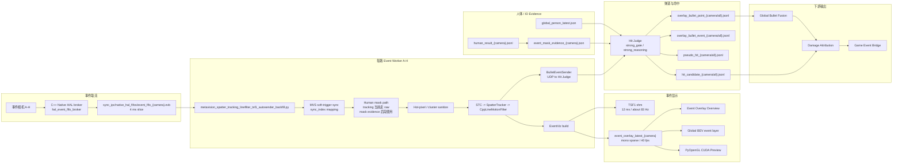

# 事件侧全链路

> 2026-07-09 V25B-H 验证补充：远端 smoke
> `event_h_worker_infer_final_smoke_20260709_171733_display1_keepstdin`
> 已确认 H 路 Event Overlay false positive 修复不破坏实时
> `event_source_mode=live_hal` 生产链路。最终摘要为
> `runtime_overall_state=OK`、`runtime_broken_links=[]`、
> `runtime_degraded_links=[]`。`runtime_overview_reconciled_links`
> 只用于解释显示/状态采样误报，不能掩盖真实 worker/sync 故障。

最后更新：2026-07-07

本文档是事件相机侧的中文 living document。凡是事件取流、同步、mask
evidence、事件 overlay、弹道追踪、命中候选、归因输入、状态 key 或控制
key 发生变化，都必须同步更新本文档和下方修订记录。

英文版同源文档：`EVENT_SIDE_CHAIN.md`。两个版本必须一起维护。

## 目标与权威边界

事件侧现在不是单线链路，而是三条并行链路：

1. 事件相机取流与同步。
2. 事件像素可视化。
3. 弹道点、pseudo hit、hit candidate 证据链。

命中是否存在的权威模块是 `hit_judge_server.py`。Global bullet
reconstruction 和 Damage Attribution 可以为已经成立的命中补充归因信息，
但除非经过明确审批并写入文档，否则它们不能反向成为 final hit 的必要门槛。

## 当前生产路径

```text
事件相机 A-H
-> C++ Native HAL broker
-> 4 ms FIFO slices
-> Event workers A-H
-> EventViz / tracking / BulletEventSender
-> Hit Judge
-> pseudo_hit / hit_candidate
-> Damage Attribution
-> Game Event Bridge
```

当前启动 profile 是 `launch_profiles/627_event_overlay_bev.json`。

生产启动入口是：

```text
launch_fusion_system.py --launch-profile launch_profiles/627_event_overlay_bev.json
```

## 数据流图



## 取流与同步

当前事件取流使用 C++ Native HAL broker，而不是每个 Python worker 直接独占
`EventsIterator`。

关键实现文件：

| 角色 | 文件 |
| --- | --- |
| Broker 进程 | `native_event_bridge/hal_event_fifo_broker.cpp` |
| FIFO reader wrapper | `native_event_bridge/hal_event_pipe_iterator.py` |
| Event worker | `metavision_spatter_tracking_linefilter_tsf1_autosender_backfill.py` |
| Launcher 接线 | `launch_fusion_system.py` |

当前 profile 默认值：

| Key | 当前默认 |
| --- | --- |
| `event_native_hal_broker_enable` | `true` |
| `event_native_hal_broker_slice_us` | `4000` |
| `event_native_hal_broker_wait_mode` | `poll` |
| `event_native_hal_broker_poll_sleep_us` | `100` |
| `event_native_hal_broker_cpus` | `29` |
| `event_worker_cpus` | `30,31,32,33,34,35,36,37` |
| `event_sync_source` | `mvs_soft_trigger` |

同步基准是 MVS 软触发信号。曝光时间不是事件链路的同步基准。每路可见光
相机曝光差异应作为修正或 metadata 处理，不能替代 MVS soft trigger 这个根
时间线。

## Worker 处理顺序

当前 Event worker 主处理顺序：

```text
FIFO event slice
-> trigger/sync mapping
-> human-mask buffer/filter accounting
-> track input selection
-> hot-pixel filter / cluster sanitize
-> SpatioTemporalContrastAlgorithm
-> spatter_tracker.process_events
-> clusters.numpy()
-> CppLineMotionFilter / line_filter.update
-> draw_paths and debug_rows
-> BulletEventExtractor
-> BulletEventSender
```

当前最重要的运行边界是：事件弹道追踪使用 raw event input，不被人体 mask
延迟直接阻塞。

## Human Mask 与 Evidence

当前 profile 默认值：

| Key | 当前默认 |
| --- | --- |
| `event_worker_human_mask_filter_enable` | `false` |
| `event_track_input_policy` | `raw` |
| `event_mask_evidence_enable` | `true` |
| `event_mask_evidence_period_ms` | `16` |
| `event_mask_evidence_stale_ms` | `120` |
| `event_human_mask_cache_max_fps` | `40` |
| `event_human_mask_stats_jsonl` | 空字符串，默认关闭 |

独立的 `event_mask_evidence_service.py` 读取
`human_result_{camera}.jsonl`，生成 `event_mask_evidence_{camera}.json`。
Hit Judge 消费这些 evidence。

mask evidence 可以因为 sync age 变为 degraded，但 mask 延迟不应该直接阻断
raw event tracking。

## 可视化输出

Event worker 的主要可视化输出：

| 输出 | 含义 | 主要消费者 |
| --- | --- | --- |
| `event_overlay_latest_{camera}` | 事件像素 shared-memory 图像 | Event Overlay Overview、Preview、Global BEV event layer |
| `event_overlay_{camera}_latest.json` | Event overlay sidecar/status | Status、Global BEV、Preview |
| Event Overlay Overview reader | 先读 `event_overlay_latest_{camera}`，缺失时兜底读 `event_overlay_masked_latest_{camera}` 显示流 | 避免 legacy overlay shm 缺失但 masked 显示流正常时，将单路误判为 `not_initialized` |
| `bullet_ts_latest_{camera}` | TSF1 shared memory | legacy/TSF consumers |
| `event_obs_{camera}_latest.json` | OBS sidecar，启用时存在 | OBS diagnostics |

当前 profile 默认值：

| Key | 当前默认 |
| --- | --- |
| `event_overlay_pub_max_fps` | `40` |
| `event_overlay_render_mode` | `mono_sparse` |
| `event_overlay_pub_channels` | `1` |
| `event_tsf1_pub_max_fps` | `83.3333333333` |
| `event_obs_submit_max_fps` | `30` |
| `event_viz_build_max_fps` | `80` |
| `event_viz_buffer_enable` | `true` |
| `event_viz_no_mask_policy` | `raw_debug` |
| `event_visual_mask_overlay_sparse_enable` | `true` |
| `event_visual_mask_overlay_sparse_sidecar_template` | `sync_ipc/event_overlay_sparse_{camera}_history.json` |
| `event_visual_mask_overlay_sparse_max_points` | `20000` |
| `event_sync_map_ring_json_template` | `sync_ipc/event_sync_map_ring_{camera}.json` |
| `event_sync_map_ring_records` | `512` |
| `event_sync_map_ring_write_interval_ms` | `100` |
| `global_bev_event_layer_template` | `event_overlay_masked_latest_{camera}` |
| `global_bev_event_layer_backend` | `sparse_gl` |
| `global_bev_event_layer_sparse_sidecar_template` | `event_overlay_sparse_{camera}_history.json` |
| `global_bev_event_layer_sparse_max_points_draw` | `20000` |
| `global_bev_event_layer_sync_map_ring_template` | `event_sync_map_ring_{camera}.json` |
| `global_bev_max_mvs_sync_delta_ticks` | `2` |
| `global_bev_mvs_sync_outlier_policy` | `hide` |
| `global_bev_event_layer_sync_mode` | `mvs_tick_guarded` |
| `global_bev_event_layer_max_sync_delta_ticks` | `2` |

必须持续区分两个概念：

- `Global BEV event layer` 显示事件像素。
- `Global BEV event bullet overlay` 显示已经识别出的弹道轨迹点。

看到事件像素，不等于弹道追踪已经成功；看到弹道轨迹点，也不等于 final hit
已经成立。

## Global BEV 事件层显示预算

V24-C6 新增 Global BEV 显示侧预算保护，当前主要作用于生产默认的
`global_bev_event_layer_backend=sparse_gl`。它不改变 Event HAL 取流、4ms
FIFO、Event worker 弹道追踪、masked overlay 发布、pseudo hit、final hit 或
Game Bridge 输出。

当 Global BEV GUI 线程在一帧 paint tick 内处理事件层读 sidecar/mmap、选帧、
投影等显示准备工作超过预算时，某路相机可以短暂复用上一组已经投影好的 sparse
points，而不是继续阻塞 GUI 线程。这是显示 hold，不是事件侧丢帧：Event 侧的
sparse history sidecar 仍继续生产，后续 paint tick 仍可重新选择正确历史帧。

新增 profile/control key：

| Key | 默认 | 含义 |
| --- | --- | --- |
| `global_bev_event_layer_display_budget_enable` / `event_layer_display_budget_enable` | `true` | 启用 Global BEV 事件层显示预算保护 |
| `global_bev_event_layer_display_budget_ms` / `event_layer_display_budget_ms` | `10` | 每帧 paint tick 内事件层读/选帧/投影预算 |
| `global_bev_event_layer_display_hold_ms` / `event_layer_display_hold_ms` | `280` | 允许复用上一组 sparse points 的最长显示 hold 时间 |

新增状态字段：

| 字段 | 含义 |
| --- | --- |
| `global_bev_status.json.event_layer.display_budget_enable` | 显示预算保护是否启用 |
| `event_layer.display_budget_ms` | 当前配置预算 |
| `event_layer.display_budget_elapsed_ms` | 最近一次事件层显示准备实际耗时 |
| `event_layer.display_budget_held_cams` | 因预算耗尽而复用上一组 sparse points 的相机 |
| `event_layer.per_camera.*.reason=held_by_display_budget` | 单路显示 hold 原因 |
| `alignment.performance.event_layer_display_budget_*` | 状态窗口与远端报告使用的压缩镜像字段 |

如果 `display_budget_held_cams` 持续增长，需要先判断这是 BEV GUI 显示负载保护，
不能直接归因为 Event 取流或弹道追踪丢帧。命中判定链路仍应看 Event worker、
Hit Judge、pseudo hit/final hit 和 Game Bridge 的状态。

## Global BEV 事件层显示同步分级

V24-E2 将 BEV 事件叠加层从单一严格显示门槛改为显示分级。命中判定同步门槛仍为
`100ms`，不随 BEV 观赏层变化。

| 分级 | 规则 | 显示行为 | 状态 key |
| --- | --- | --- | --- |
| 正常 | `abs(event_to_bev_sync_delta_ms) <= 50` | 绘制当前事件层 | `event_layer.sync_display_level_by_cam.*=OK` |
| 警告 | `50 < abs(event_to_bev_sync_delta_ms) <= 80` | 继续绘制当前事件层，但状态标黄/记录 outlier | `event_layer.sync_warn_cams` |
| 异常 | `abs(event_to_bev_sync_delta_ms) > 80` | 不绘制错位当前帧；如启用则 hold 上一张好帧，否则隐藏该路事件层 | `event_layer.sync_hard_outlier_cams`、`event_layer.sync_hold_cams`、`event_layer.sync_hidden_cams` |

当前标准 profile：

| Key | 默认值 |
| --- | --- |
| `global_bev_event_layer_max_sync_delta_ms` | `50` |
| `global_bev_event_layer_sync_normal_ms` | `50` |
| `global_bev_event_layer_sync_warn_ms` | `80` |
| `global_bev_event_layer_sync_hard_ms` | `80` |
| `global_bev_event_layer_hold_last_good_on_hard_outlier` | `true` |
| `global_bev_event_layer_hold_last_good_ms` | `250` |

该策略只影响 Global BEV 事件层视觉真实性，不改变 Event FIFO、Event worker
tracking、pseudo hit、final hit、Game Bridge 或判定同步门槛。

## Global BEV 事件层 presentation worker

V24-E4/V24-E5 将 BEV 事件层的 CPU 准备工作从 Global BEV GUI 线程中拆出到
presentation worker，但 OpenGL 上传和绘制仍在 GUI 线程。该 worker 只影响
Global BEV 的可视化事件叠加层，不改变 Event raw tracking、pseudo hit、final hit
或 Game Bridge。

V24-E5 新增按 `target_sync_id` 索引的 bundle ring。GUI 优先消费当前 BEV target
的 exact bundle；如果允许，可消费 `event_layer_presentation_target_tolerance_ticks`
范围内的 near bundle；否则回退到原来的 GUI direct sparse 路径。

当前 V24-E5B 验证后的默认 profile：

| Key | 默认 |
| --- | --- |
| `global_bev_event_layer_presentation_worker_mode` | `active` |
| `global_bev_event_layer_presentation_bundle_ring_size` | `8` |
| `global_bev_event_layer_presentation_prebuild_lookahead_ticks` | `2` |
| `global_bev_event_layer_presentation_prebuild_lookback_ticks` | `2` |
| `global_bev_event_layer_presentation_prebuild_max_per_cycle` | `1` |
| `global_bev_event_layer_presentation_target_tolerance_ticks` | `1` |

关键状态字段：

| 字段 | 含义 |
| --- | --- |
| `event_layer.presentation_worker.bundle_hit_ratio` | active 消费 exact/near bundle 的比例 |
| `event_layer.presentation_worker.fallback_count` | bundle 不可用时回退 GUI direct 的次数 |
| `event_layer.presentation_worker.consume_exact_count` | exact target 消费次数 |
| `event_layer.presentation_worker.consume_near_count` | near target 消费次数 |
| `event_layer.presentation_worker.compare_lookup_state` | shadow/compare 当前采样是 exact/near/miss |
| `event_layer.presentation_worker.compare_hit_ratio` | shadow/compare exact+near 命中率 |

`display_compare_state=pending_target` 在 shadow 中是告警，不等于错画；它表示状态采样
时 exact bundle 不在 ring 中。真正阻断 active 的条件是
`display_mismatch_cam_count>0`、`bundle_hit_ratio` 长期偏低或 fallback 比例过高。

## 弹道点与命中候选输出

Event worker 不直接拥有 final hit 文件。Event worker 通过
`BulletEventSender` 把 `BulletEvent` 包发给 Hit Judge。Hit Judge 统一写入
可视化弹道流和候选命中流。

主要输出：

| 输出 | Owner | 含义 |
| --- | --- | --- |
| `overlay_bullet_point_{camera}.jsonl` | Hit Judge | 实时 visual bullet point stream |
| `overlay_bullet_point_all.jsonl` | Hit Judge | 跨相机聚合 visual bullet point stream |
| `overlay_bullet_event_{camera}.jsonl` | Hit Judge | 稀疏 turn/terminal/track events |
| `pseudo_hit_{camera}.jsonl` | Hit Judge | strong_reasoning 命中前置证据 |
| `pseudo_hit_all.jsonl` | Hit Judge | 聚合 pseudo hit stream |
| `hit_candidate_{camera}.jsonl` | Hit Judge | final hit candidate rows |
| `hit_candidate_all.jsonl` | Hit Judge | 聚合 final hit candidate stream |

当前 Bullet event 类型包括：

- visual point sample
- turn event
- terminate event
- track probe
- shot-bounce-link turn-like event

## Hit Judge 权威

`hit_judge_server.py` 拥有命中是否存在的权威。

主循环顺序：

```text
poll_inputs()
-> receive_udp()
-> _process_pending_visual_point_segments()
-> process_pending_events()
-> _process_pending_impacts()
-> _flush_semantic_terminals()
-> _write_status()
```

权威模式：

| Mode | 含义 |
| --- | --- |
| `strong_gate` | 旧强门控 final-hit path |
| `strong_reasoning` | 新强推理 pseudo-hit path，终止点/转折点/稳定轨迹与 mask/person evidence 接触 |
| `both_shadow_compare` | 对比模式，启用时用于并行观察 |

人体噪声过滤在 Hit Judge 内部完成。当前关键参数包括：

- `human_noise_filter_mode`
- `human_noise_track_start_bbox_expand_px`
- `pseudo_hit_dedup_ms`

这些参数改变时，必须更新本文档修订记录，并记录实测或回放验证范围。

## 下游链路

`hit_candidate_all.jsonl` 之后：

```text
hit_candidate_all.jsonl
-> damage_attribution_service.py
-> damage_attribution_events.jsonl
-> game_event_bridge_service.py
-> TCP JSONL to Windows game manager
```

Global Bullet Fusion 读取 `overlay_bullet_point_all.jsonl`，输出
`global_bullet_tracks.jsonl`。它是归因和弹道重建辅助，不是命中是否存在的必要
门槛。

Manual Hit Service 是独立的人工点击命中权威路径，必须和自动命中输出保持可
区分。

## 状态与控制文件

主要状态文件：

| 文件 | 含义 |
| --- | --- |
| `sync_ipc/event_native_hal_broker_stats.jsonl` | Native HAL broker 打开、启动、FIFO、写入统计 |
| `sync_ipc/event_worker_{camera}_status.json` | 每路 worker 状态、loop rate、event rate、tracking diagnostics |
| `sync_ipc/event_mask_evidence_status.json` | Mask evidence service 健康度和周期 |
| `sync_ipc/event_overlay_overview_status.json` | 独立 Event Overlay Overview 窗口状态 |
| `sync_ipc/hit_judge_status.json` | Hit authority、pseudo hit、human-noise、candidate counters |
| `sync_ipc/global_bullet_fusion_status.json` | Global bullet fusion 输入/输出状态 |
| `sync_ipc/damage_attribution_status.json` | Damage attribution 状态 |
| `sync_ipc/game_event_bridge_status.json` | Game TCP bridge 状态 |
| `sync_ipc/system_status_latest.json` | 状态窗口聚合源 |

主要控制文件：

| 文件 | 含义 |
| --- | --- |
| `sync_ipc/event_mask_control.json` | Mask evidence 周期/stale 热更新 |
| `sync_ipc/event_overlay_overview_control.json` | 独立 Event Overlay 窗口显示/隐藏 |
| `sync_ipc/global_bev_control.json` | BEV event layer 和 event bullet overlay 控制 |
| `sync_ipc/hit_judge_control.json` | Authority、human-noise、bbox-start、输出控制 |
| `sync_ipc/manual_hit_control.json` | Manual hit 启用和 source ID |
| `sync_ipc/game_event_bridge_control.json` | Game bridge 模式和 manual-only/all 选择 |

## 健康检查

启动检查：

1. Native broker 打开并启动所有必需事件相机。
2. FIFO 文件新鲜。
3. Event workers active，并且状态文件新鲜。
4. `event_sync_lock_state` 为 locked，或明确 degraded reason。
5. Event overlay shm age 新鲜。
6. Hit Judge authority 等于本轮测试期望模式。
7. 外部 game 测试前，Game Bridge 连接状态必须明确。

追踪检查：

1. `active_track_count`
2. `display_eligible_count`
3. `draw_paths_count`
4. `bullet_sender_queue_size`
5. `bullet_sender_dropped`
6. `last_overlay_bullet_point_age_ms`
7. hot-pixel removal 和 cluster-sanitize counters

命中检查：

1. 真实射击时 `overlay_bullet_point_all.jsonl` 应增长。
2. 弹道接触人体 evidence 存在时 `pseudo_hit_all.jsonl` 应增长。
3. 只有 active authority 允许 final output 时，`hit_candidate_all.jsonl` 才应增长。
4. Human-noise suppression 原因必须记录，不能静默丢弃。
5. 跨相机去重不能掩盖多个独立真实命中。

## 常见故障解释

| 现象 | 可能层级 | 第一检查项 |
| --- | --- | --- |
| 有事件像素，但没有弹道点 | Tracking/LineFilter | `draw_paths_count`、`display_eligible_count`、hot-pixel stats |
| 有弹道点，但没有 pseudo hit | Hit Judge/evidence | mask evidence freshness、track projection、human-noise detail |
| 有 pseudo hit，但没有 hit candidate | Authority/output gate | `final_hit_authority`、`hit_candidate_output_enabled`、suppression reason |
| 有 hit candidate，但游戏没有伤害 | Attribution/bridge | `damage_attribution_events.jsonl`、bridge `client_connected` |
| Event overlay stale，但 MVS 新鲜 | Event display/sync | overlay sidecar age、`event_overlay_sync_mode`、worker status |
| E/F 有事件 overlay，但没有 track | Hot-pixel/tracker | static hot-pixel map、shadow LineFilter diagnostics |

## 修订记录

| 日期 | 版本或节点 | 变更链路 | 变更摘要 | 契约影响 | 验证 | 风险 |
| --- | --- | --- | --- | --- | --- | --- |
| 2026-07-11 | V25.8-R4 live Shadow 接线 | pseudo-hit 只读分流、V25 Combat、dry-run Bridge | 真实 launcher 新增显式 disposable-profile 开关，可拉起独立 V25 Visualization、Combat 和 Game Bridge。Combat 只读 `pseudo_hit_all.jsonl`；旧格式仅作为 compatibility observation，并标记 `algorithm_evaluated=false`。 | 不改变 Event worker、tracking、pseudo-hit 生成、final-hit authority 或 Legacy Game Bridge。所有新输出都在 run namespace 下，非正式且禁用网络。 | 远端候选 1 `v25_8_r4_20260711_131628_display1_keepstdin` 通过：三个进程/状态各采样 116 次，输入连接 115 次，网络尝试 0，补丁恢复校验通过。 | 无人场景没有 pseudo-hit，远端事件处理处于 idle；功能命中路径留到 R5 确定性 replay/fault 门，不宣称现场有效性。 |
| 2026-07-11 | V25.8-R3 BEV/polygon/disk 门 | V25 sequence map 消费、Global BEV 显示 | 候选 Global BEV 从 tmpfs 消费当前 session 的 Event-to-MVS ring；OpenGL 上传/绘制仍归 GUI 线程；输出节拍改为单调累积 deadline；统一状态显式传播 polygon 合约。 | 对 Event 侧仅影响显示与状态。Raw Event 取流、tracking、pseudo hit、final hit、判定同步门槛和生产 Event ring 均不变。 | 远端候选 3 `v25_8_r3_20260711_120643_display1_keepstdin` 通过：BEV render 30.329fps、output 12.762fps、MVS late-drop 为 0、补丁恢复校验通过。 | 无人场景没有可见 sparse Event 点，像素级 Event/MVS 叠加对齐仍未验证；候选 ring 仅在 tmpfs，生产 profile 未修改。 |
| 2026-07-09 | V25-E replay pacing 远端验证 | Event file replay、Event worker sync、BEV display sync | 新增 Event worker `event_replay_mvs_pacing`，并在测试报告中拆分 `event_worker_sync` 与 `event_display_sync`。 | 仅影响启动前指定的离线 full replay。live HAL 会 bypass；命中权威、tracking、masked overlay、FIFO 合同不变。 | 远端 full replay `v25e_report_full_replay_recheck_20260709_204938_display1_keepstdin`：runtime OK，8/8 direct-index Event workers，`event_display_sync.synced=true`，exact bundle lookup，bundle delta 0，bundle hit ratio 0.9984。live 回归 `v25e_report_live_recheck_20260709_204517_display1_keepstdin` 保持 runtime OK，并跳过 live 模式下的旧 MVS file broker 状态。 | file broker 在 timeout shutdown/backpressure 后仍会统计较高 write errors，后续工具链应拆分运行期与停机期错误，避免误读。 |
| 2026-07-09 | V25-F worker sidecar 报告修正 | 远端测试报告、Event worker 状态归档 | `remote_ops/check_fullsys_run.py` 新增 `runtime_worker_reconciled_links`。只有同一归档 run 同时存在 fresh/drawn 的 Event Overlay Overview 行，以及 run start/end 时间窗口内发布的 worker-owned `event_overlay_{camera}_latest.json` 或 `event_viz_{camera}_latest.json`，才允许清除 `event:{camera}:worker` broken link。 | 仅影响测试报告层，不改变 Event worker、命中判定权威、FIFO 契约、masked display 输出或 BEV 渲染。用于区分停机采样 false positive 与真实运行期 worker 断链。 | 部署后需本地语法检查，并用远端 summary/smoke 验证。 | 不能把 masked overlay 或 overview 单独当作 worker 证据；缺少 worker-owned sidecar 时，worker broken 必须保留。 |
| 2026-07-09 | V25B-H event overview fallback | Event worker 状态、Event Overlay Overview、远端测试工具链 | Event overlay reader 新增从 legacy `event_overlay_latest_{camera}` 到显示专用 `event_overlay_masked_latest_{camera}` 的兜底；preflight 扩充清理每路 event worker/overlay sidecar 和 event shm；smoke 测试归档每路 event 状态。 | overview/status 不再把 legacy overlay mmap 缺失直接当成事件路断开；`event_worker_*_status.json` 旧状态不能跨运行污染新状态。 | 部署后需本地编译与远端 smoke 验证。 | 如果 legacy 和 masked overlay 都缺失，仍应报告 broken；该兜底只属于显示链路，不能成为 hit authority。 |
| 2026-07-08 | V24-Z4 rollback boundary，V24-Z5/Z6 暂停 | 事件侧录制契约、文档 | 撤回 V24-Z5 post-mask 事件录制改动，以及未完成的 V24-Z6 raster-source 修复；新增 `docs/versions/NODE_VERSION_20260708_V24Z4_POSTMASK_ROLLBACK.md` 记录撤回原因和后续重启条件。 | 当前验收边界回到 V24-Z4。全量录制不包含 `event_postmask_events`；`event_slices_post_polygon_mask.*` 不作为当前运行时契约；离线 post-mask filter 工具不属于当前活跃工作区。Event raw/HAL 录制、MVS raw 录制、tracking、pseudo hit、final hit、Game Bridge、Native HAL visual mask overlay、BEV 显示均保持 V24-Z4 边界。 | 已用 `git restore` 恢复 V24-Z5/Z6 跟踪文件，并删除 V24-Z5 新增未跟踪文件。补本文档前，关键词 `event_postmask_events`、`event_slices_post_polygon_mask`、`offline_filter_event_postmask`、`PostMaskRecordingEventFilter` 无活跃残留。 | 后续若重新启用 post-mask 派生事件录制，不应继续沿用旧 `human_result_{camera}.jsonl` same-sync matcher；应优先基于事件侧 mask raster，并重新远端验证后再验收。 |
| 2026-07-08 | V24-E5-A/B BEV 事件层 target ring | Global BEV 稀疏事件显示、状态窗口、远端评估 | 在 presentation worker 中新增按 `target_sync_id` 缓存的 bundle ring。active 模式 GUI 优先消费 exact/near bundle，失败才回退 GUI direct sparse；状态新增 `bundle_hit_ratio`、`consume_exact_count`、`consume_near_count`、`compare_hit_ratio`、cached target 范围等字段。shadow 中 miss 会显示 `pending_target`，不再误报为错画。 | 仅影响 Global BEV 事件层显示。OpenGL 上传/绘制仍在 GUI 线程；不引入 CUDA/OpenGL 多线程；不改变 raw tracking、pseudo hit、final hit、Game Bridge。V24-E5B 通过后默认 profile 为 `active`，但保留 fallback，未来调参仍先走 shadow。 | V24-E5A shadow：`v24e5a_target_ring_shadow_lookahead2_20260708_124423_display1_keepstdin`，runtime OK，`display_mismatch_cam_count=0`，`bundle_ring_count=8`，`compare_hit_ratio=0.5808`，整体 WARN。V24-E5B active：`v24e5b_event_layer_target_ring_active_20260708_125329_display1_keepstdin`，BEV render `30.57fps`，GUI event-layer `0.183ms`，`bundle_hit_ratio=0.9906`，`fallback_count=24/2566`，`display_mismatch_cam_count=0`，整体 WARN 仅因 `event_sync_outlier_cam_count=2`。 | `prebuild_max_per_cycle=1` 保守避免 CPU 压力；当前 `lookahead=2` 用于抵消 worker/GUI 节拍差。near bundle 最多引入约 1 个 MVS tick 的显示偏移，必须继续在状态窗口可见。剩余风险是个别路事件层视觉同步 outlier，不是 GUI 事件层 CPU 热点。 |
| 2026-07-07 | V24-E3 BEV GUI 预算公平轮转 + OBS 重启熔断 | Global BEV 稀疏事件显示、Event worker OBS-SRT 输出、状态窗口 | MVS 纹理上传和 BEV sparse event-layer 准备改为 A-H 轮转预算顺序，避免预算压力下总是后半路相机持续 hold。新增 `display_budget_overrun_rate`、p95 hold 相机数、sparse read/sync/project 分段计时，并给 OBS-SRT 加入滚动失败窗口熔断和状态上报（`failure_window_count`、`failure_window_sec`、`circuit_open`）。生产 profile 将 `global_bev_event_layer_sparse_candidate_scan_initial` 从 `4` 降到 `2`，但保留 near-threshold 时扩展到 `32` 的兜底扫描。 | BEV 显示侧改动。OpenGL 上传/绘制仍在 Global BEV GUI 线程；raw Event 取流、tracking、pseudo hit、final hit、Game Bridge authority 不变。Event worker status 新增 `obs.*`，用于把 OBS 输出异常和 Event 检测异常分开。 | 本地 `py_compile` 已通过 Global BEV、状态窗口、OBS streamer、event worker、评估脚本。远端 V24-E3 需和 V24-E2 横比：BEV render FPS、GUI paint p95、event display-budget p95/hold 数、MVS upload p95/hold 数、YOLO FPS、mask-stats 是否增长、G 路 OBS 重启行为。 | 预算轮转会让每个 tick 被 hold 的相机变化，这是公平性策略，不是相机 ID 不稳定。若仍有视觉陈旧，先看 `display_budget_order`、`display_budget_overrun_rate`、sparse 分段耗时和 MVS upload 诊断，不要直接改同步门槛。若 scan 初始值降为 2 后 sync outlier 升高，先恢复为 4，再考虑其他同步参数。 |
| 2026-07-07 | V24-E2 BEV 事件层显示同步分级 | Global BEV 稀疏事件显示、状态窗口 | BEV 事件层新增显示分级：`<=50ms` 正常，`50-80ms` 警告但继续显示，`>80ms` 异常，不绘制错位当前帧，可 hold 上一张好帧。 | 新增/更新 `global_bev_event_layer_sync_normal_ms`、`global_bev_event_layer_sync_warn_ms`、`global_bev_event_layer_sync_hard_ms`、`global_bev_event_layer_hold_last_good_on_hard_outlier`、`global_bev_event_layer_hold_last_good_ms`，状态新增 `event_layer.sync_display_state_by_cam`、`event_layer.sync_display_level_by_cam`、`event_layer.sync_warn_cams`、`event_layer.sync_hard_outlier_cams`、`event_layer.sync_hold_cams`、`event_layer.sync_hidden_cams`。 | 本地语法/profile 检查后需要远端 smoke 验证：warn 仍显示且状态标黄，hard outlier 不再错画，Global BEV FPS 不下降。 | 仅显示链路。Raw Event、pseudo hit、final hit、Game Bridge 和 `100ms` 判定同步门槛不变；如果看到视觉陈旧，先看 `sync_hold_cams` 与 hold age。 |
| 2026-07-07 | V24-C6 BEV 事件层显示预算 | Global BEV 稀疏事件显示 | 新增显示侧预算保护。`sparse_gl` 模式下，如果 GUI 准备事件层超过预算，某路相机会短暂复用上一组已投影 sparse points，而不是继续在本帧阻塞读/投影。 | 新增 `global_bev_event_layer_display_budget_enable`、`global_bev_event_layer_display_budget_ms`、`global_bev_event_layer_display_hold_ms`，状态新增 `event_layer.display_budget_*` 和 `reason=held_by_display_budget`。不改变 Event 取流、raw tracking、pseudo hit、final hit 或 Game Bridge。 | 本地 `py_compile` 通过 Global BEV、launcher、状态窗口和检查脚本；launcher `--help` 已暴露新 key。远端 smoke `v24c6_bev_upload_budget_r2_20260707_180758_display1_keepstdin` 正常 timeout，runtime OK，`status_key_ok=true`，能看到 `event_layer_display_budget_ms=10`、`event_layer_display_budget_held_cam_count=2`、Global BEV render 约 28fps。 | 预算过紧会让 BEV 事件层短时显示旧 sparse points；需通过状态字段与 sync delta 诊断，不能误判为事件侧丢帧。本轮仍可见 Event-to-BEV sync outlier，属于独立后续风险。 |
| 2026-07-07 | V24-C4 远端 preflight 与 alignment 诊断 | 远端测试工作流、Global BEV 延迟对齐状态 | 远端 smoke/stress 默认启动前执行 preflight 清场，停止旧 launcher、Global BEV、YOLO、Event、HAL 等残余进程，避免旧 `desktop_latest` 占用相机句柄或继续写 stale status。`check_fullsys_run.py` 新增 `status_freshness`，用于判断 `global_bev_status.json` 是否由本轮启动后的进程写出。`alignment` 状态新增每路 MVS offset ticks/ms、Event delta ticks/ms、worker elapsed p95、GUI refresh/upload/render/paint p95。Sparse sidecar/mmap 启动竞态会记录 `last_read_error`，不再表现为不透明的 Event-layer error。 | 不改变 Event raw tracking、pseudo hit、final hit、Game Bridge，也不改变 OpenGL 所属线程；`alignment_mode=active` 仍保持门控。每次远端测试新增 `preflight_clean_summary.json` 和 `preflight_clean.log` 归档。 | 本地 `py_compile` 通过 Global BEV、状态窗口和检查脚本；profile JSON 解析通过。远端 smoke `v24c4_preflight_alignment_diag_20260707_170807_display1_keepstdin` 正常 timeout，runtime OK，`status_key_ok=true`，Global BEV 状态来自本轮运行，MVS 8/8 synced，Event 8/8 synced，BEV render 约 29fps。 | preflight 是 smoke/stress 专用的广义清场，不适合需要与已有 desktop/latest 共存的测试。GUI 上传/绘制 p95 仍偏高，后续性能优化应优先看 `upload_selected`、`upload_event_layer_textures`、`paint_total`，不要误判为 alignment worker 问题。 |
| 2026-07-05 | V24-B5 sparse GL 验收问题记录 | Global BEV 稀疏事件显示 | V24-B4 后现场验收仍发现显示问题：稀疏点膨胀大小可能跳变，B 路相对 MVS 可见光有延迟感。诊断指向 `event_layer_dilate_px` 在 runtime state 与 control 间不一致、自动降级缺少迟滞，以及 sparse 选帧在 20ms 可视同步门槛附近候选扫描过窄 | 本记录不改变代码契约；明确 V24-B sparse GL 暂不收口。后续收口前必须稳定 `effective_dilate_px`、清理/归一化旧 runtime state，并在最佳同步偏差接近门槛时扩大 sparse 候选重扫 | 远端验收运行 `v24b4_sparse_yfix_acceptance_20260705_213821_display1_keepstdin` 已到 8/8 event ready，但因上述显示问题未通过现场验收。诊断时看到 B 路约 +/-15-18ms 摆动，C/G 曾因 `event_mvs_sync_delta_too_large` 被隐藏，且远端 runtime state 仍保留 `event_layer_dilate_px=4` 而 control 请求 16 | 仅显示链路，但不满足收口标准。状态新鲜度也需复核，因为现场诊断时 `global_bev_status.json` / `test_run_status_latest.json` mtime 曾出现停更迹象 |
| 2026-07-05 | V24-B4 sparse GL 上下方向对齐 | Global BEV 稀疏事件显示 | 修复 sparse 点从 field 坐标正向投影到 OpenGL NDC 的 Y 轴方向，使其与 shader 内 `display_to_sample_field_xy()` 的 Y 轴约定一致。此前 sparse 路径使用 `ndc_y=qy*2-1`，而 BEV shader 背景采样使用 `uv.y -> 1-uv.y`，导致事件点相对 MVS 背景上下颠倒 | 不新增启动/config key；只改变 `event_layer_backend=sparse_gl` 的显示坐标。texture 回退、final-hit evidence、事件追踪、MVS 选帧均不变 | 本地 `py_compile` 与 `git diff --check` 通过；需要现场人工确认 sparse 事件点与 MVS/BEV 上下方向一致 | 仅影响显示链路。后续若新增绕过 FBO shader 的显示后端，必须明确 screen-to-field 的 Y 轴约定 |
| 2026-07-05 | V24-B2/B3 sparse GL 性能保护修正 | Global BEV 稀疏事件显示 | 对 sparse 选帧使用已排序的 event sync ring 缓存，首选候选扫描从 8 降到 4 并保留兜底扫描；`event_layer_backend=sparse_gl` 时，自动降级不再按 CPU sparse 读取/上传 p95 判断，而改为按 `render_fbo` 点绘制成本判断 | 不新增外部启动 key；`event_layer.performance_guard` 增加 `backend`、`guard_stage`、`guard_p95_ms`，用于说明当前像素膨胀大小由哪个阶段保护 | 远端 smoke `v24b2_sparse_gl_smoke_20260705_211217_display1_keepstdin` 将 Global BEV render 恢复到约 29-30fps；远端 smoke `v24b3_sparse_gl_guard_smoke_20260705_211712_display1_keepstdin` 保持 `effective_dilate_px=16`、`sparse_gl_draw_points>0`，sparse read p95 约 3.7ms，projection p95 约 0.2ms，`render_fbo` p95 约 0.9ms | 仅影响显示链路。某路相机 event-to-BEV 可视同步偏差超过显示目标时仍会被隐藏，这是同步真值保护，不是事件帧丢弃；final-hit 判定门槛不变 |
| 2026-07-05 | V24-B OpenGL 稀疏事件点渲染 | Native HAL mask 后可视化输出、Global BEV 事件层显示 | Native HAL broker 从已经经过人体 mask 过滤的 `window_events` 旁路写出稀疏点 history ring，保留旧 masked texture history；Global BEV 可用 `event_layer_backend=sparse_gl` 读取 `event_overlay_sparse_{camera}_history.json`，继续用 V24-A sync ring 选帧，再通过 event->MVS、MVS->field 标定投影到 BEV FBO，用 `GL_POINTS` 绘制 | 新增 broker/profile key：`event_visual_mask_overlay_sparse_*`；新增 Global BEV key/control：`global_bev_event_layer_backend`、`global_bev_event_layer_sparse_sidecar_template`、`global_bev_event_layer_sparse_max_points_draw`；状态新增 `event_layer.backend=sparse_gl`、稀疏点数、绘制点数、每路 sparse 同步/投影字段；旧 `texture` 后端保留可回退 | 本地 `py_compile`、profile JSON、diff whitespace 检查通过；远端需验证 C++ broker 编译、A-H sparse sidecar 新鲜、Global BEV FPS 接近目标，且存在事件数据时 `sparse_gl_draw_points>0` | 仅影响显示链路，不改变 final hit evidence 或事件追踪。稀疏点显示会更直接暴露标定/投影错误；如 sidecar 缺失可热切回 `event_layer_backend=texture` |
| 2026-07-05 | V24-A BEV 事件层同步真值 ring | Event/MVS 同步映射、Global BEV 事件层 | Event worker 新增固定大小 `event_sync_map_ring_{camera}.json`，保留现有 `event_trigger_map_{camera}.jsonl`；Global BEV 读取 ring 后，用每个 history 事件帧自己的 `event_window_center_us` 映射到历史 MVS sync index，不再用 `event_sync_health.latest_map` 外推延迟历史帧 | 新增 event worker key：`event_sync_map_ring_json_template`、`event_sync_map_ring_records`、`event_sync_map_ring_write_interval_ms`；新增 Global BEV key：`global_bev_event_layer_sync_map_ring_template`；状态新增 `event_layer.sync_truth_mode`、exact/interpolated/estimated/missing 数量，以及每路 `event_sync_quality`、ring age、record count、nearest anchor delta、ring error | 本地 `py_compile`、profile JSON、diff whitespace 检查通过；远端 smoke 需确认 A-H ring 新鲜，延迟 history 显示时 `estimated_sync_cam_count=0` | 只修显示同步真值，不解决当前 texture downsample/performance guard；GPU 渲染仍属于后续路径 |
| 2026-07-05 | V23-D BEV/Event 真实同步修复 | Global BEV MVS 选帧、Global BEV 事件层、状态窗口 | Global BEV 选帧新增 MVS sync outlier 硬保护；事件层新增 `mvs_tick_guarded` 模式，使用事件 worker 的 `event_sync_health_{camera}.json` 中 `mapped_mvs_sync_index` 与 BEV `target_sync_id` 对齐，不再把 overlay 发布时间新鲜度当同步依据；状态窗口新增 MVS 混帧和 event-to-BEV tick delta 诊断 | 新增启动/profile key：`global_bev_max_mvs_sync_delta_ticks`、`global_bev_mvs_sync_outlier_policy`、`global_bev_mvs_sync_tick_ms_est`、`global_bev_event_layer_max_sync_delta_ticks`；`global_bev_status.json.mvs_sync` 与 `event_layer.per_camera.*.event_to_bev_sync_delta_ticks` 成为 BEV/Event 对齐真值字段 | 本轮先做本地语法验证；远端 smoke 需确认超过阈值时不再出现 `draw=true` | 如果 MVS metadata 仍偏移，异常相机会被隐藏而不是错画；这是为了保证运营显示真实，但仍需后续修 MVS split-worker 队列偏移 |
| 2026-07-05 | V23-C1 BEV 事件层同步保护 | Global BEV event display、状态、Global YOLO 诊断 | 新增 BEV 事件层同步状态、每路 event/MVS age 诊断、`latest_guarded/drop_stale/fade` 显示策略、每路 fade alpha，以及 BEV 负载过高时降低显示膨胀的 performance guard；同时部署 Global YOLO 微分段计时 | 新增 profile/启动 key：`global_bev_event_layer_sync_mode`、`global_bev_event_layer_max_sync_delta_ms`、`global_bev_event_layer_fade_alpha_scale`、`global_bev_event_layer_auto_degrade_*`；新增 `event_layer.per_camera.*`、`event_layer.performance_guard`；Global YOLO worker status 新增 `micro_profile` | 本地 `py_compile` 通过；远端定向 overlay 部署；5 分钟 smoke `v23c1_yolo_micro_smoke2_20260705_155959_display1_keepstdin` 正常 timeout，runtime OK，BEV 事件层 8/8 synced，render 约 30 fps，YOLO micro-profile window 正常 | `global_bev_runtime_state.json` 仍会覆盖 profile 的显示参数，例如 `event_layer_dilate_px`；16px 自动降级路径需在显式切回 16px 后再复测 |
| 2026-07-04 | Documentation standard node | Event side | 基于当前代码/profile 和近期远端事件链路报告，创建事件侧中文 living chain document | 建立事件侧中文链路契约和修订记录要求 | 本轮仅做代码/profile 文档检查，引用此前远端报告 | 下一次远端实测若 runtime 与文档不一致，必须刷新本文档 |

## 未关闭风险

- V24-B sparse GL 暂不收口。当前验收阻塞项为：稀疏点膨胀大小不稳定、
  B/临界相机可视同步延迟、状态新鲜度与 runtime state/control 权威混乱。
- 事件侧核心 JSONL 目前仍多为共享 append 文件。为了回放和版本横向对比，
  仍建议推进 run-scoped evidence。
- `event layer` 和 `event bullet overlay` 名称接近，状态窗口和报告中必须持续
  区分。
- 外部 Game Bridge TCP 连接必须实测通过后，才能声称 game 端已收到。
- 未来如果重新启用 mask hard filtering，必须在本文档中明确延迟、drop 策略、
  命中风险和验证结果。
# 2026-07-05 V23-B 更新摘要

本次事件侧链路新增“显示专用人体 mask 过滤分支”，不改变 raw FIFO、不降低 HAL 取流频率，也不把显示过滤结果作为弹道追踪或 final hit 的硬门槛。

新增链路：

```text
human_result_{camera}.jsonl
-> event_mask_evidence_service.py
-> /dev/shm/event_human_mask_raster_{camera}.mmap   30ms mask 切片
-> C++ Native HAL broker callback visual branch
-> event_overlay_masked_latest_{camera}             66ms 事件累计显示层
-> Global BEV event layer
```

关键默认值：

| Key | 默认值 |
| --- | --- |
| `event_mask_evidence_period_ms` | `30` |
| `event_mask_raster_enable` | `true` |
| `event_mask_raster_dilate_px` | `8` |
| `event_visual_mask_overlay_enable` | `true` |
| `event_visual_mask_slice_us` | `30000` |
| `event_visual_mask_accumulation_us` | `66000` |
| `global_bev_event_layer_template` | `event_overlay_masked_latest_{camera}` |

状态窗口新增/对齐：

- `mask_raster_enabled`
- `mask_raster_seq`
- `mask_raster_pixels`
- `mask_raster_used_persons`
- `mask_raster_used_polygons`
- `hal_visual_mask_overlay.mask_valid`
- `hal_visual_mask_overlay.filtered_events_seen`
- `hal_visual_mask_overlay.dropped_by_mask`
- `hal_visual_mask_overlay.reduction_pct`

控制文件 `sync_ipc/event_mask_control.json` 支持热切换 `mask_raster_enable` 和 `mask_raster_dilate_px`。本分支仍需远端 Metavision SDK 环境编译和 BEV 实测验证。
# 2026-07-05 V23-B 补充修订

- 人体 mask 可视化过滤链路已改为：`event_mask_evidence_service.py` 每 30ms 发布 `/dev/shm/event_human_mask_raster_{camera}.mmap`，C++ Native HAL broker 在官方 HAL raw callback/decoder 路径旁路生成 66ms 累计的 `event_overlay_masked_latest_{camera}`。
- 该 mask 过滤仅用于 Global BEV / 显示叠加层，不作为 raw tracking、pseudo hit、final hit 的硬门控。
- 启动器会在每次按 profile 启动时重置 `sync_ipc/event_mask_control.json`，避免旧热控文件把 30ms 默认周期覆盖回 4ms。
- `hold_last_good` 现在表示 mask 短暂不新鲜时继续使用最后一张有效 mask 做显示过滤；状态里 `mask_valid` 表示新鲜度，`mask_hold_active` 表示正在使用 last-good 兜底。
- 如果 `mask_pixels=0` 但 `persons/polygons` 不为 0，需要先看 `projection_state/raw_bbox_xyxy/projected_bbox_xyxy/projected_in_bounds_points`，用于判断是否是 MVS polygon 投影到事件相机 1280x720 后超出 FOV。
- 远端 smoke 已验证 Native HAL broker 可在 Metavision 4.6.2 环境编译运行，A-H masked overlay 计数输出正常；仍需在真实人员移动场景中做 BEV 视觉确认。

# 2026-07-05 BEV 事件层显示控制补充

- Global BEV 事件相机叠加层透明度仍走既有热控制 key：`sync_ipc/global_bev_control.json` 内的 `event_layer_alpha`，范围 `0.0-1.0`。
- 新增颜色热控制 key：`event_layer_color_mode`，取值为 `camera`、`red`、`yellow`。其中 `camera` 保持旧的按相机着色；`red/yellow` 会强制把事件像素显示为单色，便于监视运营观察。
- 启动 profile 新增默认 key：`global_bev_event_layer_color_mode`，当前默认 `camera`，避免改变既有画面。
- 状态窗口“控制按钮 / 运行参数”页新增 `BEV透明` 和 `BEV颜色` 控件；系统状态 JSON 新增/保留 `event_layer.alpha`、`event_layer.color_mode`、`event_layer.available_color_modes`。
- 本变更只影响 Global BEV 可视化叠加层，不改变 raw tracking、pseudo hit、final hit 或人体 mask evidence 权威链路。

# 2026-07-05 V23-E1 BEV 事件层不丢帧累计显示修订

- Global BEV event layer 现在从 `event_overlay_masked_{camera}_history.json` 对应的 history ring 中按小时间窗读取多帧，并用 max composite 合成为一张显示纹理，避免 BEV 30fps 消费 40fps 事件 overlay 时只取最近一帧造成视觉信息断裂。
- 纹理上传版本号不再只使用 `frame_id`，而是同时包含 history slot、path、event window center、累计帧 key 和 dilate key，避免不同 history slot 因局部 `frame_id` 相同而被误判为已经上传。
- `event_visual_mask_overlay_history_slots` 从 64 提高到 128，给 820ms BEV 延迟显示保留更大 history 覆盖余量。
- C++ HAL masked overlay sidecar 新增 `history_write_count`、`history_overwrite_count`、`history_valid_count`、`history_coverage_us`，用于判断是否真的发生 history 覆盖不足。
- `global_bev_status.json` 主状态改为轻量实时状态，完整 `selected/calibration` 调试信息移到可选的 `global_bev_status_debug.json`，降低状态写入对 BEV 渲染线程的阻塞。
- 新增/保留状态字段：`event_layer.accumulated_event_frames`、`event_layer.uploaded_cams`、`event_layer.event_frame_dropped_count`、`event_layer.event_history_coverage_ms_min`、`event_layer.per_camera.*.accumulated_frame_count`。
- 本修订只影响 Global BEV 可视化叠加层。命中判定同步门槛保持 100ms，不受 BEV 显示累计、hold、上传节奏或状态降负载影响。

# 2026-07-07 V24-C3-B0/B1/B2 BEV 延迟对齐 shadow

- Global BEV 新增 `DelayedAlignmentWorker`，用于构建 `alignment` shadow bundle。
- 该 worker 只读取 MVS raw ring 的 slot metadata、Event sparse history sidecar metadata、`event_sync_map_ring_{camera}.json`，不读取 MVS 图像 payload，不读取 sparse 点云 payload，也不触碰 OpenGL。
- 当前默认 `global_bev_alignment_mode=shadow`，`global_bev_alignment_delay_ms=820`，`global_bev_alignment_shadow_interval_ms=250`。
- 状态输出新增 `global_bev_status.json.alignment`，用于显示同一个 `target_sync_id` 下：
  - MVS 背景层每路状态：`synced`、`hold_warn`、`missing_history`、`metadata_outlier` 等。
  - Event sparse 层每路状态：`synced`、`no_sparse_frame`、`sync_delta_too_large` 等。
  - `compare_to_active`：shadow bundle 与当前 GUI active 选帧的差异。
- 本节点不改变 Event raw tracking、pseudo hit、final hit、Game Bridge，也不改变 OpenGL 上传和绘制线程。OpenGL texture/VBO/FBO/PBO 仍由 Global BEV GUI 线程负责。
- `alignment_mode=active` 目前被门控，远端 shadow 验证通过前会降级为 `shadow`。如果 shadow 显示 MVS `missing_history` 或 `metadata_outlier`，应先修 MVS raw ring 覆盖或 metadata，而不是继续调整事件层。
# 2026-07-07 V24-C2-0 / V24-C2-A 记录（待远端验证）

本次更新针对 V24-B 未收口的 BEV 事件层显示问题，先做低风险修复与 shadow 一致性验证，不直接切换 active worker。

关键变更：

- sparse 候选帧选择保留首轮 4 帧快速扫描；当首轮没有可用帧，或最佳 `event_to_bev_sync_delta_ms` 接近 20ms 显示同步门槛时，自动扩扫到 32 帧。
- `global_bev_runtime_state.json` 默认不再恢复事件层显示控制类 key，避免旧的 `event_layer_dilate_px=4` 覆盖 profile/control 的 16px。
- `sparse_gl` 点大小不再因为短时 render FPS 低于阈值而自动降级；只有 sparse 绘制 guard 成本异常时才允许降级。
- `global_bev_status.json` 增加 `published_wall_us`，用于状态窗口判断 Global BEV 状态新鲜度。
- 新增 `event_layer.shadow`：独立 shadow worker 复算 sparse 选帧、同步 delta、draw eligibility，但不参与 OpenGL 绘制。shadow 只读 sidecar 元数据，不读 sparse 点云 mmap，并使用 sync ring 二分查找；默认周期为 1000ms，避免影响主渲染链路。

新增/更新 key：

- `global_bev_event_layer_sparse_candidate_scan_initial`
- `global_bev_event_layer_sparse_candidate_scan_escalated`
- `global_bev_event_layer_sparse_candidate_escalate_abs_ms`
- `global_bev_event_layer_sparse_candidate_escalate_ratio`
- `global_bev_event_layer_sparse_candidate_escalate_enable`
- `global_bev_event_layer_sparse_shadow_enable`
- `global_bev_event_layer_sparse_shadow_interval_ms`
- `global_bev_event_layer_dilate_stabilize_enable`
- `global_bev_runtime_state_event_layer_display_restore_enable`

验收规则：

1. 先远端启动 C2-A shadow；确认 `event_layer.shadow.matching_target=true`。
2. `event_layer.shadow.mismatch_cam_count` 稳定为 0 或可解释的短暂 pending。
3. `effective_dilate_px` 稳定在控制期望值，例如 16px。
4. `global_bev_status.json.published_wall_us` 持续刷新。
5. 只有 shadow 一致性通过后，才进入 V24-C2-B active worker。

远端验证记录：

- `v24c2a_shadow_cmpfix` 暴露 shadow 如果读取 sparse 点云 mmap，会造成主链路性能降级，BEV 可降到约 22fps，膨胀也会被 guard 降到 4px；该方式废弃。
- `v24c2a_shadow_metaonly` 改为只读 sidecar 元数据，长期归档恢复到约 30fps。
- `v24c2a_shadow_bisect` 增加 sync ring 二分查找后，shadow 一致性保持 `match/mismatch=0`。
- `v24c2a_shadow_1s_20260707_144523_display1_keepstdin` 作为 C2-A 当前通过样本：60 秒后 live 采样 `render_fps=30.73`、`effective_dilate_px=16`、`event_layer.shadow.compare_state=match`、`mismatch_cam_count=0`、状态新鲜度小于 1 秒。

C2-B active 风险：

- BEV `target_sync_id` 每帧推进；如果只把事件层选帧/投影放到异步 worker，而 MVS 背景仍用 GUI 当前 target，就容易出现事件层比背景晚一个 target 的假同步。
- 因此 C2-B active 必须设计成“同一个 presentation target 同时驱动 MVS 选帧和事件层 worker 输出”，不能只把事件层单独异步化后直接替换 active。
# 2026-07-09 V25-D/E Event File Replay 与 full replay 同步边界

- Event file replay 由 `native_event_bridge/event_file_fifo_broker.cpp` 负责读取离线 Event RAW，
  并通过现有 FIFO 合同送入 Event worker；`--loop` 仅用于测试短 RAW 数据集时保持 broker
  不提前结束，不改变 live Event 链路。
- 正式 Event replay 入口必须优先验证 RAW 中的 External Trigger。远端工具链统一使用
  `tools/remote_test.ps1 check-event-raw-exttrig -DatasetDir <raw_records/session> -UpdateManifest`
  更新 manifest，不能用 `-AllowMissingExtTrigger` 作为验收路径。
- Event worker 的 file replay direct-index mapper 只在 `sync_ipc/sync_start.flag` 明确声明
  `source_mode=mvs_file_replay` 或 `event_sync_direct_index_map=true` 时启用；live 模式不会走该路径。
- direct-index mapper 的作用是诊断“Event worker 是否收到触发并能映射到 MVS sync 坐标系”，
  不是 full replay 的最终同步方案。若数据集没有保存原始共同同步锚点，Event RAW broker
  循环次数、RAW 解码速度、MVS AVI replay 速度都会让 BEV target 与 Event overlay sync 漂移。
- 后续录制全量数据集时，必须把 Event trigger 与 MVS `program_sync_index` 的录制期对应关系
  一并落盘，例如 `event_trigger_map_{camera}.jsonl` 或 manifest 中的
  `event_trigger_zero_to_mvs_sync`。没有该锚点时，只允许标记为“可启动/可消费”，不能标记为
  “BEV Event/MVS 严格同步验收通过”。

# 2026-07-09 V25-E replay pacing 与显示同步诊断

- Event worker 新增 `event_replay_mvs_pacing`。它默认开启，但只在
  `sync_start.flag.source_mode=mvs_file_replay` 或
  `event_sync_direct_index_map=true` 的 direct-index file replay 中生效；live HAL
  模式 bypass，不影响生产实时链路。
- pacer 读取 `sync_ipc/trigger_status.json`，默认允许 Event producer head 比当前
  MVS replay tick 最多提前 2 帧；每个 slice 最多等待 250ms，超时后释放，避免
  MVS replay 卡住时 Event worker 死锁。
- 测试报告新增/明确两个字段：
  - `event_worker_sync`：Event worker 最新 producer head，用来诊断 replay 漂移、
    FIFO backpressure 与 direct-index 锁定状态。
  - `event_display_sync`：Global BEV 实际选择并显示的事件 bundle，用于视觉同步验收。
- full replay 视觉验收优先看 `event_display_sync.synced=true` 与
  `bundle_target_delta_ticks`；producer head 的 delta 需要记录，但不能和 BEV 已显示
  bundle 混为一谈。
- 远端验证：
  - live：`v25e_report_live_recheck_20260709_204517_display1_keepstdin`，
    runtime OK，live source mode 下 `mvs_file_broker_stats` 被正确跳过，C-H worker
    停机采样误报由 fresh masked overlay 与 EventPerf 日志证据消解。
  - full replay：`v25e_report_full_replay_recheck_20260709_204938_display1_keepstdin`，
    runtime OK，8/8 Event worker direct-index 锁定，`event_display_sync.synced=true`，
    `bundle_lookup_state=exact`，`bundle_target_delta_ticks=0`。

# 2026-07-09 V25-A/D/E replay 产品化证据层

- `remote_ops/check_v25_dataset_manifest.py` 新增 resolved manifest 输出，用于把数据集能否
  支持 Event replay / MVS replay / full replay 的结论固化到文件，而不是只停留在命令行输出。
- `launch_fusion_system.py` 新增统一 `--dataset-dir`，并在启动时写出：
  - `sync_ipc/source_mode_effective.json`
  - `sync_ipc/v25_resolved_manifest_latest.json`
  - `sync_ipc/_runtime_config/source_mode_effective.json`
  - `sync_ipc/_runtime_config/v25_resolved_manifest.json`
- Event 链路复盘时必须区分：
  - `source_mode_request.json`：启动脚本请求；
  - `source_mode_effective.json`：launcher 解析 profile/CLI/dataset 后实际生效的源模式。
- `remote_ops/run_fullsys_test.sh` 会把上述文件归档到 run `status/` 目录。后续判断
  Event 是否跑 file replay 时，优先看 run 归档里的 `source_mode_effective.json`，
  不要只看 profile 默认值。
- 本次补丁不改变 Event worker、mask overlay、raw tracking、pseudo hit、final hit 的处理逻辑；
  只改变启动/回放/报告证据层。
