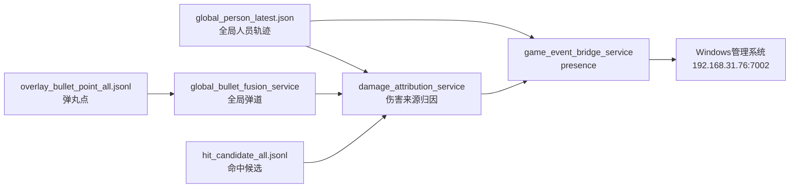

# 游戏进程管理系统对接文档：全局ID与命中事件桥接

版本：2026-07-03  
对接方向：方向B改版  
管理系统电脑：`192.168.31.76`  
管理系统监听端口：`7002`  
协议：TCP 长连接，UTF-8 JSON Line，每条消息一个 JSON，末尾 `\n`

## 1. 对接边界

本套服务只负责把现场视觉侧的运行时信息发给游戏进程管理系统：

- 实时发送场上所有运行时全局 ID。
- 发送可发布的命中关系：谁命中谁。
- 不做玩家身份映射。
- 不绑定手表、不计算 HP、不计算伤害值、不统计战绩。
- 管理系统继续负责身份、队伍、血量、伤害、手表、面板显示和结算。

关键约定：

- 所有 ID 的语义都是 `global_runtime_id`，不是玩家身份 ID。
- `source_yolo_id` / `target_yolo_id` 为兼容管理系统旧字段，当前承载的是 `global_id_int`。
- 新字段 `source_global_id` / `target_global_id` 是明确语义字段，格式为 `G0001`。
- 管理系统如需做玩家身份绑定，应自行维护 `global_runtime_id -> 玩家/手表` 的关系；视觉侧不提供身份映射。

## 2. 服务链路



三段服务：

| 服务 | 作用 | 主要输入 | 主要输出 |
|---|---|---|---|
| `global_bullet_fusion_service.py` | 将各相机弹丸点投影到场地坐标，并形成短生命周期弹道轨迹 | `overlay_bullet_point_all.jsonl`、相机标定 | `global_bullet_tracks.jsonl`、`global_bullet_fusion_latest.json` |
| `damage_attribution_service.py` | 用命中候选、全局人员轨迹、全局弹道，推断伤害来源全局 ID | `hit_candidate_all.jsonl`、`global_person_latest.json`、`global_bullet_fusion_latest.json` | `damage_attribution_events.jsonl` |
| `game_event_bridge_service.py` | 通过 TCP JSON Line 向 Windows 管理系统发送 presence 与 hit | `global_person_latest.json`、`damage_attribution_events.jsonl` | TCP 消息、`game_event_bridge_sent.jsonl` |

## 3. Windows 管理系统接收消息

### 3.1 presence：场上全局 ID 列表

发送频率：默认 `5 Hz`  
发送条件：

- `game_event_bridge_mode=publish/enforce` 时发送。
- `game_event_bridge_mode=shadow` 且 `game_event_bridge_send_presence_in_shadow=true` 时也发送。
- 当前业务启动 profile 为 `publish`，会发送 presence；`send_presence_in_shadow` 保留用于回退 shadow 时仍让 Win 面板看到场上 ID。

示例：

```json
{
  "type": "presence",
  "alive_yolo_ids": [1, 2, 3, 4, 5],
  "global_ids": [
    {
      "global_id": "G0001",
      "global_id_int": 1,
      "global_player_id": "P01",
      "state": "tracking",
      "age_ms": 12.5,
      "confidence": 0.97,
      "source_cameras": ["A", "D"]
    }
  ],
  "id_semantics": "global_runtime_id",
  "ts_ms": 1783060000000
}
```

字段说明：

| 字段 | 类型 | 说明 | 管理系统建议 |
|---|---:|---|---|
| `type` | string | 固定为 `presence` | 用于分发消息类型 |
| `alive_yolo_ids` | int[] | 兼容旧字段，当前是场上所有 `global_id_int` | 旧面板可继续读这个数组 |
| `global_ids` | object[] | 全量 ID 详情 | 新面板优先使用 |
| `global_ids[].global_id` | string | 字符串全局 ID，如 `G0001` | 推荐用于显示/日志 |
| `global_ids[].global_id_int` | int | 整型全局 ID，如 `1` | 可用于旧字段兼容 |
| `global_ids[].global_player_id` | string | 运行时显示键，通常如 `P01` | 不等于玩家身份，勿当身份映射 |
| `global_ids[].state` | string | 跟踪状态 | 可用于 UI 灰显 |
| `global_ids[].age_ms` | number | 轨迹年龄，超过阈值会被过滤 | 越小越新 |
| `global_ids[].confidence` | number | 轨迹置信度 | 可选显示/调试 |
| `global_ids[].source_cameras` | string[] | 当前 ID 来源相机 | 可选显示/调试 |
| `id_semantics` | string | 固定为 `global_runtime_id` | 必须按运行时全局 ID 理解 |
| `ts_ms` | int | 发送时间，毫秒 | 可用于超时判断 |

### 3.2 hit：命中关系

发送条件：

- `damage_attribution_service` 产出 `publishable=true`。
- `game_event_bridge_mode` 必须是 `publish` 或 `enforce`。
- 当前业务启动 profile 已切到 `publish`，真实链路中 `publishable=true` 的 hit 会发送给管理系统。

示例：

```json
{
  "type": "hit",
  "source_yolo_id": 3,
  "target_yolo_id": 7,
  "source_global_id": "G0003",
  "target_global_id": "G0007",
  "event_id": "G-D-1024-5-7-3",
  "camera": "D",
  "id_semantics": "global_runtime_id",
  "confidence": 0.82
}
```

字段说明：

| 字段 | 类型 | 说明 | 管理系统建议 |
|---|---:|---|---|
| `type` | string | 固定为 `hit` | 用于分发消息类型 |
| `source_yolo_id` | int | 兼容旧字段，当前等于攻击者 `global_id_int` | 旧系统可继续按 attacker ID 使用 |
| `target_yolo_id` | int | 兼容旧字段，当前等于被命中者 `global_id_int` | 旧系统可继续按 target ID 使用 |
| `source_global_id` | string | 攻击者全局 ID，如 `G0003` | 新逻辑优先使用 |
| `target_global_id` | string | 被命中者全局 ID，如 `G0007` | 新逻辑优先使用 |
| `event_id` | string | 命中事件唯一键 | 管理系统应按此去重 |
| `camera` | string | 命中候选来源相机或 `global` | 调试字段 |
| `id_semantics` | string | 固定为 `global_runtime_id` | 必须按运行时全局 ID 理解 |
| `confidence` | number | 来源归因置信度，0 到 1 | 低置信可在 UI 标记 |

不发送字段：

- 不发送 `damage`。
- 不发送 HP。
- 不发送队伍、玩家名、手表 ID。
- 不发送击杀/复活/结算结果。

## 4. 内部字段衔接

### 4.1 全局人员输入：`global_person_latest.json`

桥接服务读取 `tracks`：

| 字段 | 用途 |
|---|---|
| `global_id` | 转成 `global_id_int` 与 `G0001` |
| `global_player_id` | 运行时显示键；没有时自动生成 `Pxx` |
| `state` | 透传到 presence |
| `age_ms` | 超过 `presence_max_age_ms` 的轨迹不发送 |
| `confidence` | 透传到 presence |
| `source_cameras` | 透传到 presence |
| `local_ids` | 仅供内部从局部 stable_id 找到目标全局 ID，不是身份映射 |
| `field_xy` / `filtered_xy` / `raw_xy` | 伤害来源归因时用于空间评分 |

### 4.2 全局弹道输出：`global_bullet_fusion_latest.json`

`global_bullet_fusion_service` 输出 `tracks`：

| 字段 | 说明 |
|---|---|
| `track_id` | 弹道轨迹 ID |
| `camera` | 来源相机 |
| `camera_sn` | 来源相机序列号 |
| `bullet_id` | 弹丸 ID |
| `point_count` | 轨迹点数量 |
| `field_xy` | 当前场地坐标，米 |
| `prev_field_xy` | 上一个场地坐标，米 |
| `direction_xy` | 单位方向向量 |
| `speed_mps` | 估算速度 |
| `last_ts_us` | 最后点时间戳，微秒 |
| `age_ms` | 轨迹年龄 |
| `source_record` | 原始弹丸点摘要 |

### 4.3 伤害归因事件：`damage_attribution_events.jsonl`

这是桥接服务读取的 hit 上游。

示例：

```json
{
  "type": "damage_attribution",
  "schema_version": 1,
  "source": "damage_attribution_service",
  "mode": "publish",
  "event_id": "G-D-1024-5-7-3",
  "camera": "D",
  "id_semantics": "global_runtime_id",
  "source_global_id": "G0003",
  "source_global_id_int": 3,
  "target_global_id": "G0007",
  "target_global_id_int": 7,
  "confidence": 0.82,
  "publishable": true,
  "reject_reason": "",
  "score_threshold": 0.45,
  "bullet_track_id": "D:SN123:5",
  "bullet_field_xy": [12.34, 8.91],
  "bullet_direction_xy": [0.96, -0.28],
  "target_reason": "local_id_map"
}
```

桥接服务只会把其中 `publishable=true` 且有 source/target 的事件转换为 Windows `hit` 消息。

常见 `reject_reason`：

| 值 | 含义 |
|---|---|
| `no_target_global_id` | 命中候选无法关联到目标全局 ID |
| `no_matching_global_bullet_track` | 找不到匹配弹道 |
| `bad_bullet_track_geometry` | 弹道缺少坐标或方向 |
| `no_source_candidate` | 反向弹道方向上找不到合理攻击者 |
| `below_score_threshold` | 有来源但置信度低于阈值 |

## 5. 当前配置

配置文件：`launch_profiles/627_event_overlay_bev.json`

当前关键值：

```json
{
  "global_bullet_fusion_enable": true,
  "global_bullet_fusion_mode": "publish",
  "damage_attribution_enable": true,
  "damage_attribution_mode": "publish",
  "game_event_bridge_enable": true,
  "game_event_bridge_mode": "publish",
  "game_event_bridge_windows_host": "192.168.31.76",
  "game_event_bridge_windows_port": 7002,
  "game_event_bridge_presence_hz": 5.0,
  "game_event_bridge_send_presence_in_shadow": true
}
```

含义：

- 现场正式链路启动时，Win 面板可以收到 presence。
- `publish` 模式下，`damage_attribution_service` 输出且 `publishable=true` 的真实 hit 会发给管理系统。
- 需要回到只看不发 hit 的保守模式时，把 `game_event_bridge_mode` 改回 `shadow`，并保留 `game_event_bridge_send_presence_in_shadow=true`。

## 6. 联调模拟器

现场系统暂不启用时，可用模拟发送器直接向管理系统发包。

当前联调参数：

- 目标：`192.168.31.76:7002`
- 玩家：10 人，`G0001` 到 `G0010`
- presence：`5 Hz`
- hit：`30 Hz`
- 数据特征：随机攻击者、随机目标，攻击者与目标不同

模拟器发送的 presence 示例：

```json
{
  "type": "presence",
  "alive_yolo_ids": [1,2,3,4,5,6,7,8,9,10],
  "global_ids": [
    {
      "global_id": "G0001",
      "global_id_int": 1,
      "global_player_id": "P01",
      "state": "tracking",
      "age_ms": 0,
      "confidence": 0.99,
      "source_cameras": ["sim"]
    }
  ],
  "id_semantics": "global_runtime_id",
  "simulated": true,
  "ts_ms": 1783060000000
}
```

模拟器发送的 hit 示例：

```json
{
  "type": "hit",
  "source_yolo_id": 4,
  "target_yolo_id": 9,
  "source_global_id": "G0004",
  "target_global_id": "G0009",
  "event_id": "SIM-SIM-1783060000000-000123",
  "camera": "SIM",
  "id_semantics": "global_runtime_id",
  "confidence": 0.91,
  "simulated": true
}
```

模拟器停止方式：

```powershell
New-Item -ItemType File -Force -Path "C:\Users\axyis\Documents\判定开发\_sandbox\game_event_sim_20260703.stop"
```

模拟器日志：

```text
C:\Users\axyis\Documents\判定开发\_sandbox\game_event_sim_20260703_live.log
```

## 7. 管理系统开发建议

建议管理系统按以下顺序改：

1. TCP 接收端保持 `7002`，继续按 JSON Line 拆包。
2. 对 `type=presence` 增加处理：
   - 用 `alive_yolo_ids` 兼容旧面板。
   - 用 `global_ids` 更新新面板的场上全局 ID 列表。
   - 当某个 ID 连续超时未出现在 presence 中，管理系统侧自行置为离场或失活。
3. 对 `type=hit` 增加新语义：
   - 旧字段 `source_yolo_id` / `target_yolo_id` 仍可读，但要理解为全局运行时 ID。
   - 新代码优先读 `source_global_id` / `target_global_id`。
   - 用 `event_id` 做去重，避免网络重连或重发导致重复扣血。
4. 不要期待视觉侧发送 `damage`。
   - 伤害数值、护甲、队伍、友伤、复活保护等规则仍由管理系统判定。
5. UI 上建议标明 ID 语义：
   - 显示 `G0001` 这类运行时 ID。
   - 玩家身份/手表绑定由管理系统自己建立和维护。

## 8. 排查文件

| 文件 | 用途 |
|---|---|
| `sync_ipc/game_event_bridge_status.json` | 桥接服务状态、连接状态、发送统计 |
| `sync_ipc/game_event_bridge_latest.json` | 最近一次桥接 payload |
| `sync_ipc/game_event_bridge_sent.jsonl` | 每次发送或 shadow 记录 |
| `sync_ipc/damage_attribution_status.json` | 伤害归因状态、输入数量、reject 统计 |
| `sync_ipc/damage_attribution_latest.json` | 最近一次归因事件 |
| `sync_ipc/damage_attribution_events.jsonl` | 归因事件流 |
| `sync_ipc/global_bullet_fusion_status.json` | 弹道融合状态、标定加载、丢弃统计 |
| `sync_ipc/global_bullet_fusion_latest.json` | 当前活跃弹道 |
| `sync_ipc/global_bullet_tracks.jsonl` | 弹道轨迹流 |

桥接状态中重点看：

| 字段 | 含义 |
|---|---|
| `client_connected` | 是否已连接 Windows 管理系统 |
| `client_last_error` | 最近一次连接/发送错误 |
| `send_presence_enabled` | 当前是否允许发送 presence |
| `send_hits_enabled` | 当前是否允许发送 hit |
| `stats.sent_presence` | 已发送 presence 数 |
| `stats.sent_hit` | 已发送 hit 数 |
| `stats.send_failed_presence` | presence 发送失败数 |
| `stats.send_failed_hit` | hit 发送失败数 |
| `stats.shadow_hit` | shadow 模式下拦截的 hit 数 |

## 9. 真实 hit 发布与回退条件

当前业务启动 profile 已切到 `publish`。现场启用前仍建议确认：

- Win 管理系统已确认 `presence` 正常刷新。
- Win 管理系统已确认 `hit` 按 `event_id` 去重。
- Win 管理系统已确认把 `source_yolo_id` / `target_yolo_id` 视为 `global_id_int`。
- `damage_attribution_status.json` 中 reject 比例可接受。
- `global_bullet_fusion_status.json` 中 `drop_no_calib` 不应持续增长到影响主相机。
- 现场验证至少覆盖：多人同时在场、同一目标连续命中、快速进出场、网络断连重连。

当前打开方式：

```json
{
  "game_event_bridge_mode": "publish"
}
```

需要更保守时：

```json
{
  "game_event_bridge_mode": "shadow",
  "game_event_bridge_send_presence_in_shadow": true
}
```

## 10. V25.8-R4 独立 dry-run Bridge

V25 新增的 `mrg_game_bridge.live_shadow` 与上述 Legacy 发布桥是两条独立链路：

- 只读取 V25 Combat Shadow 的 namespaced decision JSONL。
- 只写 run 目录下的 `dry_run_events.jsonl`。
- 固定 `authority=dry_run_only`、`official_result=false`。
- 固定 `production_enable=false`、`production_network_enabled=false`。
- 不连接 Windows 游戏进程，不写 `sync_ipc/game_event_bridge_*` 正式文件。

统一状态入口：

`system_status_latest.json.categories.v25_shadow_services.services.game_bridge`

R4 远端通过只证明进程、输入和状态接通；该轮没有 pseudo-hit，不能据此宣称真实 hit 已由 V25 Bridge 发送。
