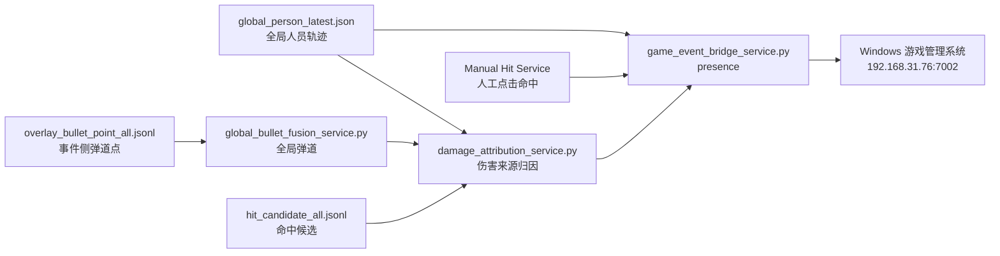

# 游戏进程管理系统对接文档：全局 ID 与命中事件桥接

更新时间：2026-07-09

本文档是 `GAME_EVENT_BRIDGE_HANDOFF_20260703.md` 的中文可读版。它说明视觉侧向游戏进程管理系统发送什么、不发送什么，以及字段语义如何理解。

## 对接边界

视觉侧只负责把现场视觉运行时信息发送给游戏管理系统：

- 场上实时全局 ID 列表。
- 可发布的命中关系：谁命中谁。
- 当前人工命中时，伤害来源可使用虚拟全局 ID `99`。

视觉侧不负责：

- 玩家身份映射。
- 手表绑定。
- HP/血量计算。
- 伤害数值计算。
- 战绩统计。
- 面板展示和结算。

游戏管理系统继续负责身份、队伍、血量、伤害、手表、面板展示和结算。

## 关键 ID 语义

| 字段 | 含义 |
| --- | --- |
| `global_runtime_id` | 视觉运行时全局 ID，不等于玩家身份 ID |
| `global_id_int` | 整型全局 ID，例如 `1` |
| `global_id` | 字符串全局 ID，例如 `G0001` |
| `source_yolo_id` / `target_yolo_id` | 旧兼容字段，当前承载 `global_id_int` |
| `source_global_id` / `target_global_id` | 明确语义字段，推荐新系统使用 |
| `99` | 当前可作为虚拟伤害来源 ID，用于人工点击命中或未启用 shooter attribution 时 |

如果管理系统需要绑定玩家/手表，应自行维护：

```text
global_runtime_id -> 玩家身份 / 手表 / 队伍
```

视觉侧不提供身份映射。

## 服务链路



## 三个主要服务

| 服务 | 作用 | 主要输入 | 主要输出 |
| --- | --- | --- | --- |
| `global_bullet_fusion_service.py` | 把各相机弹道点投影/关联为全局弹道 | `overlay_bullet_point_all.jsonl`、标定 | `global_bullet_tracks.jsonl`、`global_bullet_fusion_latest.json` |
| `damage_attribution_service.py` | 用命中候选、人员轨迹、全局弹道推断伤害来源 | `hit_candidate_all.jsonl`、`global_person_latest.json`、`global_bullet_fusion_latest.json` | `damage_attribution_events.jsonl` |
| `game_event_bridge_service.py` | 通过 TCP JSON Line 发送 presence 和 hit | `global_person_latest.json`、`damage_attribution_events.jsonl`、manual hit | TCP message、`game_event_bridge_sent.jsonl` |

## 协议

| 项 | 值 |
| --- | --- |
| 管理系统地址 | `192.168.31.76` |
| 端口 | `7002` |
| 协议 | TCP 长连接 |
| 编码 | UTF-8 |
| 消息格式 | JSON Line，每条 JSON 以 `\n` 结尾 |

## presence 消息

presence 表示当前场上全局 ID 列表。

发送频率：默认 `5 Hz`。

示例：

```json
{
  "type": "presence",
  "alive_yolo_ids": [1, 2, 3],
  "global_ids": [
    {
      "global_id": "G0001",
      "global_id_int": 1,
      "global_player_id": "P01",
      "state": "tracking",
      "age_ms": 12.5,
      "confidence": 0.97,
      "source_cameras": ["A", "D"]
    }
  ],
  "id_semantics": "global_runtime_id",
  "ts_ms": 1783060000000
}
```

管理系统建议：

- 新界面优先使用 `global_ids`。
- 旧界面可继续读 `alive_yolo_ids`。
- 不要把 `global_player_id` 当成真实玩家身份，它只是运行时显示键。

## hit 消息

hit 表示一次命中关系。

示例：

```json
{
  "type": "hit",
  "source_global_id": "G0099",
  "source_yolo_id": 99,
  "target_global_id": "G0003",
  "target_yolo_id": 3,
  "damage": 1,
  "hit_id": "hit_20260709_000001",
  "authority": "strong_reasoning",
  "ts_ms": 1783060000123
}
```

当前业务约定：

- 自动命中可由 `strong_gate` 或 `strong_reasoning` 产生，具体看 `final_hit_authority`。
- 人工点击命中走独立 Manual Hit Service。
- 人工命中默认来源为虚拟 ID `99`。
- 切到 manual-only 时，应屏蔽其他自动命中链路输出，避免重复伤害。

## 状态和诊断文件

| 文件 | 说明 |
| --- | --- |
| `sync_ipc/game_event_bridge_status.json` | 桥接服务状态 |
| `sync_ipc/game_event_bridge_latest.json` | 最新发送状态 |
| `sync_ipc/game_event_bridge_sent.jsonl` | 已发送消息记录 |
| `sync_ipc/damage_attribution_status.json` | 伤害归因状态 |
| `sync_ipc/damage_attribution_events.jsonl` | 伤害归因事件 |
| `sync_ipc/global_person_latest.json` | 全局人员 ID 输入 |

## 常见问题

### 伤害来源是不是固定 99

只有在人工点击命中、或 shooter attribution 未启用/未通过时，才应使用虚拟 ID `99`。如果自动归因已启用并通过，应发送真实 `source_global_id`。

### 命中没有绑定到目标 ID

检查：

- Hit Judge 输出是否含 target evidence。
- `global_person_latest.json` 是否有新鲜 target。
- identity evidence 是否过期。
- bridge 是否读到了最新 target mapping。

### 发送了重复 hit

检查：

- strong_gate 和 strong_reasoning 是否同时作为 authority。
- manual hit 是否没有屏蔽自动链路。
- cross-camera dedup 和 same-track episode dedup 是否开启。

## V25.8-R4 独立 dry-run Bridge

`mrg_game_bridge.live_shadow` 不替代当前 Legacy 发布桥。它只读取 V25 Combat Shadow 的 run-scoped decision JSONL，并只写同一 run 下的 `dry_run_events.jsonl`。

固定边界：

- `authority=dry_run_only`
- `official_result=false`
- `official_writer_count=0`
- `production_enable=false`
- `production_network_enabled=false`
- 不写 `sync_ipc/game_event_bridge_*` 正式文件
- 不连接 Windows 游戏进程

统一状态读取：`system_status_latest.json.categories.v25_shadow_services.services.game_bridge`。

R4 候选 1 只证明 live 进程、输入和状态接通；无人测试没有 pseudo-hit，不能据此宣称真实命中发送已通过。
