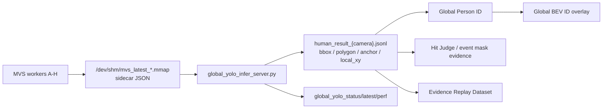

# Global YOLO C+3 架构

更新时间：2026-07-09

本文档是 `GLOBAL_YOLO_C3_ARCHITECTURE.md` 的中文可读版。原文当前存在历史编码乱码，本文保留关键契约和字段，供新同事理解 Global YOLO 链路。

## 目标

Global YOLO 的目标是在 8 路 MVS 可见光输入下保持高吞吐，同时把人员 bbox、polygon、anchor/foot point、置信度和本地/全局坐标稳定发布给下游。

核心目标：

- 每路接近 40Hz 的可见光节拍。
- 全局总吞吐接近 8 路 40Hz，即约 320fps 的输入处理能力。
- 输出兼容 `human_result_{camera}.jsonl`，避免 Global Person ID、BEV、Hit Judge、Event human mask 消费端大改。
- polygon 可按配置开启，用于 mask evidence、回放数据集和命中判定优化。

## 主要进程

```text
global_yolo_infer_server.py
```

## 输入

| 输入 | 说明 |
| --- | --- |
| `/dev/shm/mvs_latest_{camera}.mmap` | 每路 MVS 最新帧 |
| `sync_ipc/mvs_latest_{camera}.json` | frame_id、sync、timestamp、exposure metadata |
| `calib_true/field_calib_camera{camera}.json` | 相机到场地坐标标定 |
| `ids_8cam_fusion_config_627_runtime.json` | unified runtime config |
| launch profile/runtime args | 控制 shard、polygon、anchor、buffer、postprocess |

## 输出

| 输出 | 说明 |
| --- | --- |
| `sync_ipc/global_yolo_status.json` | 总状态、FPS、polygon contract、input audit |
| `sync_ipc/global_yolo_latest.json` | 最新全局 YOLO 汇总 |
| `sync_ipc/global_yolo_infer_perf.csv` | 性能采样 |
| `sync_ipc/human_result_{camera}.jsonl` | 主输出，供 Global Person ID、Hit Judge、Event mask 使用 |
| `sync_ipc/global_yolo_shadow/human_result_{camera}.jsonl` | shadow 模式输出 |

## 数据流



## 运行模式

### Legacy mode

- `global_yolo_enable=false`
- 继续使用旧 YOLO shard worker。
- 用于回退或对比，不推荐作为长期主线。

### Shadow mode

- `--global-yolo-enable --global-yolo-shadow-mode`
- 旧链路继续作为主线，Global YOLO 写入 `sync_ipc/global_yolo_shadow/`。
- 用于横向比较 FPS、polygon、ID 稳定性。

### Primary mode

- `--global-yolo-enable`
- Global YOLO 直接写主 `human_result_{camera}.jsonl`。
- 下游正式消费 Global YOLO 输出。

## 关键配置和语义

| 参数/字段 | 说明 |
| --- | --- |
| `global_yolo_microbatch_groups` | 控制多路 batch 组合，例如 A,C,E,G / B,D,F,H |
| `global_yolo_include_mask_polygons` | 是否输出 polygon；开启会增加 CPU 后处理压力 |
| `global_yolo_postprocess_backend` | 后处理路径，可能是 GPU-first 或异步 postprocess |
| `anchor_mode` | 人体定位锚点策略，例如 `bbox_center`、`auto_topdown_center` |
| `foot_pixel` | 下游兼容字段；现在语义可能是 corrected anchor，不一定是真脚底点 |
| `anchor_quality` | 融合权重的一部分，综合置信度、mask质量、边缘质量、几何权重 |
| `input_buffer` | 等待同 sync 多路帧，降低跨相机错位 |

## polygon 契约

当 polygon 开启且正常时：

- `published_records_with_polygon_ratio` 应接近 `1.0`。
- `published_persons_with_polygon_ratio` 应接近 `1.0`。
- `polygon_contract_ok=true`。

如果这些字段降为 0 或 false，要先判断是：

1. 刚启动 warm-up。
2. 当前场景无人。
3. polygon 开关未启用。
4. 后处理队列阻塞或被降级。
5. YOLO 输出正常但 person/mask 消费链路读错旧文件。

## 性能重点

主要看：

- `inferred_fps_total`
- `published_fps_total`
- `postprocess_queue_depth`
- `postprocess_lag_ms`
- `postprocess_backpressure_ms`
- `postprocess_dropped_batches`
- `input_buffer_aligned_full_ratio`
- `input_buffer_fallback_ratio`

经验判断：

- YOLO 总 FPS 约 270-320fps，通常可支撑 8 路 40Hz。
- polygon 开启会增加后处理压力，但对 mask evidence 和数据集回放很重要。
- input buffer 会增加少量等待，但能显著降低跨相机 ID/位置错位。

## 常见问题

### FPS 下降

优先检查：

- 是否开启了 heavy polygon/mask debug。
- `postprocess_queue_depth` 是否增长。
- 是否有磁盘 JSONL 写入放大。
- MVS input 是否卡帧或等待过长。

### Global ID 在相机交接区不稳定

重点检查：

- anchor/foot_pixel 选点策略。
- 高位俯视高度修正 `height_correction_k`。
- 相机交接区出生/死亡规则。
- fusion weight 是否过度偏向某一路。

### Hit Judge 绑定不到人

重点检查：

- `human_result_{camera}.jsonl` 是否有目标时序。
- polygon 是否存在。
- `global_person_latest.json` 是否同步更新。
- Event worker / Hit Judge 使用的是不是同一套 sync/evidence source。

## V25.8-R3 polygon 合约补充（2026-07-11）

- 开启 polygon 输出后，每个已发布 person 都必须携带至少 3 点的可用 polygon。
- 当前批次没有 person 时，worker 状态为 `valid_empty`，这是合法空输出，不再污染 merge 合约。
- person 存在但 polygon 缺失/非法时必须 fail closed，不能用上一批 ratio 或无人 worker 掩盖。
- 新状态字段为 `polygon_contract_state`、`polygon_output_enabled`、`published_persons_without_polygon`，状态窗口和脚本应优先读取这些稳定 key。
- R3 候选 3 验证 merge=`valid_complete`、缺 polygon person=0；Global YOLO FPS 仍为 monitor-only，polygon 正确性仍是硬门。

详细节点记录见 `docs/versions/NODE_VERSION_20260711_V25_8_R3_BEV_POLYGON_DISK.md`。
